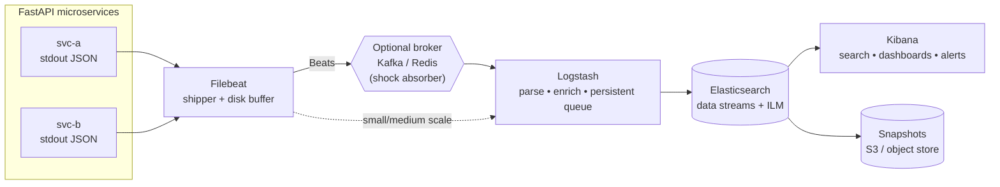
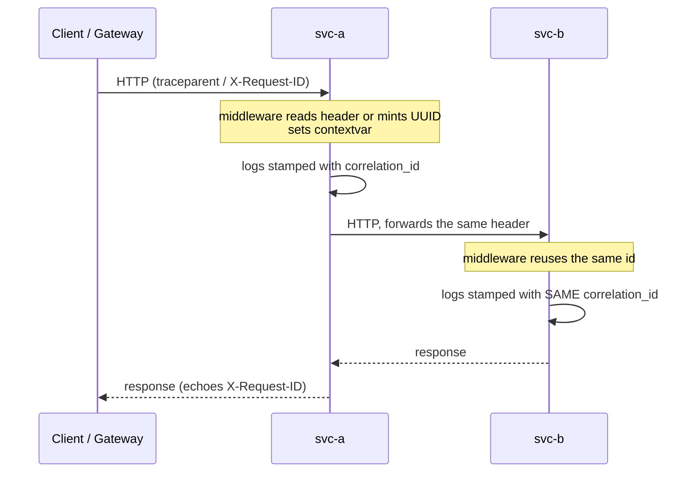
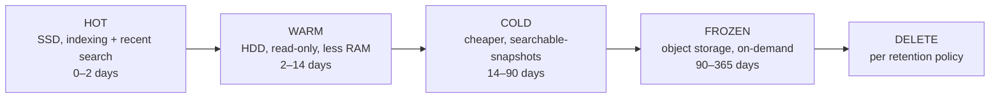
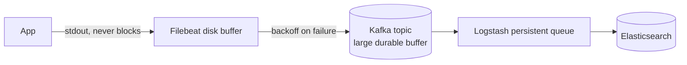

# Centralized Logging for FastAPI with ELK — An Infrastructure Architect's Guide

> A production blueprint for turning per-service `stdout` into a searchable,
> correlated, retention-governed log platform using **Elasticsearch, Logstash,
> Kibana**, and **Filebeat**. Covers the reference architecture, app-side
> structured logging, cross-service correlation IDs, scaling, backpressure, and
> data retention — plus senior system-design interview questions with answers.

---

## 1. Goals and Non-Goals

**Goals**
- Every service emits **structured JSON** to stdout; the platform does the rest.
- A single request is **traceable across microservices** via a correlation ID.
- The pipeline is **reliable under load** (backpressure, no silent loss) and the
  storage is **cost-governed** (rollover, tiering, retention/deletion).
- The logging stack **cannot take down the app**, and **cannot fill its own disk**.

**Non-Goals (know the boundaries)**
- Logs are not metrics or traces. Use logs for *why*; use metrics (Prometheus)
  for *alerting* and traces (OpenTelemetry/APM) for *where*. This guide focuses
  on logs but wires in the correlation/trace ID that joins all three.

---

## 2. Reference Architecture



**Why each hop exists**
| Component | Role | Why it's separate |
| --- | --- | --- |
| **App → stdout** | Emit structured JSON | 12-factor: the app must not know or care where logs go. No file rotation, no network calls on the hot path. |
| **Filebeat** | Collect & ship, with an on-disk buffer | Lightweight (Go), runs per host/node; first backpressure buffer. |
| **Broker (Kafka/Redis)** *(optional)* | Absorb spikes, decouple ingest from processing | The real shock absorber at high scale; lets you restart Logstash/ES without dropping logs. |
| **Logstash** | Parse, enrich, transform; persistent queue | Heavy transforms and a durable buffer live here, off the app. |
| **Elasticsearch** | Index & store; data streams + ILM | The searchable engine; ILM governs rollover/retention. |
| **Kibana** | Query, dashboard, alert | The human interface. |
| **Snapshots** | Long-term archival to object storage | Cheap, out-of-cluster durability for compliance. |

> **Design rule:** the app's only job is to write good JSON to stdout. Everything
> downstream is infrastructure you can evolve without redeploying services.

---

## 3. App-Side: Structured Logging Configuration (FastAPI)

The single most important decision is **structured JSON with consistent field
names**, because Elasticsearch indexes *fields*. Free text (`f"user {id} failed"`)
is unsearchable and un-aggregatable.

### 3.1 `logging.config.dictConfig` snippet

```python
# logging_setup.py — import and call configure_logging() at process start.
import contextvars
import datetime as dt
import json
import logging
from logging.config import dictConfig

# Correlation ID lives in a contextvar so it survives across `await` boundaries
# and is available to the formatter without threading it through every call.
correlation_id: contextvars.ContextVar[str] = contextvars.ContextVar(
    "correlation_id", default="-"
)


class CorrelationIdFilter(logging.Filter):
    """Injects the current correlation/trace id onto every LogRecord."""
    def filter(self, record: logging.LogRecord) -> bool:
        record.correlation_id = correlation_id.get()
        return True


class JsonFormatter(logging.Formatter):
    """One JSON object per line — the unit Filebeat/Logstash ingest."""
    _RESERVED = set(logging.LogRecord("", 0, "", 0, "", (), None).__dict__) | {
        "message", "asctime", "correlation_id"
    }

    def format(self, record: logging.LogRecord) -> str:
        payload = {
            "@timestamp": dt.datetime.fromtimestamp(
                record.created, dt.timezone.utc
            ).isoformat(),
            "level": record.levelname,
            "logger": record.name,
            "service": "svc-a",            # set per service (env var in prod)
            "message": record.getMessage(),
            "correlation_id": getattr(record, "correlation_id", "-"),
        }
        # Merge structured fields passed via logger.info("msg", extra={...}).
        for key, value in record.__dict__.items():
            if key not in self._RESERVED and not key.startswith("_"):
                payload[key] = value
        if record.exc_info:
            payload["exception"] = self.formatException(record.exc_info)
        return json.dumps(payload, default=str)


def configure_logging(level: str = "INFO") -> None:
    dictConfig({
        "version": 1,
        "disable_existing_loggers": False,
        "filters": {"correlation": {"()": CorrelationIdFilter}},
        "formatters": {"json": {"()": JsonFormatter}},
        "handlers": {
            "stdout": {
                "class": "logging.StreamHandler",
                "stream": "ext://sys.stdout",   # 12-factor: stdout only
                "formatter": "json",
                "filters": ["correlation"],
            }
        },
        # Route uvicorn/gunicorn access + error logs through the SAME JSON handler
        # so the whole process speaks one log format.
        "loggers": {
            "uvicorn": {"handlers": ["stdout"], "level": level, "propagate": False},
            "uvicorn.error": {"handlers": ["stdout"], "level": level, "propagate": False},
            "uvicorn.access": {"handlers": ["stdout"], "level": level, "propagate": False},
        },
        "root": {"handlers": ["stdout"], "level": level},
    })
```

A minimal runnable version of this (with a FastAPI middleware) lives in
[production_code.py](production_code.py).

### 3.2 Non-negotiable field conventions
- `@timestamp` (ISO-8601, UTC), `level`, `service`, `logger`, `message`,
  `correlation_id` on **every** line, named **identically** across all services.
- Numbers as numbers (`latency_ms: 42`, not `"42ms"`) so Kibana can aggregate.
- **Never** log secrets/PII (passwords, tokens, full PANs). See §7.

---

## 4. Correlation IDs Across Microservices

A request that touches five services writes logs in five places. Without a shared
key, those lines are unjoinable. The correlation ID is that key.



### 4.1 How it works, end to end
1. **Ingress:** an edge middleware reads an inbound `traceparent` (W3C Trace
   Context) or `X-Request-ID`; if absent, it **mints a UUID**. It stores the id
   in a `contextvar`.
2. **Stamping:** the `CorrelationIdFilter` puts that id on every `LogRecord`, so
   all lines for the request carry it automatically — even across `await`.
3. **Propagation:** whenever the service calls another service, it **forwards the
   same header**. The downstream middleware reuses it, so the id is stable across
   the whole call graph.
4. **Pipeline preservation:** Logstash promotes `correlation_id` into a stable
   field (`trace.correlation_id`), so it's queryable in every backing index.
5. **Investigation:** in Kibana you filter `correlation_id: "abc-123"` and see the
   entire cross-service timeline in order.

### 4.2 Correlation ID vs. Trace ID — use both
- **`correlation_id` / `X-Request-ID`** — simple, one id per request; great for
  log-stitching. Easy to adopt.
- **W3C Trace Context (`traceparent`)** — carries `trace-id` **and** `span-id`,
  enabling true distributed tracing (parent/child spans, timing per hop) in
  OpenTelemetry/APM. Prefer this as the source of truth and log the `trace_id`
  and `span_id` fields; keep `X-Request-ID` as a human-friendly alias.

> **Gotcha:** a `contextvar` is the correct carrier because it is coroutine-safe.
> A module global or `threading.local` will bleed ids between concurrent requests
> on the event loop. Also remember to propagate the id into background tasks and
> outbound message headers, or the trail goes cold at async boundaries.

---

## 5. The Deployment: `docker-compose.yml` Walkthrough

The [docker-compose.yml](docker-compose.yml) in this directory is a hardened
single-host template. Supporting config:
[logstash/pipeline/logstash.conf](logstash/pipeline/logstash.conf),
[logstash/config/logstash.yml](logstash/config/logstash.yml),
[filebeat/filebeat.yml](filebeat/filebeat.yml), and
[.env.example](.env.example).

**Bring it up**
```bash
cp .env.example .env          # then edit: set strong passwords
# Linux hosts only (Elasticsearch requirement):
sudo sysctl -w vm.max_map_count=262144
docker compose up -d
# Create the kibana_system password after first boot:
docker exec -it elk-elasticsearch bin/elasticsearch-reset-password -u kibana_system -b
# paste it into .env as KIBANA_SYSTEM_PASSWORD, then: docker compose up -d kibana
```

**What makes this template production-oriented (and what's still TODO)**
| Concern | In the template | Hardening TODO for real prod |
| --- | --- | --- |
| Auth | `xpack.security.enabled=true`, service accounts | Add **TLS** (http + transport) with real certs |
| Memory | heap pinned, `bootstrap.memory_lock`, `memlock` ulimit | Size heap ≤ 50% RAM, ≤ 31 GB |
| Durability | named volumes, Logstash **persistent queue** | Multi-node ES cluster + **snapshots** to object storage |
| Backpressure | Filebeat + Logstash disk buffers | Add a **Kafka** broker in front of Logstash at scale |
| Self-protection | container `json-file` log rotation caps | Dedicated logging nodes; resource `limits` per service |
| Secrets | `${VAR}` from `.env`, ports bound to `127.0.0.1` | Vault/Secrets Manager; private network + reverse proxy |

---

## 6. Scaling Elasticsearch (the hard part)

Elasticsearch scale is about **shards, replicas, and tiers**, governed by **ILM**.

### 6.1 Shards and replicas
- An index is split into **primary shards** (units of parallelism/distribution)
  each with **replica shards** (redundancy + read throughput).
- **Oversharding is the #1 cluster killer.** Thousands of tiny shards exhaust heap
  (cluster state) and slow everything. Target **10–50 GB per shard**; use
  **rollover** so shards are created by size/age, not guessed up front.
- Replicas: at least 1 for HA (survive a node loss). More replicas = more read
  capacity but more storage and write amplification.

### 6.2 Data streams + rollover
Logs are append-only time-series. Use a **data stream** (as the pipeline does):
writes go to a hidden **write index** that ILM **rolls over** at, e.g., 50 GB or
1 day. This keeps shard sizes healthy automatically and makes deletion cheap
(drop whole indices, never `DELETE by query`).

### 6.3 Hot–Warm–Cold–Frozen tiers (the cost lever)

Recent logs (hot) live on fast, expensive nodes; older logs migrate to cheaper
hardware and finally to object storage before deletion. This is how you keep a
year of logs without a year of SSD cost.

### 6.4 Example ILM policy (rollover → tier → delete)
```json
PUT _ilm/policy/fastapi-logs
{
  "policy": { "phases": {
    "hot":    { "actions": { "rollover": { "max_primary_shard_size": "50gb", "max_age": "1d" } } },
    "warm":   { "min_age": "2d",  "actions": { "shrink": { "number_of_shards": 1 }, "forcemerge": { "max_num_segments": 1 } } },
    "cold":   { "min_age": "14d", "actions": { "searchable_snapshot": { "snapshot_repository": "s3-logs" } } },
    "frozen": { "min_age": "30d", "actions": { "searchable_snapshot": { "snapshot_repository": "s3-logs" } } },
    "delete": { "min_age": "90d", "actions": { "delete": {} } }
  }}
}
```

### 6.5 Horizontal scale of the pipeline
- **Filebeat** scales with your hosts (one per node) — no bottleneck.
- **Logstash** is stateless behind a broker; add instances to a Kafka consumer
  group to parse in parallel.
- **Elasticsearch** scales by adding data nodes; dedicate **master**, **ingest**,
  and **coordinating** roles at large scale so one workload can't starve another.

---

## 7. Backpressure and Reliability (don't lose logs, don't die)

Under a traffic spike or a downstream outage, an unbuffered pipeline either
**drops logs** or **applies backpressure that stalls the app**. Neither is
acceptable by default — you design for it explicitly.

### 7.1 The layered buffer strategy

- **App:** logs to stdout via a handler; if you ever log over the network, use an
  async/non-blocking handler with a bounded queue so logging can't block request
  threads.
- **Filebeat:** on-disk registry + queue; retries with exponential backoff. It
  *reads slower* when the output is slow — backpressure without loss for transient
  outages.
- **Kafka (at scale):** the real shock absorber — hours/days of durable buffer,
  decoupling ingest rate from ES indexing rate. Lets you restart or reindex ES
  without dropping a single event.
- **Logstash persistent queue:** spools to disk (`queue.type: persisted`), bounded
  by `queue.max_bytes`; when full it back-pressures Filebeat/Kafka rather than
  OOM-ing.

### 7.2 When the buffer is still not enough — shed load deliberately
Infinite buffering is impossible; decide the failure mode **in advance**:
- **Sampling:** drop a percentage of high-volume, low-value logs (successful
  `2xx`, health checks) — **never sample errors**. The Logstash pipeline drops
  `/health` for exactly this reason.
- **Log-level gating:** raise the level (e.g., DEBUG→INFO) dynamically under load.
- **Prioritized loss:** if you must drop, drop `INFO` before `ERROR`.
- **Bounded queues + monitoring:** every queue has a max; alert on depth and on
  drop counters so you *know* when shedding begins.

### 7.3 Protecting the app and the cluster from each other
- **The app must never block on logging.** stdout + a shipper decouples it; avoid
  synchronous network log handlers on the request path.
- **The logging stack must never fill the host disk.** Cap container logs
  (`max-size`/`max-file`, done in the compose), and bound Logstash/Filebeat queues.
- **Watermarks:** Elasticsearch stops indexing at disk watermarks (flood-stage,
  95%) and marks indices read-only — monitor disk and ILM-delete before you get
  there, or ingestion silently halts.

---

## 8. Data Retention Policies

Retention is a **cost, compliance, and risk** decision — not a default.

- **Tier by value × age (ILM).** Hot for operational debugging (days), warm/cold
  for incident forensics (weeks), frozen/snapshots for compliance (months–years),
  then **delete**.
- **Regulatory drivers:** security/audit logs may be legally mandated for 1–7
  years (PCI-DSS, HIPAA, SOX); app debug logs often need only days. Separate data
  streams let you apply **different ILM policies per log class**.
- **PII & GDPR:** minimize PII at the source; where present, plan for
  **right-to-erasure** (retention limits + the ability to purge), pseudonymize
  identifiers, and restrict index access via role-based security. Logs are a
  common, overlooked source of a data-subject's personal data.
- **Cost math:** GB/day × retention days × replicas × (1 − tier discount). Cold
  and frozen tiers (searchable snapshots on S3) can cut storage cost by an order
  of magnitude for rarely-queried data.
- **Snapshots (SLM):** schedule Snapshot Lifecycle Management to object storage
  for out-of-cluster durability and disaster recovery, independent of ILM.

---

## 9. Operating the Platform (the parts that bite)

- **Monitor the monitoring.** If the log pipeline dies silently, you're blind
  during the exact incident you need it for. Alert on: Filebeat/Logstash queue
  depth, Logstash→ES failures, ES disk watermarks, cluster status (yellow/red),
  and rejected-bulk counters.
- **Mapping explosions.** Dynamic/unbounded field names (e.g., logging a whole
  object with arbitrary keys, or high-cardinality values as field *names*) blow up
  the index mapping and destabilize the cluster. Keep fields bounded and typed;
  use `flattened` for genuinely dynamic sub-objects.
- **Cardinality & cost.** Every indexed field costs storage and heap; index only
  what you'll query.
- **Alert on symptoms, not causes.** Drive alerts from the golden signals
  (latency p99, error rate, saturation, traffic), joined to logs by correlation
  id — not from raw CPU.
- **One format everywhere.** Route framework logs (uvicorn access/error) through
  the same JSON handler so the pipeline sees a single schema.

---

## 10. Senior System-Design Interview Questions (with answers)

### Q1 — Log scaling: "Your platform ingests 50k log events/sec and the Elasticsearch cluster is falling behind on indexing. Walk me through diagnosing and scaling it."

**Answer.** First quantify: events/sec × avg doc size = ingest MB/s; check whether
the bottleneck is **indexing** (bulk-reject queue growing, high CPU on data nodes)
or **the pipeline** (Logstash CPU, queue depth). Common wins, cheapest first:
(1) **Reduce volume at the source** — sample successful/health logs, gate levels,
drop noisy fields; often 30–50% is pure noise. (2) **Fix sharding** — oversharding
is the usual culprit; ensure rollover targets 10–50 GB/shard and reduce replica
count on hot indices during bursts. (3) **Tune bulk** — larger bulk batches,
increase `refresh_interval` (e.g., 30s) on write-heavy indices to cut segment
churn. (4) **Add a Kafka buffer** so ingest spikes don't have to be indexed in
real time — decouple ingest rate from index rate. (5) **Scale out**: add data
nodes, and at large scale split node roles (master/ingest/data/coordinating) so
indexing doesn't starve search. The senior signal is starting with *volume
reduction and shard hygiene* before throwing hardware at it, and naming the
metric that identifies the bottleneck (bulk rejections / queue depth).

---

### Q2 — Backpressure: "Elasticsearch is down for 20 minutes during peak. What happens to logs, and how do you design so nothing is lost and the apps stay up?"

**Answer.** With a naive pipeline you either lose logs or the app blocks. The
correct design has **layered, bounded buffers with backpressure, and no
synchronous logging on the request path**. Concretely: the app logs to stdout
(never blocks); **Filebeat** buffers on disk and retries with backoff, holding its
read position so nothing is re-lost; a **Kafka** topic in front of Logstash
provides hours of durable buffer, so a 20-minute ES outage is absorbed entirely —
Logstash simply resumes consuming when ES returns. **Logstash's persistent queue**
adds a further disk buffer bounded by `max_bytes`; when full it back-pressures
upstream instead of OOM-ing. The key trade-offs to articulate: buffering is
finite, so you must define the **shedding policy** for a *sustained* outage that
outlasts the buffer (drop INFO before ERROR, sample success logs, alert on queue
depth and drop counters). And you must ensure the buffer's disk usage itself can't
take down the host. "Backpressure without loss for transient outages; deliberate,
prioritized shedding for sustained ones" is the complete answer.

---

### Q3 — Retention & compliance: "Security needs audit logs kept 7 years; engineers only want app logs for 7 days; storage cost is exploding. Design the retention strategy."

**Answer.** Don't apply one policy to all logs — **classify log streams and give
each its own lifecycle**. Route audit/security logs to a separate data stream with
an ILM policy that tiers hot→warm→cold→**frozen/searchable-snapshots on object
storage** and retains 7 years, mostly on cheap S3-backed frozen tier where cost is
a fraction of SSD. App/debug logs get an aggressive policy: hot for a few days,
then delete. This alone slashes cost because the expensive tier only holds recent
data. Layer in **volume reduction** (sample/aggregate high-volume debug logs) and
**snapshots (SLM)** for DR. For compliance/PII: minimize PII at the source,
pseudonymize identifiers, enforce **role-based access** to sensitive indices, and
ensure retention limits satisfy **GDPR right-to-erasure** (you can't keep personal
data forever "just in case"). The cost model to state explicitly:
`GB/day × retention × replicas × tier-cost`, and the lever is moving old,
rarely-queried data to frozen/object storage rather than keeping it hot. The
senior move is recognizing that "7 years" and "7 days" are *different data classes*
with *different policies*, not a single retention number.

---

## 11. Production Readiness Checklist

- [ ] App logs **structured JSON** to **stdout** with consistent field names.
- [ ] `correlation_id` (and ideally W3C `traceparent`) on every line, set in
      middleware via a `contextvar`, **propagated** to downstream calls, background
      tasks, and message headers.
- [ ] Framework logs (uvicorn/gunicorn) routed through the same JSON formatter.
- [ ] **No secrets/PII** in logs; redaction filter + review as a safety net.
- [ ] Elasticsearch: **security + TLS** on, heap ≤ 50% RAM / ≤ 31 GB, memory lock,
      multi-node for HA, replicas ≥ 1.
- [ ] **Data streams + ILM**: rollover at 10–50 GB/shard, hot/warm/cold/frozen
      tiers, per-class retention, **SLM snapshots** to object storage.
- [ ] **Backpressure**: Filebeat disk buffer + (Kafka broker) + Logstash persistent
      queue; defined **shedding/sampling** policy; container log rotation caps.
- [ ] **Monitor the monitoring**: queue depth, bulk rejections, ES disk watermarks,
      cluster status; alert on symptoms tied to correlation ids.
- [ ] Guard against **mapping explosions** (bounded, typed fields; `flattened` for
      dynamic objects).

---

> *"Centralized logging is not `docker compose up`. It's a data pipeline with a
> latency budget, a durability contract, a cost model, and a retention policy —
> designed so it survives the incident it exists to help you debug."*
