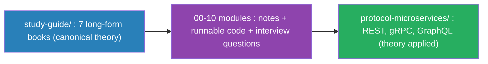

# The Architect's Path — From Junior Engineer to Senior Architect

> A structured, production-grounded study repository for engineers who want to
> stop writing code that merely *works* and start designing systems that
> **scale, survive failure, and stay maintainable**.
>
> **Stack:** Python · FastAPI · Elasticsearch / Logstash / Kibana (ELK)

---

## 1. Who This Is For

You are a competent engineer. You can ship a feature, close a ticket, and pass a
code review. The gap between you and a Senior Architect is **not** more syntax —
it is *judgment under constraints*: latency budgets, consistency trade-offs,
failure domains, cost, and team cognitive load.

This repository is the deliberate-practice curriculum to close that gap. It is
organized around **eight pillars**, each treated the way a Principal Architect
treats a design review: *what is the theory, what does production code look like,
and what will an interviewer (or an incident) ask of you?*


---

## 2. How to Use This Repository

Each topic directory is **self-contained** and follows an identical contract of
three files. Learn to expect the same shape everywhere — that consistency is
itself an architectural lesson.

| File | Purpose | How to consume it |
| --- | --- | --- |
| `production_code.py` | Runnable, review-grade reference implementation. Not toy code — includes typing, error handling, and comments that explain *why*. | Read it, run it, then break it and fix it. |
| `architectural_notes.md` | The "why" behind the code: trade-offs, failure modes, when **not** to use the approach, and how it scales. | This is where senior thinking lives. Read it slowly. |
| `interview_questions.md` | Staff/Principal-level questions with model answers and follow-up traps. | Answer out loud *before* reading the model answer. |

**Recommended cadence:** one topic per week. Read notes → study code → run code →
answer interview questions from memory → write your own variation.

---

## 3. The Curriculum Modules (00–10)

| # | Pillar | Directory | Core Question It Answers |
| --- | --- | --- | --- |
| 00 | **Python Foundations** | [`00-python-foundations/`](./00-python-foundations/) | *Am I fluent in the language everything else is built on?* |
| 01 | **Data Structures & Algorithms** | [`01-dsa/`](./01-dsa/) | *Is this operation fast enough at scale?* |
| 02 | **SOLID Principles** | [`02-solid/`](./02-solid/) | *Will this code survive change?* |
| 03 | **Design Patterns** | [`03-design-patterns/`](./03-design-patterns/) | *Has someone solved this shape of problem before?* |
| 04 | **System Design** | [`04-system-design/`](./04-system-design/) | *How do the boxes and arrows actually behave under load?* |
| 05 | **FastAPI Advanced Architecture** | [`05-fastapi-advanced/`](./05-fastapi-advanced/) | *How do I build an API that a team can own for years?* |
| 06 | **ELK Monitoring & Observability** | [`06-elk-monitoring/`](./06-elk-monitoring/) | *When it breaks at 3 AM, can I see why?* |
| 07 | **Database Scaling** | [`07-database-scaling/`](./07-database-scaling/) | *What happens when one database is no longer enough?* |
| 08 | **Event-Driven Systems** | [`08-event-driven-systems/`](./08-event-driven-systems/) | *How do services collaborate without being coupled?* |
| 09 | **Concurrency & Parallelism** | [`09-concurrency/`](./09-concurrency/) | *How do I do many things at once — correctly — under load?* |
| 10 | **Networking, Security & Testing** | [`10-networking-security-testing/`](./10-networking-security-testing/) | *Is this system secure, correctly connected, and provably tested?* |

---

## 4. The Full Learning Path — Books, Modules & Applied Repos

This repository has **three layers**, meant to be consumed in this order. Each
layer answers the same questions at a different altitude.



| Layer | Where | What it is | How to use it |
| --- | --- | --- | --- |
| **1. Books** (canonical) | [`study-guide/`](./study-guide/) | 7 book-length treatments (HTML + PDF) plus `The-Architects-Path` master overview. The long-form *narrative* — read for depth. | Read the relevant book first for the mental model. |
| **2. Modules** (practice) | `00-` … `10-` | Condensed `architectural_notes.md`, runnable `production_code.py`, `interview_questions.md`, and a self-testing `examples/` folder. | Study notes → run code → answer questions from memory. |
| **3. Applied repos** | [`protocol-microservices/`](./protocol-microservices/) | The same e-commerce system built three ways (REST / gRPC / GraphQL) so you see the concepts collide in one real codebase. | Run a stack, read the per-folder READMEs, trace a request. |

### Book → Module → Applied mapping

Start with **`The-Architects-Path`** (the master overview), then walk this table
top to bottom.

| Book (`study-guide/`) | Module(s) | Where it's applied in `protocol-microservices/` |
| --- | --- | --- |
| Book 1 — Python Mastery | [`00-python-foundations/`](./00-python-foundations/) | async/await, context-manager lifespans, factory classmethods, Pydantic boundaries |
| Book 2 — DSA | [`01-dsa/`](./01-dsa/) | bcrypt hashing, protobuf varint encoding, hash-map lookups, pagination |
| Book 3 — Concurrency | [`09-concurrency/`](./09-concurrency/) | the check-then-act oversell race in Orders `reserve_stock`; async I/O fan-out |
| Book 4 — Clean Code & Patterns | [`02-solid/`](./02-solid/) · [`03-design-patterns/`](./03-design-patterns/) | Repository, Adapter, Facade/Gateway, Strategy (retry), DI, the 3-adapter SOLID experiment |
| Book 5 — System Design | [`04-system-design/`](./04-system-design/) · [`07-database-scaling/`](./07-database-scaling/) | DB-per-service, API gateway, graph stitching, price snapshot, correlation IDs |
| Book 6 — Backend in Production | [`05-fastapi-advanced/`](./05-fastapi-advanced/) · [`06-elk-monitoring/`](./06-elk-monitoring/) · [`08-event-driven-systems/`](./08-event-driven-systems/) | layered services + DI + lifespan, JSON logging + correlation IDs, orchestration baseline |
| Book 7 — Networking, Security & Testing | [`10-networking-security-testing/`](./10-networking-security-testing/) | HTTP/1.1 vs HTTP/2 vs GraphQL, bcrypt + JWT, ASGITransport test doubles |

### Follow the concepts in either direction

Every module **and** every repo carries a `CONCEPTS.md` that cross-links the two:

- From a **module**, `CONCEPTS.md` points *forward* to the exact repo files that
  apply the idea (with an honest "what these repos do **not** demonstrate" list).
- From a **repo**, `CONCEPTS.md` points *back* to the module notes that explain
  the theory (design patterns, SOLID, system design).

> **Canonical vs reference.** The `study-guide/` books are the *canonical* source
> of truth for theory; the module folders are the *practice* layer; the repos are
> the *applied* layer. When two disagree, prefer the book for concepts and the
> repo for how it really wires together. `The-Architects-Path` is a high-level
> map — an overview, not a replacement for the individual books.

---

## 5. Repository Structure

```
system-design/
├── README.md                          # You are here — the blueprint
│
├── study-guide/                       # 7 long-form "books" (HTML + PDF) — the canonical theory
├── protocol-microservices/            # 3 applied repos (REST · gRPC · GraphQL) — the concepts in a real system
│
├── 00-python-foundations/             # The language itself (companion to Book I — Python Mastery)
│   ├── fundamentals.py                # types, control flow, collections, functions, files, errors
│   ├── oop.py                         # four pillars, dunder methods, dataclasses
│   ├── iterators_generators_decorators.py
│   ├── advanced_dunder.py             # eq/hash, ordering, containers, context managers, __call__
│   ├── descriptors_slots_meta.py      # descriptors, __slots__, decorators-with-args, metaclasses
│   └── typing_and_memory.py           # generics, Protocols, context managers, refcounting, GC, weakref
│
├── 01-dsa/
│   ├── production_code.py             # LRU cache, rate limiter, trie, graph BFS/DFS
│   ├── architectural_notes.md         # Big-O as a budgeting tool; when O(n²) is fine
│   ├── interview_questions.md
│   └── examples/                      # DSA Masterclass (Book II) — from-scratch, self-testing
│       ├── data_structures.py         # linked lists, LRU, stack/queue/ring, BST, heap
│       ├── hash_tables.py             # dict from scratch: chaining & open addressing, resize
│       ├── balanced_trees.py          # AVL tree with four rotations; height stays log n
│       ├── heaps.py                    # binary min-heap, sift up/down, O(n) heapify, heapsort
│       ├── tries.py                    # prefix tree: insert/search/starts_with/autocomplete
│       ├── bit_manipulation.py        # XOR loner, subset masks, popcount, power-of-two
│       ├── sorting_searching.py       # 5 sorts + binary search (property-tested)
│       ├── recursion_dp_greedy_backtracking.py
│       └── graphs.py                  # BFS/DFS, topo sort, Dijkstra, MST
│
├── 02-solid/
│   ├── production_code.py             # Payment processor refactored across all 5 principles
│   ├── architectural_notes.md         # SOLID as coupling/cohesion levers, not dogma
│   ├── interview_questions.md
│   └── examples/                      # SOLID Masterclass (Book IV) — self-testing
│       └── solid_principles.py        # the five principles, one smell→fix each
│
├── 03-design-patterns/
│   ├── production_code.py             # Strategy, Factory, Observer, Adapter, Circuit Breaker
│   ├── architectural_notes.md         # Patterns as vocabulary; the cost of over-patterning
│   ├── interview_questions.md
│   └── examples/                      # All 23 Gang-of-Four patterns, self-testing
│       ├── creational.py              # Factory Method, Abstract Factory, Builder, Prototype, Singleton
│       ├── structural.py              # Adapter, Bridge, Composite, Decorator, Façade, Flyweight, Proxy
│       └── behavioral.py              # the 11 behavioral patterns (Chain … Visitor)
│
├── 04-system-design/
│   ├── production_code.py             # Consistent hashing + token-bucket + idempotency keys
│   ├── architectural_notes.md         # CAP, back-of-envelope math, failure domains
│   ├── interview_questions.md
│   └── examples/                      # System Design Masterclass (Book V) — self-testing
│       ├── consistent_hashing.py      # hash ring; scaling moves ~1/N keys, not all
│       ├── load_balancing.py          # round-robin, weighted, least-conn, key-hash
│       ├── caching_strategies.py      # LRU/LFU eviction + cache-aside read path
│       ├── rate_limiting.py           # fixed/sliding window, token bucket (fake clock)
│       └── bloom_filter.py            # probabilistic membership; no false negatives
│
├── 05-fastapi-advanced/
│   ├── production_code.py             # Layered app: routers, services, repos, DI, lifespan
│   ├── architectural_notes.md         # Dependency injection, boundaries, testability
│   ├── interview_questions.md
│   └── examples/                      # Backend in Production (Book VI) — self-testing
│       ├── pagination.py              # offset vs cursor (keyset); measures deep-page scan
│       └── retry_backoff.py           # backoff+jitter + circuit breaker (fake clock)
│
├── 06-elk-monitoring/
│   ├── production_code.py             # Structured JSON logging + correlation IDs → ELK
│   ├── architectural_notes.md         # Logs vs metrics vs traces; index lifecycle
│   ├── interview_questions.md
│   └── examples/
│       └── structured_logging.py      # JSON logs + correlation IDs + RED metrics, redaction
│
├── 07-database-scaling/
│   ├── production_code.py             # Read replicas router, sharding key, outbox pattern
│   ├── architectural_notes.md         # Replication, partitioning, CQRS, consistency
│   ├── interview_questions.md
│   └── examples/
│       ├── connection_pool.py         # pooling, leak-safety, exhaustion
│       └── outbox_pattern.py          # transactional outbox; no lost/phantom events
│
└── 08-event-driven-systems/
    ├── production_code.py             # Producer/consumer, saga, idempotent handler
    ├── architectural_notes.md         # Choreography vs orchestration, delivery guarantees
    ├── interview_questions.md
    └── examples/                      # EDA deep dive — runs without a real broker
        ├── idempotent_consumer.py     # partitioned retained log, at-least-once, DLQ, replay
        ├── event_sourcing_cqrs.py     # event store, projections, CQRS, snapshots
        └── saga.py                    # orchestrated saga with compensations

├── 09-concurrency/
│   └── examples/                      # Concurrency & parallelism — companion to Book III
│       ├── threads_processes.py       # threads for I/O, processes for CPU, the GIL, futures
│       ├── synchronization.py         # race conditions, Lock/RLock/Semaphore/Event, Queue, deadlock
│       └── async_io.py                # event loop, gather, asyncio.Lock/Queue, timeouts
│
└── 10-networking-security-testing/
    └── examples/                      # Networking, Security & Testing — companion to Book VII
        ├── http_parsing.py            # parse an HTTP/1.1 request & build a response by hand
        ├── jwt_auth.py                # sign/verify a JWT from scratch; tamper & expiry checks
        ├── password_hashing.py        # salted, slow PBKDF2 + constant-time verify
        ├── sql_injection.py           # injection vs parameterized queries (OWASP)
        └── test_doubles.py            # test pyramid: stub, mock, integration, property-based
```

---

## 6. Getting Started

```bash
# 1. Create an isolated environment
python -m venv .venv
source .venv/bin/activate            # Windows: .venv\Scripts\Activate.ps1

# 2. Install the shared toolchain
pip install -r requirements.txt

# 3. Run any topic's reference implementation
python 01-dsa/production_code.py
python 05-fastapi-advanced/production_code.py   # starts a local FastAPI app

# 4. Spin up ELK locally (for topic 06) — optional
docker compose -f 06-elk-monitoring/docker-compose.yml up -d
```

### `requirements.txt`

```
fastapi>=0.110
uvicorn[standard]>=0.29
pydantic>=2.6
sqlalchemy>=2.0
httpx>=0.27
python-json-logger>=2.0
elasticsearch>=8.13
pytest>=8.0
```

---

## 7. The Mental Models to Internalize

These recur across every pillar. If you take nothing else, take these.

1. **Everything is a trade-off.** There is no "best" — only "best given these
   constraints." A senior answer always names what it is *giving up*.
2. **Latency, consistency, and availability form a budget.** You spend from it;
   you cannot get all three for free (CAP / PACELC).
3. **Design for failure, not for the happy path.** Retries, timeouts, idempotency,
   and back-pressure are load-bearing, not decoration.
4. **Coupling is the enemy of change.** Most architecture is the art of drawing
   boundaries so that change stays local.
5. **You cannot fix what you cannot see.** Observability is a first-class feature,
   not an afterthought (this is why ELK is a full pillar).
6. **Optimize for the reader.** Code is read far more than written; the same is
   true of systems, which are *operated* far more than they are built.

---

## 8. How to Know You've Leveled Up

| Junior mindset | Senior / Architect mindset |
| --- | --- |
| "It works on my machine." | "It works under load, and degrades gracefully when it doesn't." |
| "Which library should I use?" | "What are the failure modes of this dependency?" |
| "The requirement says X." | "The requirement implies a consistency and latency contract — let me name it." |
| "Add a cache." | "A cache introduces a second source of truth. Here's the invalidation strategy." |
| "It's done." | "It's observable, documented, load-tested, and on-call can operate it." |

---

## 9. Contributing to Your Own Learning

Treat this repo as a living lab notebook:

- After each incident or hard bug at work, add a note to the relevant pillar.
- Rewrite a `production_code.py` from scratch without looking. If you can't,
  you don't understand it yet.
- Teach one topic to a colleague. Teaching exposes the gaps.

---

> *"The architect's job is not to make decisions, but to make the trade-offs
> explicit so the right decision becomes obvious."*

**Happy building. See you on the other side of the gap.**
