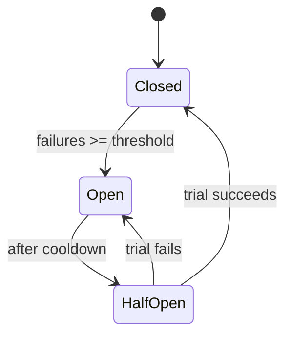
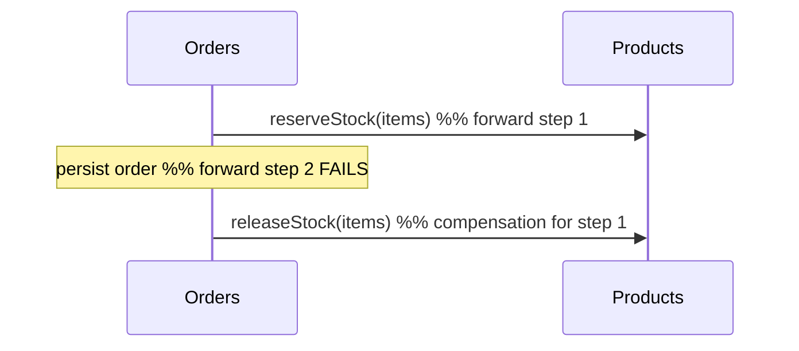
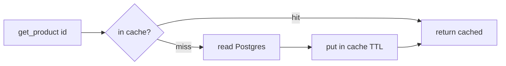
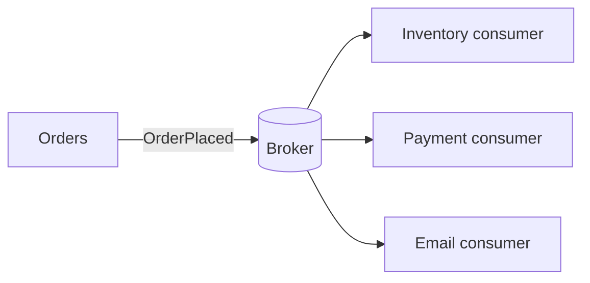
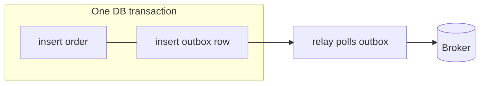

# Advanced Patterns — Reference (not yet wired into the running system)

> **What this is.** The three e-commerce repos (`rest-ecommerce`, `grpc-ecommerce`,
> `graphql-ecommerce`) are deliberately a *baseline*: synchronous, orchestrated,
> single-database-per-service CRUD. That baseline is the honest starting point —
> and the honest **gap** is that several production-grade patterns are **taught in
> the curriculum but not applied here**.
>
> This document closes that gap **on paper**: for each pattern it shows *where it
> would slot into this exact system*, a **minimal illustrative sketch** (reference
> only — intentionally NOT stood up as infrastructure), and a link to the
> **runnable** version in the curriculum. Nothing here changes the running repos;
> it is the "here is how you would take the next step" map.

Curriculum sources (runnable, self-testing):
[03-design-patterns](../03-design-patterns/) ·
[04-system-design](../04-system-design/) ·
[06-elk-monitoring](../06-elk-monitoring/) ·
[07-database-scaling](../07-database-scaling/) ·
[08-event-driven-systems](../08-event-driven-systems/) ·
[10-networking-security-testing](../10-networking-security-testing/)

---

## Map: pattern → where it slots in → runnable reference

| Pattern | The gap today | Where it would go | Runnable reference |
|---|---|---|---|
| Circuit Breaker | **IMPLEMENTED** — per-dependency breaker fails fast when a downstream is down (see [HARDENING.md](HARDENING.md)) | `services/orders/app/circuit_breaker.py` + `clients.py` | [05-fastapi-advanced/examples/retry_backoff.py](../05-fastapi-advanced/examples/retry_backoff.py) |
| Saga + compensation | **IMPLEMENTED** — `place_order` releases reserved stock on partial failure (see [HARDENING.md](HARDENING.md)) | `services/orders/app/service.py` | [08-event-driven-systems/examples/saga.py](../08-event-driven-systems/examples/saga.py) |
| Idempotency keys | Retrying `POST /orders` can create duplicate orders | Orders write path + a small idempotency store | [04-system-design/production_code.py](../04-system-design/production_code.py) |
| Cache-aside | Every `get_product` hits Postgres | Products read path (+ gateway) | [04-system-design/examples/caching_strategies.py](../04-system-design/examples/caching_strategies.py) |
| Event-driven / broker | Checkout is synchronous orchestration; a slow consumer stalls the buyer | Orders emits `OrderPlaced`; consumers react | [08-event-driven-systems/examples/idempotent_consumer.py](../08-event-driven-systems/examples/idempotent_consumer.py) |
| Transactional outbox | "Write DB **and** publish event" is not atomic | Orders DB + an `outbox` table + relay | [07-database-scaling/examples/outbox_pattern.py](../07-database-scaling/examples/outbox_pattern.py) |
| Read replicas | All reads and writes hit one primary | Repository read/write routing | [07-database-scaling/production_code.py](../07-database-scaling/production_code.py) |
| Sharding / consistent hashing | One DB per service caps a single service's write volume | Partition by a shard key (e.g. `user_id`) | [04-system-design/examples/consistent_hashing.py](../04-system-design/examples/consistent_hashing.py) |
| CQRS / event sourcing | Reads and writes share one model | A projected read model fed by events | [08-event-driven-systems/examples/event_sourcing_cqrs.py](../08-event-driven-systems/examples/event_sourcing_cqrs.py) |
| TLS / mTLS | Service-to-service traffic is plaintext HTTP/HTTP2 | Gateway↔service transport / a mesh sidecar | [10-networking-security-testing/architectural_notes.md](../10-networking-security-testing/architectural_notes.md) |
| ELK wiring | Services emit JSON logs that go nowhere | `observability.py` output → Logstash → Elasticsearch → Kibana | [06-elk-monitoring/production_code.py](../06-elk-monitoring/production_code.py) |

---

## 1. Circuit Breaker

> **Status: now implemented in all three repos.** The illustrative sketch below
> remains for teaching, but the real, tested breaker lives at
> `services/orders/app/circuit_breaker.py` and is wired into the downstream
> client path. See [HARDENING.md](HARDENING.md) for the why/what/how.

**Today.** `services/orders/app/clients.py` retries transient failures with
backoff. But if Products is *down* (not flaky), every checkout still pays the
full retry budget before failing — the classic *retry storm* that turns a partial
outage into a total one.

**The fix.** Wrap the downstream call in a breaker: after *N* consecutive
failures the breaker **opens** and fails fast for a cooldown window, then lets a
single trial request through (**half-open**) to test recovery.



```python
# ILLUSTRATIVE — a breaker around the existing retry client. Reference only.
class CircuitBreaker:
    def __init__(self, threshold: int = 5, cooldown: float = 10.0) -> None:
        self._threshold, self._cooldown = threshold, cooldown
        self._failures = 0
        self._opened_at: float | None = None

    def _state(self, now: float) -> str:
        if self._opened_at is None:
            return "closed"
        return "half_open" if now - self._opened_at >= self._cooldown else "open"

    async def call(self, fn, *args, now: float):
        if self._state(now) == "open":
            raise DownstreamUnavailable("circuit open — failing fast")
        try:
            result = await fn(*args)
        except Exception:
            self._failures += 1
            if self._failures >= self._threshold:
                self._opened_at = now  # trip the breaker
            raise
        self._failures, self._opened_at = 0, None  # success closes it
        return result
```

Put one breaker **per downstream** (Users, Products) so a Products outage cannot
starve Users calls. Runnable version with jitter:
[05-fastapi-advanced/examples/retry_backoff.py](../05-fastapi-advanced/examples/retry_backoff.py).

---

## 2. Saga with compensation

> **Status: now implemented in all three repos.** `place_order` tracks every
> stock reservation and releases them on any failure. The sketch below remains
> for teaching; the real, tested code lives in `services/orders/app/service.py`
> and a new `releaseStock` operation on Products. See [HARDENING.md](HARDENING.md).

**Today.** `services/orders/app/service.py` does `validate buyer → reserve stock
→ persist order`. If persisting the order fails **after** stock was reserved, the
reservation leaks — inventory is silently lost. Orchestration without
*compensation* is only half a saga.

**The fix.** Record each completed step and, on failure, run the registered
**compensating action** in reverse order.



```python
# ILLUSTRATIVE — a tiny saga runner. Reference only.
class Saga:
    def __init__(self) -> None:
        self._undo: list = []

    async def step(self, do, undo):
        result = await do()
        self._undo.append(undo)  # remember how to roll this back
        return result

    async def compensate(self) -> None:
        for undo in reversed(self._undo):  # LIFO: unwind newest first
            await undo()


# usage inside place_order:
#   saga = Saga()
#   try:
#       await saga.step(lambda: products.reserve(items),
#                       lambda: products.release(items))
#       await saga.step(lambda: repo.persist(order), lambda: repo.delete(order.id))
#   except Exception:
#       await saga.compensate(); raise
```

Runnable orchestrated saga with compensations:
[08-event-driven-systems/examples/saga.py](../08-event-driven-systems/examples/saga.py).

---

## 3. Idempotency keys

**Today.** A client that times out and retries `POST /orders` can place the
**same order twice** — the write path is not idempotent. (Note: the *price
snapshot* on `OrderItem` makes an order immutable once written, which is related
but different — it does not stop a duplicate *create*.)

**The fix.** The client sends an `Idempotency-Key` header (a UUID it generates
once per intent). The server stores `key → response`; a repeat key returns the
**stored** response instead of doing the work again.

```python
# ILLUSTRATIVE — a dependency/guard around the create handler. Reference only.
async def place_order(payload, idempotency_key: str, store, svc):
    if (cached := await store.get(idempotency_key)) is not None:
        return cached  # replay the first result, no re-charge
    result = await svc.place_order(payload)
    await store.put(idempotency_key, result, ttl=86_400)
    return result
```

The store is typically Redis with a TTL. Key insight: idempotency is a **write**
concern; combine it with at-least-once retries so "try again" is always safe.
Runnable idempotency-key handling:
[04-system-design/production_code.py](../04-system-design/production_code.py).

---

## 4. Cache-aside (read-through caching)

**Today.** `services/products/app/` reads every product from Postgres. Hot
products (a homepage bestseller) hammer the primary on every request.

**The fix.** *Cache-aside*: check the cache first; on a miss, read the DB and
populate the cache with a TTL. Invalidate (or let the TTL expire) on write.



```python
# ILLUSTRATIVE — wraps the repository read. Reference only.
async def get_product(product_id: str, cache, repo):
    if (hit := await cache.get(product_id)) is not None:
        return hit
    product = await repo.get(product_id)  # miss → source of truth
    if product is not None:
        await cache.set(product_id, product, ttl=60)
    return product
```

The trade-off a senior always names: a cache is a **second source of truth**, so
you own an **invalidation strategy** (here: short TTL + invalidate on
`reserve_stock`). Runnable LRU/LFU + cache-aside:
[04-system-design/examples/caching_strategies.py](../04-system-design/examples/caching_strategies.py).

---

## 5. Event-driven checkout (message broker)

**Today.** Checkout is **synchronous orchestration**: the buyer waits while
Orders calls Products (and would call Payments, Email, …). Every added step adds
latency and a new failure mode on the critical path. The repos are a good
*counter-example* baseline (see [08's CONCEPTS](../08-event-driven-systems/CONCEPTS.md)).

**The fix.** Orders commits the order and **publishes `OrderPlaced`** to a broker
(Kafka/RabbitMQ). Inventory, payment, and email react **asynchronously**. The
buyer’s request returns as soon as the order is durably recorded.



Consumers must be **idempotent** (at-least-once delivery means duplicates) and
have a **dead-letter queue** for poison messages. Runnable partitioned log with
at-least-once + DLQ + replay:
[08-event-driven-systems/examples/idempotent_consumer.py](../08-event-driven-systems/examples/idempotent_consumer.py).

---

## 6. Transactional outbox

**Today.** If Orders tried to "write the order **and** publish `OrderPlaced`", a
crash between the two would either lose the event or publish one for an order
that rolled back — the **dual-write** problem.

**The fix.** Write the event into an `outbox` table **in the same DB transaction**
as the order. A separate relay polls the outbox and publishes, marking rows sent.
The DB commit is the single source of truth; publishing becomes retryable.



Runnable outbox with no lost/phantom events:
[07-database-scaling/examples/outbox_pattern.py](../07-database-scaling/examples/outbox_pattern.py).

---

## 7. Read replicas (read/write split)

**Today.** Every repository call — read or write — hits one primary DB.

**The fix.** Route writes to the primary and reads to a replica. The catch a
senior names: **replication lag** means read-your-writes is not guaranteed, so
route reads that must be fresh (e.g. immediately after a write) back to the
primary.

```python
# ILLUSTRATIVE — a repository that picks an engine by intent. Reference only.
class RoutingRepository:
    def __init__(self, primary, replica) -> None:
        self._primary, self._replica = primary, replica

    def _engine(self, *, write: bool):
        return (
            self._primary if write else self._replica
        )  # lag-aware callers pass write=True
```

Runnable replica router + sharding key + outbox:
[07-database-scaling/production_code.py](../07-database-scaling/production_code.py).

---

## 8. Sharding & consistent hashing

**Today.** DB-per-service caps *cross-service* coupling, but a single hot service
(say Orders) is still one database. Beyond one box you must **partition**.

**The fix.** Choose a shard key (e.g. `user_id`) and map keys to shards with
**consistent hashing** so adding a shard moves only ~`1/N` of keys instead of
rehashing everything. Trade-off: cross-shard queries and transactions get hard —
pick a key that keeps most access single-shard.

Runnable hash ring (scaling moves ~1/N keys):
[04-system-design/examples/consistent_hashing.py](../04-system-design/examples/consistent_hashing.py).

---

## 9. CQRS / event sourcing

**Today.** One model serves both reads and writes. Complex read shapes (an order
history dashboard) force awkward joins onto the write model.

**The fix.** **CQRS** splits them: the write side emits events; a **projection**
builds a read-optimized model. **Event sourcing** goes further — the event log
*is* the source of truth and current state is a fold over events (with snapshots
for speed). Cost: eventual consistency and more moving parts; use it where the
read/write shapes genuinely diverge, not by default.

Runnable event store + projections + CQRS + snapshots:
[08-event-driven-systems/examples/event_sourcing_cqrs.py](../08-event-driven-systems/examples/event_sourcing_cqrs.py).

---

## 10. TLS / mTLS

**Today.** The gateway talks to services over plaintext HTTP/1.1 (REST/GraphQL)
or HTTP/2 (gRPC). Inside a trusted network that is common, but zero-trust
architectures encrypt **and authenticate** every hop.

**The fix.** **TLS** gives confidentiality + integrity + server identity (the
client verifies the server's cert). **mTLS** adds *client* identity — both sides
present certificates — which is how service meshes (Istio/Linkerd) let a service
prove *which* peer is calling without passing a token. In this system that would
sit at the gateway↔service boundary, typically terminated by a sidecar so app
code stays unchanged. Conceptual treatment (no infra stood up):
[10-networking-security-testing/architectural_notes.md](../10-networking-security-testing/architectural_notes.md).

---

## 11. Wiring the ELK half

**Today.** Every service already emits **structured JSON logs** with a
correlation ID (`observability.py`). They print to stdout and stop there — the
platform half (Elasticsearch/Logstash/Kibana) is not connected.

**The fix.** Ship those logs into the stack: container stdout → a shipper
(Filebeat/Fluent Bit) or Logstash → Elasticsearch (index + retention lifecycle)
→ Kibana (search + dashboards). Because the logs are *already* JSON with a
correlation ID, tracing one request across all four services is a single Kibana
query — the design work is already done; only the pipeline is missing.


Runnable structured logging + correlation IDs + RED metrics + redaction:
[06-elk-monitoring/production_code.py](../06-elk-monitoring/production_code.py).

---

> **The senior framing.** None of these is "always correct." Each buys a property
> (resilience, throughput, decoupling, security) at a cost (latency, eventual
> consistency, operational surface, cognitive load). The baseline repos ship the
> *happy path* on purpose so these trade-offs are visible as deliberate next
> steps rather than hidden defaults.
