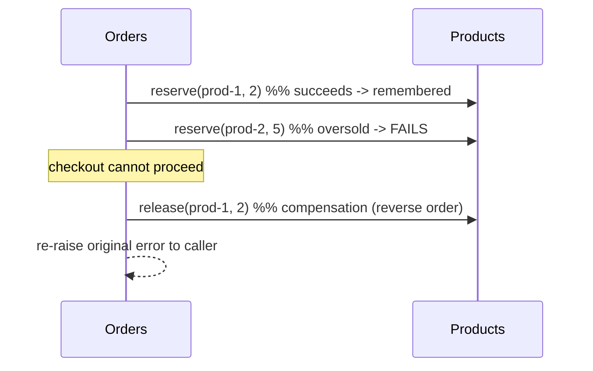
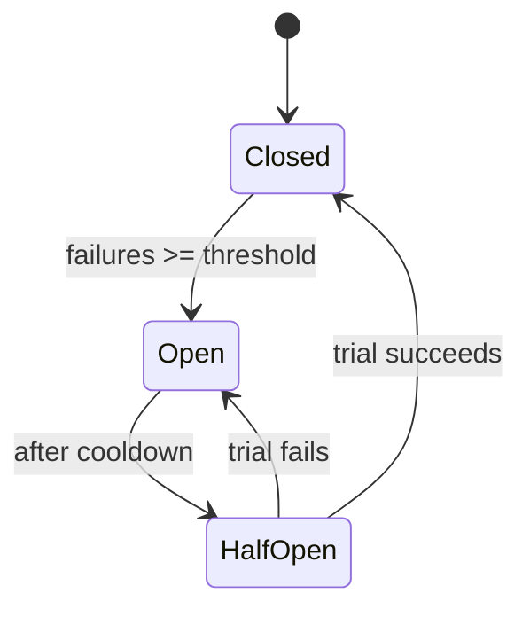

# Hardening Pass — Saga Compensation & Circuit Breaker

> **What this is.** A principal-architect review of these three repos flagged two
> distributed-systems gaps that changed the *lesson the code taught*:
>
> 1. **Partial-failure without compensation** — `place_order` reserved stock on a
>    remote service in a bare loop and never undid it if a later step failed, so a
>    failed checkout silently *leaked inventory*.
> 2. **Retries without a circuit breaker** — when a downstream was hard-down,
>    every checkout still paid the full retry budget, amplifying load on the very
>    dependency that was already failing (a *retry storm*).
>
> This pass closes both **in real, tested code**, mirrored across all three
> protocols (REST, gRPC, GraphQL). This document explains the **why, what, and
> how** of each change.

---

## Change 1 — Saga with compensating actions

### Why

Placing an order is a mini **distributed transaction**: it reserves stock on the
Products service (a *remote mutation*) once per line item, then persists the order
locally. There is no shared database transaction across services, so the usual
`BEGIN … COMMIT/ROLLBACK` cannot help. If item 2 is oversold *after* item 1 was
reserved — or if persisting the order fails after every reservation succeeded —
the already-reserved units were never released. Inventory silently disappears,
and the bug is invisible until stock counts drift.

The **Saga pattern** is the standard answer: when you cannot get one atomic
transaction, model the flow as a sequence of steps, each with a **compensating
action** that undoes it, and run the compensations (in reverse) on failure.

### What

- A new **`release` (compensation) operation** on the Products service that adds
  units back to stock — the inverse of `reserve`.
- `place_order` now **tracks every successful reservation** and, on *any*
  exception, releases them all before re-raising the original error. The caller
  still sees the same error (e.g. `409 / FAILED_PRECONDITION`); the difference is
  that inventory is no longer leaked.

Releasing is deliberately **safe and idempotent-friendly**: it only ever
*increases* stock, and it tolerates a now-missing product (there is simply nothing
to release). Those two properties are exactly what make it a valid compensation.



### How (per protocol)

| Concern | REST (`rest-ecommerce`) | gRPC (`grpc-ecommerce`) | GraphQL (`graphql-ecommerce`) |
|---|---|---|---|
| New Products operation | `POST /products/{id}/release` | `rpc ReleaseStock` (added to `protos/products.proto`, stubs regenerated) | `releaseStock` mutation |
| Products service method | `ProductService.release_stock` | `ProductService.release_stock` | `ProductService.release_stock` |
| Orders client method | `ProductsClient.release` | `ProductsGrpcClient.release` | `ProductsGraphQLClient.release` |
| Orchestration | `OrderService.place_order` + `_compensate` | same | same |

Key implementation points, identical across all three:

- **Best-effort compensation.** `_compensate` catches and *logs* any error from a
  release and continues — compensation must never mask the original failure. It
  releases in **reverse order** (LIFO), which is intuitive when a product repeats.
- **Tolerant release.** A `404` / `NOT_FOUND` / GraphQL "not found" during release
  is swallowed (nothing to give back).
- **No new dependencies.** Pure application logic over the existing clients.

Representative code — `services/orders/app/service.py`:

```python
reserved: list[tuple[str, int]] = []
try:
    for line in items:
        await self._products.reserve(line.product_id, line.quantity)
        reserved.append((line.product_id, line.quantity))
        ...
    return await self._repo.add(order)          # persist
except Exception:
    await self._compensate(reserved)            # release everything reserved
    raise                                       # original error still propagates
```

---

## Change 2 — Circuit breaker per downstream dependency

### Why

The Orders clients already retried transient failures with exponential backoff —
good for a *flaky* dependency, but actively harmful for a *dead* one. If Products
is down, every checkout still burns its full retry budget (N attempts × backoff)
before failing, and all that doomed traffic piles onto the struggling service.
The result is worse latency for us and a retry storm for them.

A **circuit breaker** gives the client a short memory of recent failures so that,
once a dependency looks dead, calls **fail fast** instead of queuing more doomed
work.

### What

A tiny, self-contained **three-state machine**, one instance **per downstream
dependency** (Users, Products), so a Products outage cannot starve Users calls:



- **CLOSED** — calls flow through; consecutive failures are counted.
- **OPEN** — after `cb_failure_threshold` consecutive failures, reject calls
  immediately (no network) for `cb_recovery_seconds`.
- **HALF_OPEN** — after the cooldown, admit exactly **one** trial call; success
  closes the breaker, failure re-opens it.

### How

The breaker lives in `services/orders/app/circuit_breaker.py` (identical in all
three repos) and is wired into the **shared client call path** so every downstream
call is guarded:

| Concern | REST | gRPC | GraphQL |
|---|---|---|---|
| Guarded call path | `_request_with_retry(..., breaker)` | `_call_with_retry(..., breaker)` | `_post_graphql(..., breaker)` |
| Counts as **failure** | network error / 5xx on every attempt | transient code (`UNAVAILABLE`, `DEADLINE_EXCEEDED`) exhausting retries | transport / HTTP-status error exhausting retries |
| Counts as **success** (dependency healthy) | 2xx–4xx (4xx = caller's fault) | any *answered* RPC, incl. business errors like `NOT_FOUND` | clean HTTP 200, even one carrying GraphQL `errors` |

The success/failure classification is the subtle part and is deliberate: a
**business error means the dependency is healthy** (it answered), so it must *not*
trip the breaker. Only genuine transport/server failures do.

Design decisions worth calling out:

- **In-process, per worker.** The breaker is a plain in-memory object. A breaker
  shared across replicas would need a coordination store (e.g. Redis) — out of
  scope here and noted as a scaling step in
  [ADVANCED-PATTERNS.md](ADVANCED-PATTERNS.md#1-circuit-breaker).
- **Monotonic clock + lock.** Transitions use `time.monotonic()` (immune to
  wall-clock jumps) under a `threading.Lock`, so concurrent coroutines agree on
  the state and only one trial probe is admitted in HALF_OPEN.
- **Configurable.** `cb_failure_threshold` (default 5) and `cb_recovery_seconds`
  (default 30) are settings on the Orders service, overridable via env.
- **No new dependencies.** Standard library only (`threading`, `time`, `enum`).

---

## Tests

Every repo gained the same coverage (all suites green):

- **Circuit breaker unit tests** — `services/orders/tests/test_circuit_breaker.py`
  (5 tests): opens after threshold, rejects fast while open, success resets the
  streak, half-open closes on a good trial, half-open re-opens on a bad trial.
- **Saga compensation test** — in `services/orders/tests/test_orders.py`: a
  two-item checkout whose second line is oversold must fail *and* leave the first
  product's stock restored to its original value (proving the release ran).
- **Release operation test** — in `services/products/tests/`: reserve then release
  returns stock to its starting level.

### Test-count impact

| Repo | Before | After | Added |
|---|---|---|---|
| `rest-ecommerce` | 34 | 41 | +7 |
| `grpc-ecommerce` | 35 | 42 | +7 |
| `graphql-ecommerce` | 37 | 44 | +7 |
| **Total** | **106** | **127** | **+21** |

Per repo the +7 is: 5 circuit-breaker unit tests + 1 saga-compensation test + 1
Products release test.

---

## What is intentionally still open

- The compensation is **best-effort in-process**. A crash *between* a failed
  persist and its compensation would still leak (the durable fix is the
  **transactional outbox** + an async compensator, see
  [ADVANCED-PATTERNS.md](ADVANCED-PATTERNS.md#6-transactional-outbox)).
- The breaker is **per process**, not cluster-wide (see above).
- `reserve`/`release` are not yet **idempotent by key**, so a retried release
  could over-credit stock under adversarial timing; pairing them with
  **idempotency keys** ([ADVANCED-PATTERNS.md](ADVANCED-PATTERNS.md#3-idempotency-keys))
  is the next step.

These are deliberate boundaries for a teaching baseline, now documented rather
than implied.
