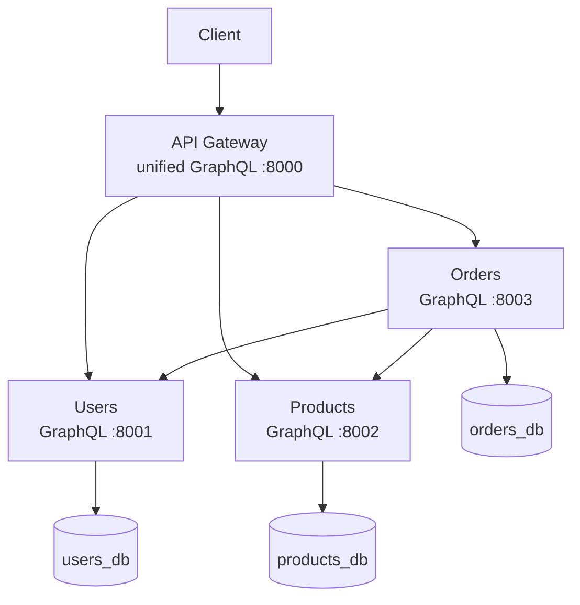
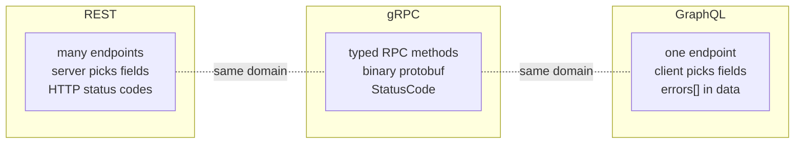

# GraphQL E-commerce Microservices

A production-grade, multi-service e-commerce backend where **every service speaks
GraphQL** and the Gateway composes them into a **single unified graph**. It is one
of three sibling repos implementing the *identical* domain over different
protocols so they can be compared directly:

| Repo | Transport | Contract |
| --- | --- | --- |
| `rest-ecommerce` | HTTP/JSON | OpenAPI (implicit) |
| `grpc-ecommerce` | gRPC / HTTP-2 | Protocol Buffers |
| **`graphql-ecommerce`** (this) | **GraphQL** | **SDL schema (Strawberry)** |

---

## 1. Topology



The Gateway is the only public component; every service exposes a single
`/graphql` endpoint.

---

## 2. What's inside

```
graphql-ecommerce/
├── services/
│   ├── users/              # UserService graph (Query/Mutation)
│   ├── products/           # ProductService graph + reserveStock
│   └── orders/             # OrderService graph AND GraphQL client
├── gateway/                # unified graph stitching all three services
├── infra/postgres/         # init-databases.sql (3 databases)
├── docs/                   # ARCHITECTURE.md + REQUEST-LIFECYCLE.md
├── docker-compose.yml      # postgres + 3 services + gateway
└── Makefile                # up / down / test / logs
```

Each folder has its own `README.md` explaining the code with Mermaid diagrams.

---

## 3. REST vs gRPC vs GraphQL — what actually changed



| Concern | REST | gRPC | GraphQL |
| --- | --- | --- | --- |
| Endpoints | many URLs | service methods | **one `/graphql`** |
| Field selection | server decides | server decides | **client decides** |
| Wire format | JSON | protobuf | JSON |
| Contract | implicit | `.proto` codegen | SDL (from Python types) |
| Business errors | HTTP status | `StatusCode` | `errors[]` (HTTP 200) |
| Aggregation | bespoke `/aggregate` route | bespoke aggregate RPC | **nested fields, resolved on demand** |

The **business logic layer is identical across all three** — only the transport
adapter differs.

---

## 4. The GraphQL headline feature

Ask for an order, its buyer, and each line's product **in one round trip**, and
the Gateway fans out to three services — fetching only the fields you requested:

```graphql
query {
  order(id: "…") {
    totalCents
    buyer { fullName }
    items { quantity product { name priceCents } }
  }
}
```

No custom aggregation endpoint required — the graph *is* the aggregation.

> **Studying the concepts?** [CONCEPTS.md](CONCEPTS.md) maps every **design
> pattern**, **SOLID** principle, **system-design** idea, and (the few) genuine
> **DSA** touch-points in this repo to the exact file that demonstrates them —
> including the GraphQL-specific ones (graph stitching, the N+1 problem,
> errors-in-body, graph/tree traversal) — and cross-links to the `02`/`03`/`04`
> curriculum folders.

---

## 5. Quick start (Docker)

```bash
cp .env.example .env
docker compose up --build -d      # postgres + 3 GraphQL services + gateway
curl http://localhost:8000/health
```

Then open `http://localhost:8000/graphql` for the GraphiQL explorer and run the
composition query above.

---

## 6. Local development & tests

The `.venv/` here has the toolchain (strawberry-graphql, fastapi, sqlalchemy,
httpx, pytest…).

```powershell
cd services\orders
..\..\.venv\Scripts\python.exe -m pytest -q
```

**Test counts:** Users 7 · Products 8 · Orders 8 · Gateway 6 = **29 tests**.

Each suite runs against fake in-process GraphQL dependencies, so no Postgres or
Docker is needed to run them.

---

## 7. Learn the internals

- [docs/ARCHITECTURE.md](docs/ARCHITECTURE.md) — single-graph design, layering, composition.
- [docs/REQUEST-LIFECYCLE.md](docs/REQUEST-LIFECYCLE.md) — placing and reading an order end to end.
- Per-folder READMEs: [services/users/README.md](services/users/README.md), [services/products/README.md](services/products/README.md), [services/orders/README.md](services/orders/README.md), [gateway/README.md](gateway/README.md).
