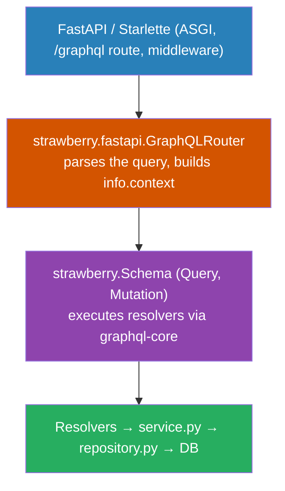
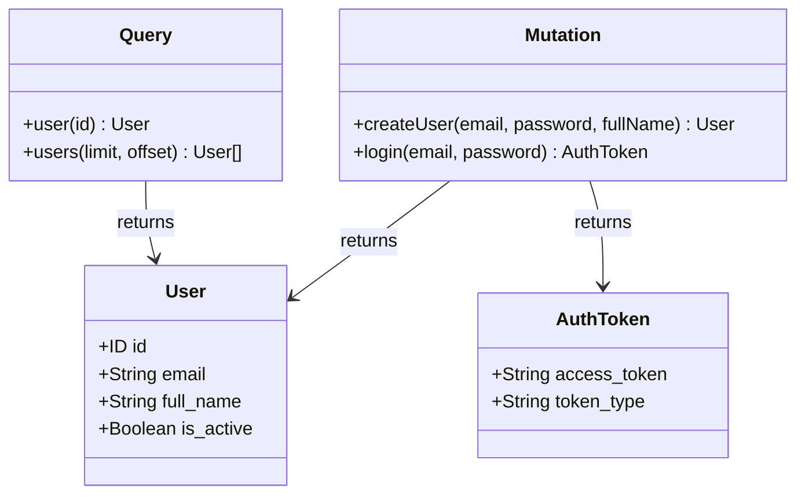
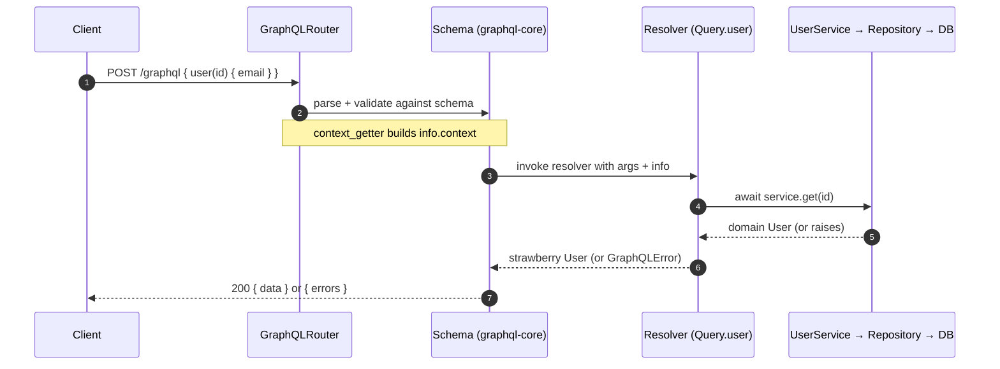
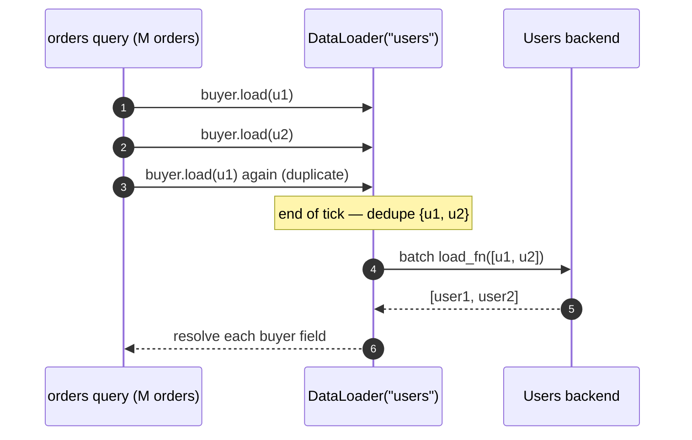
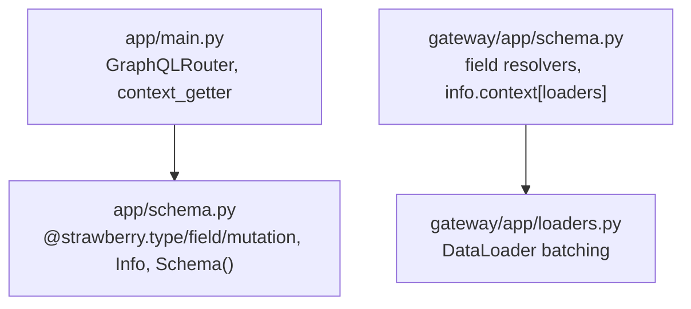

# Strawberry in the GraphQL edition — how it works & how this service uses it

> **TL;DR.** Strawberry is a **code-first** GraphQL library: you describe the
> schema with Python classes, type hints, and decorators, and Strawberry turns
> them into a GraphQL schema executed by `graphql-core`. It is served over HTTP
> by mounting a `strawberry.fastapi.GraphQLRouter` onto a FastAPI/Starlette app.
> This document explains the Strawberry pieces this repo uses and points at the
> exact files.

---

## 1. The layered picture



The schema is the GraphQL equivalent of the REST edition's routers or the gRPC
edition's servicer: it is the **transport adapter** that opens a DB session,
calls the transport-agnostic service, and translates domain exceptions into
`GraphQLError`s.

---

## 2. Code-first: decorators *are* the schema

You never hand-write a `.graphql` SDL file. Strawberry reads your annotated
classes and derives the schema:



That diagram is a literal reading of
[services/users/app/schema.py](services/users/app/schema.py).

---

## 3. The Strawberry API surface this repo uses

| Symbol | What it does | Used in |
| --- | --- | --- |
| `@strawberry.type` | turn a class into a GraphQL object type | [services/users/app/schema.py](services/users/app/schema.py) |
| `@strawberry.type(description=...)` | same, with schema docs surfaced in GraphiQL | [services/orders/app/schema.py](services/orders/app/schema.py) |
| `strawberry.ID` | the GraphQL `ID` scalar for identifiers | every `schema.py` |
| `@strawberry.field` | mark a method as a **query** resolver | `schema.py` `Query` |
| `@strawberry.mutation` | mark a method as a **mutation** resolver | `schema.py` `Mutation` |
| `strawberry.Schema(query=, mutation=)` | assemble the executable schema | end of each `schema.py` |
| `strawberry.types.Info` | injected context handle (request, loaders, clients) | `schema.py`, [gateway/app/schema.py](gateway/app/schema.py) |
| `strawberry.fastapi.GraphQLRouter` | ASGI router that mounts the schema at `/graphql` | [services/users/app/main.py](services/users/app/main.py) |
| `context_getter=` | per-request hook that fills `info.context` | `main.py` `_get_context` |
| `strawberry.dataloader.DataLoader` | batch + cache field resolutions (N+1 fix) | [gateway/app/loaders.py](gateway/app/loaders.py) |

---

## 4. Mounting the schema on FastAPI

`GraphQLRouter` is the bridge from Strawberry to Starlette. `context_getter`
runs on every request; whatever it returns becomes `info.context` inside every
resolver — that is how a resolver can read the `Authorization` header.

```python
from fastapi import FastAPI, Request
from strawberry.fastapi import GraphQLRouter

from .schema import schema


async def _get_context(request: Request) -> dict:
    return {"request": request}


def create_app() -> FastAPI:
    app = FastAPI(title="Users GraphQL service")
    graphql_app = GraphQLRouter(schema, context_getter=_get_context)
    app.include_router(graphql_app, prefix="/graphql")
    return app
```

Full version: [services/users/app/main.py](services/users/app/main.py).

---

## 5. A resolver, end to end

Resolvers are just `async` methods. They read `info.context`, open a session,
call the service, and raise `GraphQLError` for domain failures (which appear in
the response's `errors[]` while the HTTP status stays `200`, per GraphQL).

```python
import strawberry
from graphql import GraphQLError
from strawberry.types import Info


@strawberry.type
class Query:
    @strawberry.field(description="Fetch a single user by id.")
    async def user(self, id: strawberry.ID) -> User:
        async with SessionLocal() as session:
            try:
                return User.from_model(await _service(session).get(str(id)))
            except UserNotFound:
                raise GraphQLError("user not found")

    @strawberry.field(description="List users. Requires a valid bearer token.")
    async def users(self, info: Info, limit: int = 50, offset: int = 0) -> list[User]:
        _require_auth(info)  # reads info.context["request"].headers
        async with SessionLocal() as session:
            rows = await _service(session).list(limit=limit, offset=offset)
            return [User.from_model(u) for u in rows]
```



> `info` is injected by Strawberry, **not** exposed as a GraphQL argument — note
> `users(info, limit, offset)` publishes only `limit`/`offset` in the schema.

---

## 6. The Gateway: field resolvers + DataLoader (the N+1 story)

The Gateway stitches `Order.buyer → Users` and `OrderItem.product → Products` as
**field resolvers**. Naively, a query returning *M* orders each with *K* items
fires `1 + M + M*K` backend calls. A `DataLoader` defers every `.load(id)` to the
end of the event-loop tick, de-duplicates the ids, and dispatches **one batch**.

```python
from strawberry.dataloader import DataLoader


def build_loaders(clients) -> dict[str, DataLoader]:
    async def load_users(user_ids):
        return await asyncio.gather(*(clients.get_user(u) for u in user_ids))

    return {"users": DataLoader(load_fn=load_users)}
```



The loaders are built **per request** (see
[gateway/app/loaders.py](gateway/app/loaders.py)) so one caller's cache never
leaks into another's. The batching behaviour is pinned by
`test_dataloader_batches_and_dedupes_stitching` in
[gateway/tests/test_gateway.py](gateway/tests/test_gateway.py).

---

## 7. Where each concept lives (map)



**Key takeaway.** Strawberry lets the *type system* double as the schema: the
decorators in `schema.py` fully define the API, resolvers stay thin adapters over
the shared service core, and request-scoped `DataLoader`s keep the Gateway's
fan-out from degenerating into N+1 round trips.
