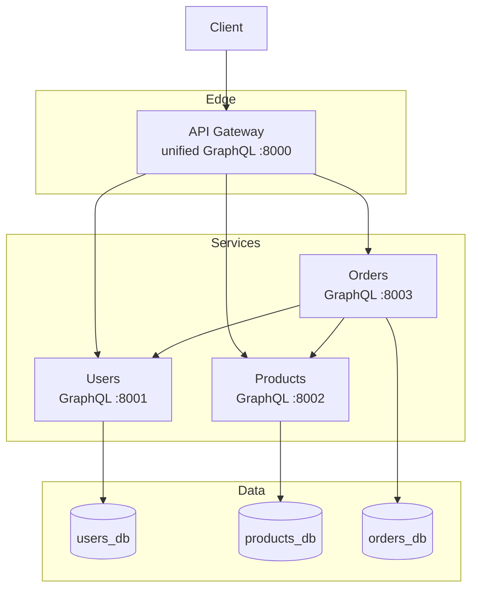
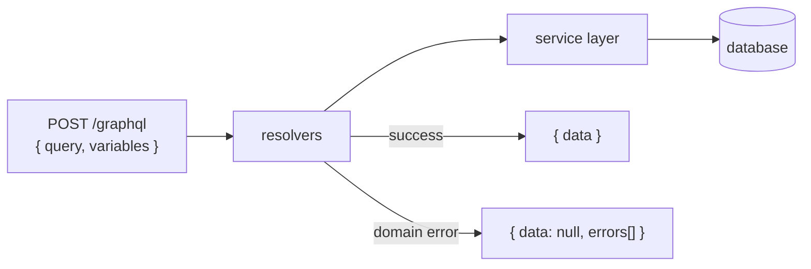
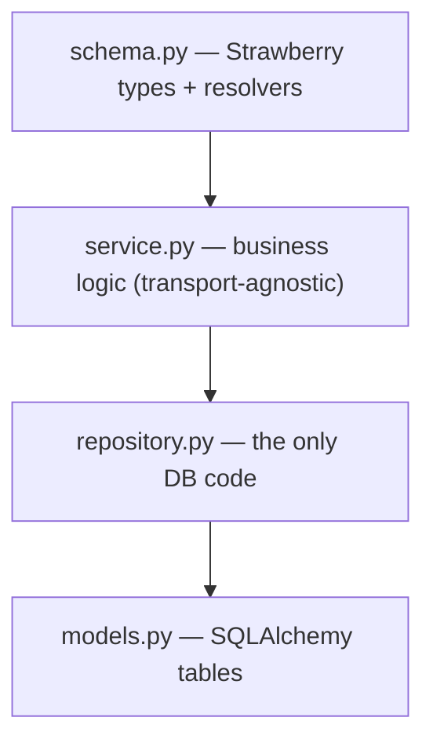
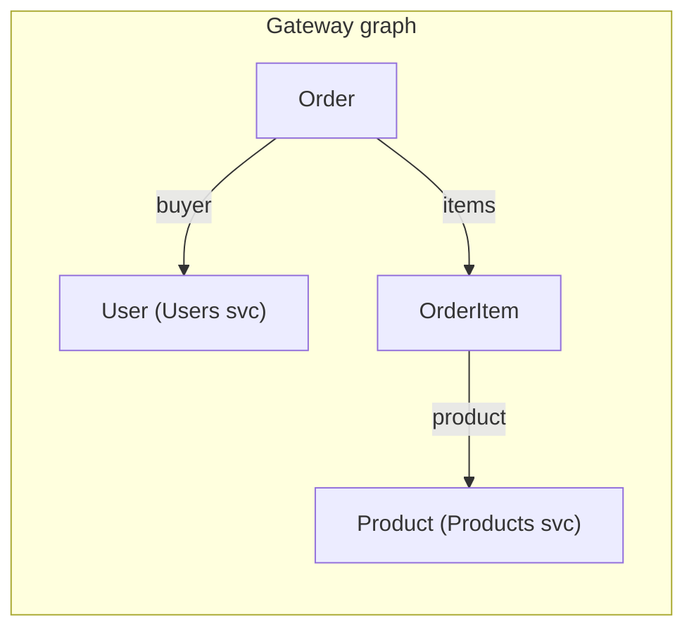
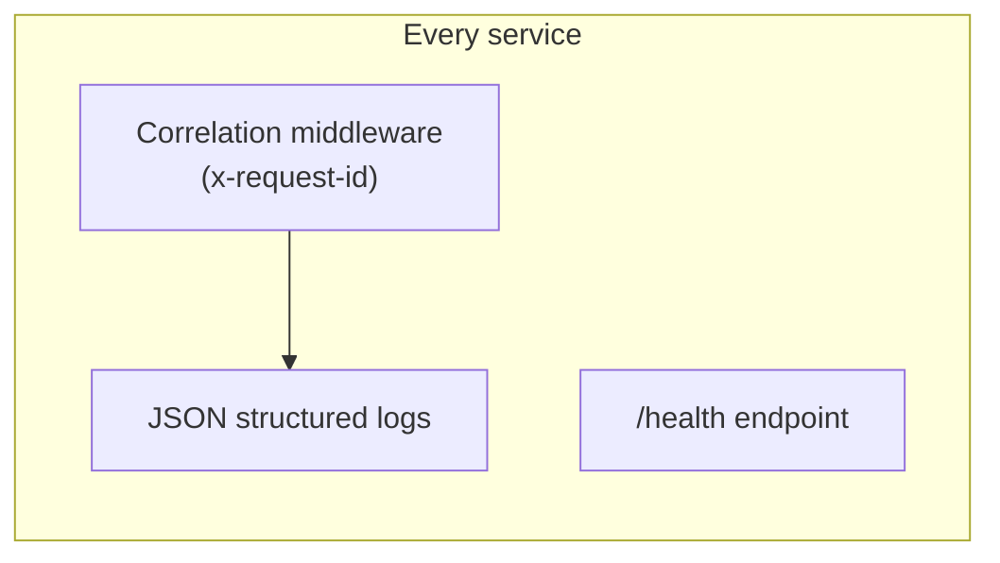

# Architecture — GraphQL E-commerce

This repo implements the same e-commerce domain as the REST and gRPC editions,
but every service speaks **GraphQL** and the Gateway composes them into a single
unified graph. Reading the three editions side by side shows what the transport
choice changes — and what stays identical.

---

## 1. System topology

Only the Gateway is public. Every service — including the Gateway — exposes a
single `/graphql` endpoint.

---

## 2. One endpoint, client-selected fields

The defining GraphQL trait: there is one endpoint per service and the client
chooses which fields to fetch. There are no per-resource URLs and no HTTP status
codes for business outcomes — errors are returned in the response's `errors`
array while the HTTP status stays 200.

---

## 3. Per-service layering

Every service uses the same layered design; only the top (schema) layer knows
about GraphQL.

Because `service.py` and below never import Strawberry, the exact same business
logic is what the REST and gRPC editions expose — only the adapter differs.

---

## 4. The Gateway is a composition layer, not a proxy

In REST/gRPC the Gateway forwards calls and needs a bespoke `/aggregate` endpoint
to join data. Here the Gateway defines a **graph**: `Order.buyer` and
`OrderItem.product` are fields resolved on demand from the owning service.

A client asks for exactly the nesting it needs; unrequested fields are never
resolved, so no downstream call is made for them.

---

## 5. Cross-cutting concerns

- **Correlation id**: the Gateway mints an `x-request-id`; every service reads it
  and forwards it on outbound GraphQL calls, so one id traces the whole fan-out.
- **Health**: each service exposes `/health` for Docker's `HEALTHCHECK`.
- **Deadlines + retries**: callers (Orders, Gateway) attach a timeout to every
  GraphQL POST and retry only transport-level failures.

---

## 6. Data ownership

Database-per-service: one Postgres instance, three logical databases created by
`infra/postgres/init-databases.sql`. No service reads another's tables — the only
way to get another service's data is to query its graph.

| Service | Database | Owns |
| --- | --- | --- |
| Users | `users_db` | user accounts, credentials |
| Products | `products_db` | catalog, stock levels |
| Orders | `orders_db` | orders + line items (with price snapshot) |
