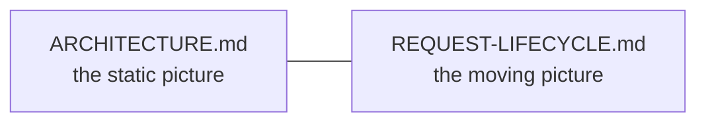
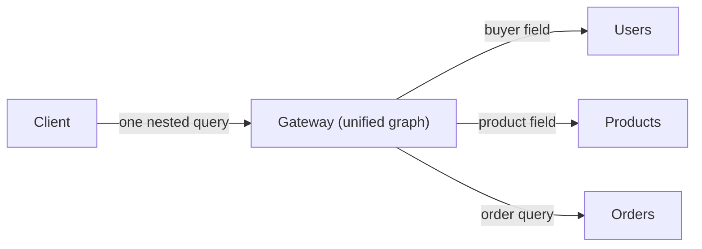
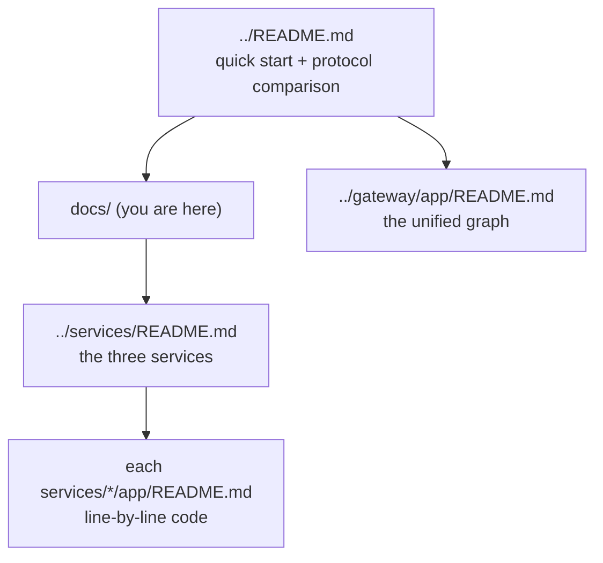

# `docs/` — architecture documentation (GraphQL edition)

System-level documentation for the GraphQL e-commerce repo. These explain the
**whole** system; each folder's own README explains that folder's code.

| Document | Answers |
|----------|---------|
| [ARCHITECTURE.md](ARCHITECTURE.md) | What are the pieces, how do they fit, and why does the Gateway stitch a single graph over three services? The static structure. |
| [REQUEST-LIFECYCLE.md](REQUEST-LIFECYCLE.md) | What happens, step by step, when a nested GraphQL query fans out across services? The dynamic behaviour. |

## What makes this edition different

Where the REST edition exposes a bespoke `/aggregate` endpoint and the gRPC
edition fans out through an aggregate method, the GraphQL Gateway lets the
**client** decide the shape: `Order.buyer` and `OrderItem.product` are field
resolvers that call the owning service only when requested.

## Where to go next

- Start with [ARCHITECTURE.md](ARCHITECTURE.md) for the big picture.
- Then [REQUEST-LIFECYCLE.md](REQUEST-LIFECYCLE.md) to watch a query fan out.
- Then drill into [../services/README.md](../services/README.md) and each
  service's `app/` README for the code itself, and the
  [Gateway app README](../gateway/app/README.md) for the graph stitching.
