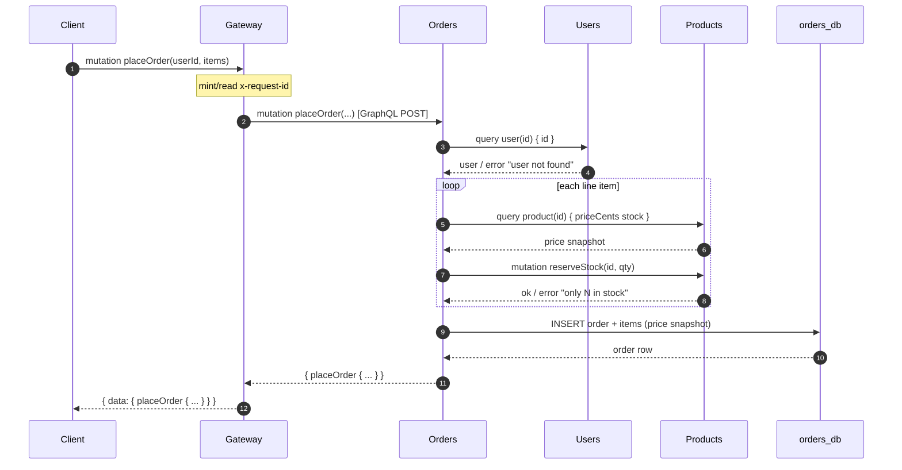
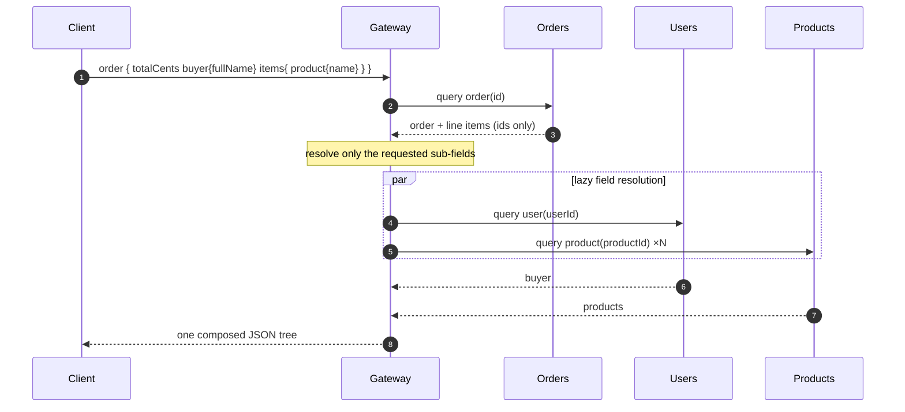
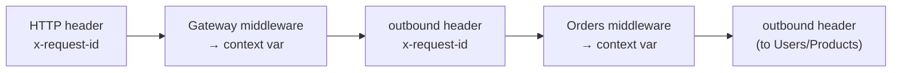
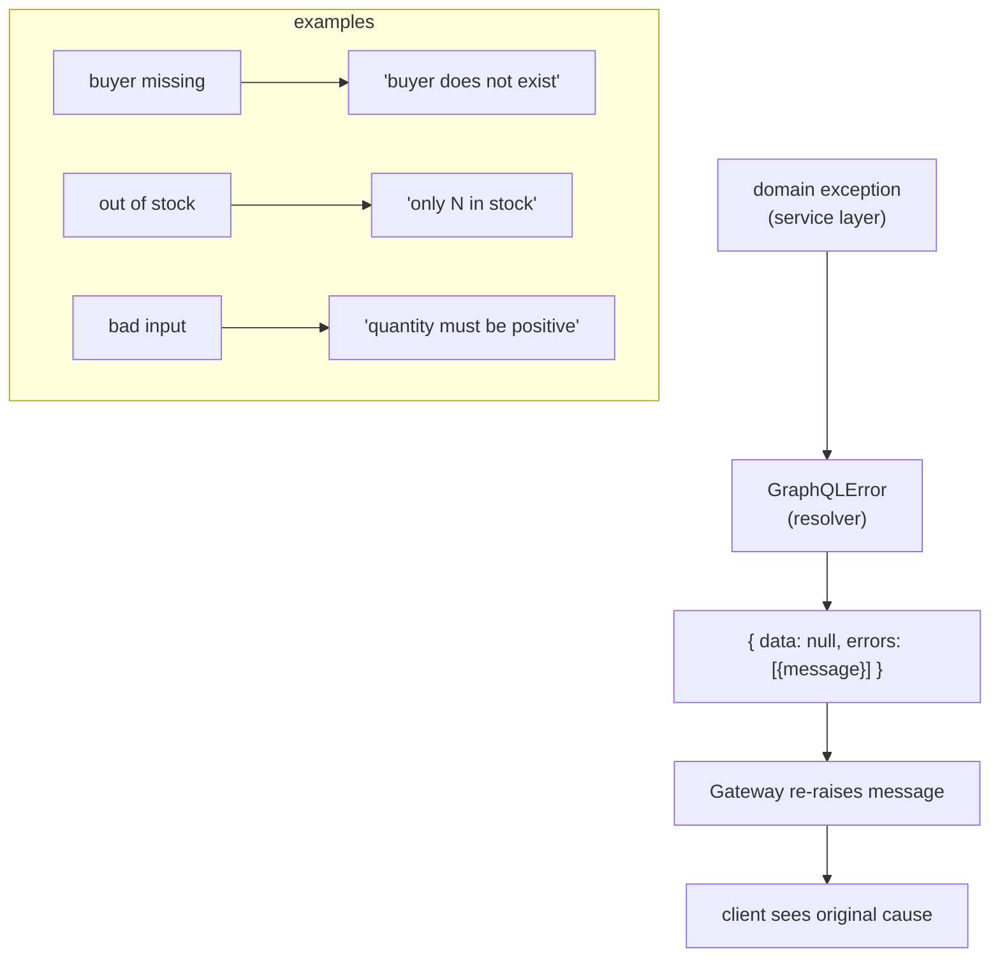
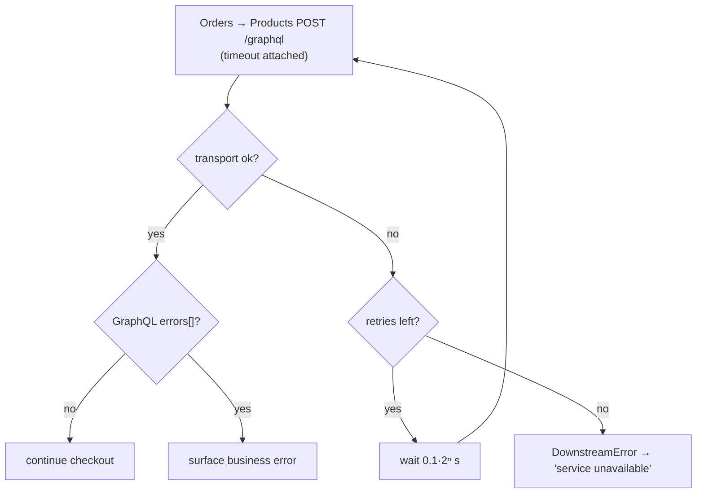

# Request Lifecycle — placing and reading an order

This traces two requests: placing an order (a write that fans out) and reading it
back with a single nested query (the GraphQL composition superpower).

---

## 1. Placing an order

Every hop is a GraphQL document POSTed over HTTP; the Gateway forwards the
mutation and the Orders service acts as a GraphQL client of Users and Products.

---

## 2. Reading it back — one query, three services

If the client omits `buyer`, the Gateway never queries Users. This demand-driven
resolution is what replaces the REST/gRPC hand-written aggregation endpoint.

---

## 3. Where the id lives

The same id is a header on every hop — logs from all four services can be joined
on it.

---

## 4. Failures are data, not status codes

In GraphQL a business failure is HTTP 200 with an `errors` array. Each service's
resolver raises a `GraphQLError`; the Gateway re-raises the backend's message so
the client sees the real cause.

---

## 5. Retry behaviour on a flaky dependency

Only transport failures are retried; a GraphQL `errors` array is a real answer
and is surfaced without retrying.
