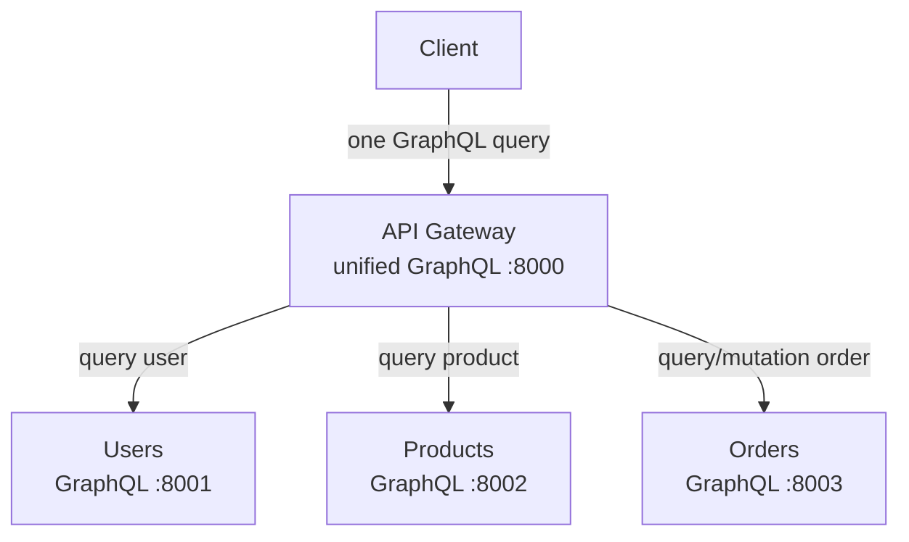
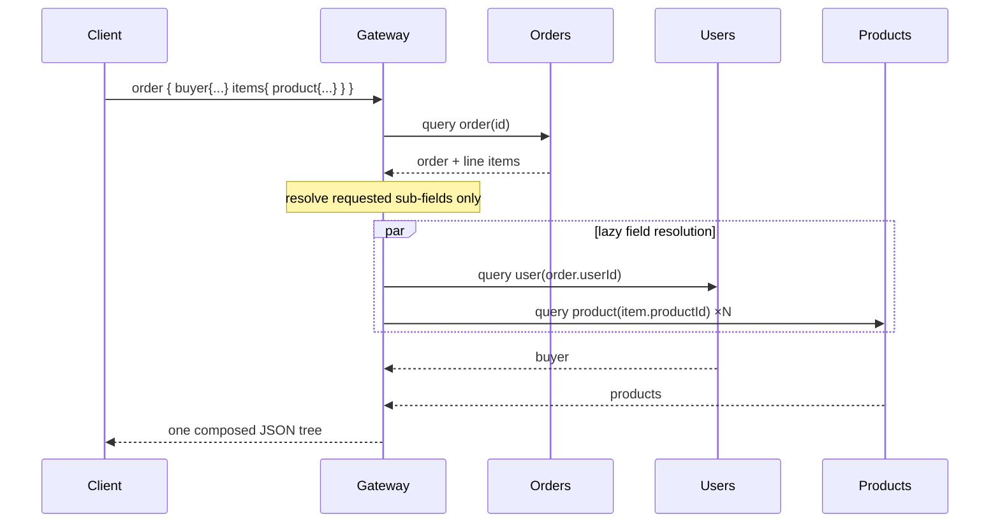

# API Gateway (unified GraphQL)

The **Gateway** is the single public entry point and the best showcase of what
GraphQL buys you. Instead of many REST endpoints or a bespoke aggregation route,
it exposes **one graph** that stitches the three backend GraphQL services
together. An `Order` simply *has* a `buyer: User` field and each `OrderItem` *has*
a `product: Product` field; the client asks for exactly the nesting it wants and
the Gateway resolves each field by calling the owning service — only when that
field is requested.

---

## 1. Position in the system



---

## 2. The composition superpower

REST and gRPC needed a hand-written `/aggregate/orders/{id}` endpoint to join an
order with its buyer and products. In GraphQL that join is just the schema:

```graphql
query {
  order(id: "…") {
    totalCents
    buyer { fullName }            # resolved from Users
    items {
      quantity
      product { name }            # resolved from Products
    }
  }
}
```



If the client omits `buyer`, the Gateway never calls Users — resolution is
demand-driven. That is the core difference from the REST/gRPC editions, where the
aggregation shape was fixed in code.

---

## 3. File anatomy

| File | Responsibility |
| --- | --- |
| `config.py` | The three backend GraphQL URLs + HTTP port. |
| `observability.py` | Correlation middleware; forwards `x-request-id` downstream. |
| `clients.py` | One `httpx.AsyncClient` per backend; forwards GraphQL documents. |
| `schema.py` | Unified types + `Order.buyer` / `OrderItem.product` field resolvers. |
| `main.py` | Opens clients on startup; exposes them via GraphQL context. |

---

## 4. Error propagation

When a backend returns a GraphQL `errors` array, `clients.py` re-raises the first
message as a `GraphQLError`, so the original caller sees the real cause
unchanged (e.g. `only 2 in stock`). Single-entity lookups (`user`, `product`)
return `null` instead of erroring, which is idiomatic GraphQL for "not found".

---

## 5. Unified schema (excerpt)

```graphql
type User { id: ID!, email: String!, fullName: String!, isActive: Boolean! }
type Product { id: ID!, sku: String!, name: String!, priceCents: Int!, stock: Int! }
type OrderItem { productId: ID!, quantity: Int!, unitPriceCents: Int!, product: Product }
type Order { id: ID!, userId: ID!, status: String!, totalCents: Int!, items: [OrderItem!]!, buyer: User }

type Query {
  user(id: ID!): User
  product(id: ID!): Product
  order(id: ID!): Order!
  orders(userId: ID!): [Order!]!
}
type Mutation {
  createUser(email: String!, password: String!, fullName: String): User!
  login(email: String!, password: String!): AuthToken!
  createProduct(sku: String!, name: String!, priceCents: Int!): Product!
  placeOrder(userId: ID!, items: [OrderItemInput!]!): Order!
}
```

---

## 6. Testing & running

The tests build fake in-process Users/Products/Orders GraphQL apps and wire the
real gateway clients to them, so the composition (including the cross-service
`buyer`/`product` resolvers) runs end to end.

```powershell
..\.venv\Scripts\python.exe -m pytest -q     # 6 tests

uvicorn app.main:app --port 8000             # explore the unified graph at /graphql
```
