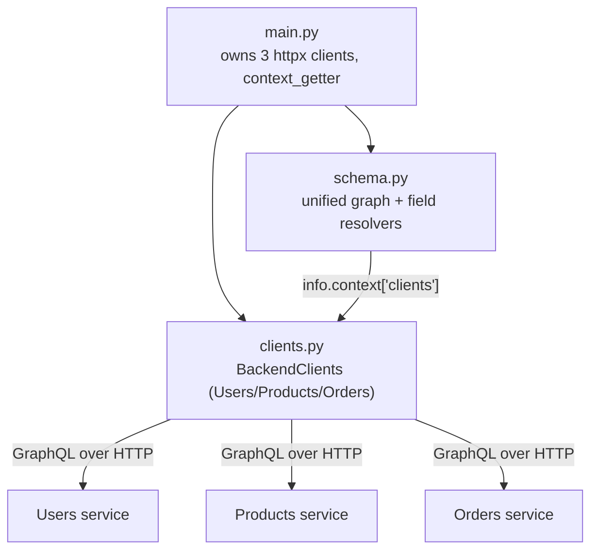
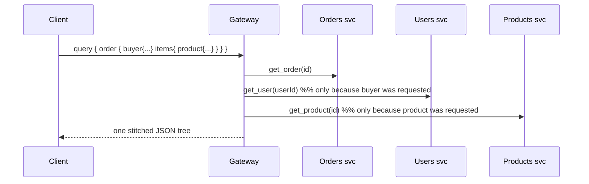
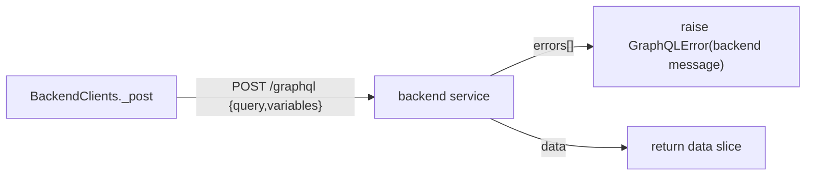
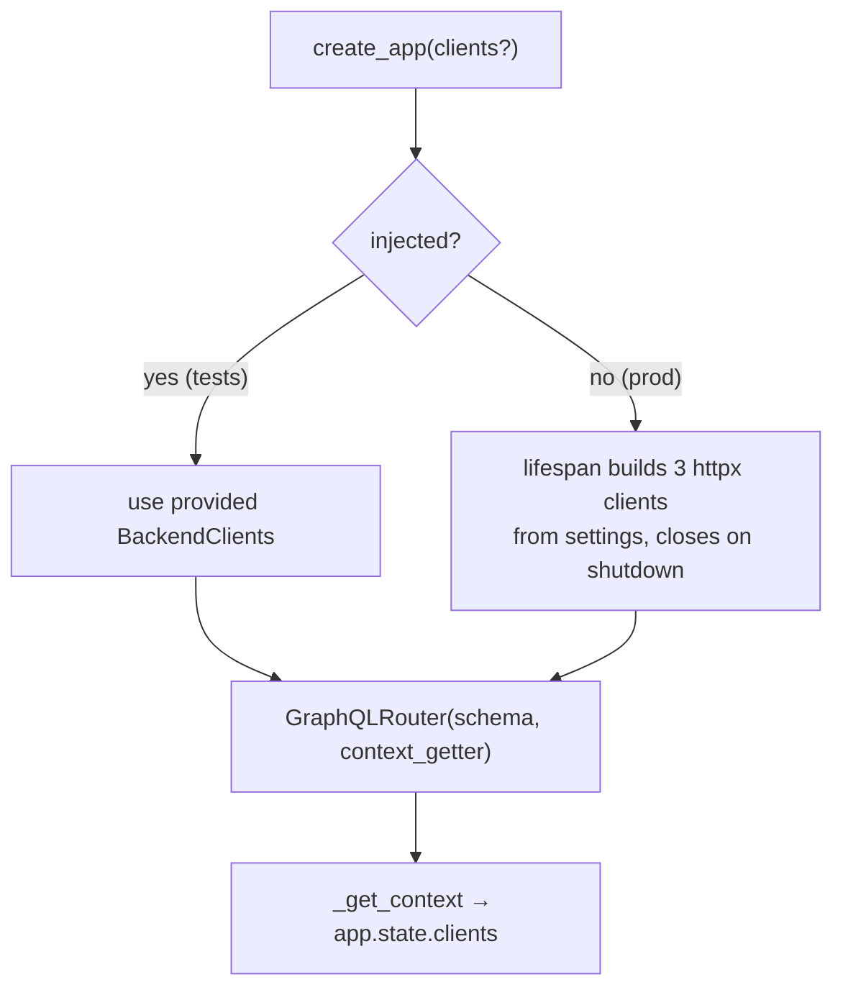

# `gateway/app/` — the unified GraphQL Gateway

This is where **GraphQL shines** over the REST and gRPC editions. Instead of a
bespoke `/aggregate/orders/{id}` endpoint, the Gateway exposes **one graph**
where an `Order` naturally has a `buyer: User` field and each `OrderItem` has a
`product: Product` field. The client asks for exactly the nesting it wants, and
the Gateway resolves each field by calling the owning service **only when that
field is requested**.

> **Concepts in this folder** — see [CONCEPTS.md](../../CONCEPTS.md). The headline:
> *Facade / BFF with graph stitching* (field resolvers replace the aggregate
> endpoint), the *N+1 query problem*, and *graph/tree traversal (DSA)* — flagged
> inline below.

```graphql
query {
  order(id: "…") {
    totalCents
    buyer { fullName }          # resolved via Users service on demand
    items { quantity product { name } }   # each product via Products service
  }
}
```

---

## 1. Module map



---

## 2. `schema.py` — graph stitching via field resolvers

The headline feature: `Order.buyer` and `OrderItem.product` are **field
resolvers** that fan out to the owning service on demand. This replaces the
REST/gRPC `/aggregate` endpoint — the *client* decides how much to stitch.



| Type | Field resolver | Fetches |
|------|----------------|---------|
| `Order.buyer` | `_clients(info).get_user(user_id)` | Users service — only if requested |
| `OrderItem.product` | `_clients(info).get_product(product_id)` | Products service — only if requested |

> **Pattern — Graph stitching (BFF/API composition):** these field resolvers turn
> three services into one navigable graph; the *client* chooses the join depth.
> **System design — N+1 problem:** an order with N items triggers N `get_product`
> calls — the classic GraphQL N+1 that DataLoader/batching exists to solve.
> **DSA — tree traversal:** the server walks the query tree, resolving child nodes
> on demand ([04-system-design](../../../../04-system-design/architectural_notes.md)).

`from_dict` classmethods read the backends' **camelCase** JSON (`fullName`,
`priceCents`, `userId`, `totalCents`, `unitPriceCents`). `Query` exposes
`user(s)`, `product(s)`, `order(s)`; `Mutation` exposes `createUser`, `login`,
`createProduct`, `placeOrder` — each a thin pass-through to `BackendClients`.

**Gotcha — `OrderItemInput`:** the input type name must match what the Orders
service expects; the fake in tests renames its input via `name="OrderItemInput"`.

---

## 3. `clients.py` — `BackendClients` (3 GraphQL clients)

Each backend is itself a GraphQL server, so the Gateway forwards GraphQL
documents over HTTP.



- `_post(client, query, variables)` POSTs the document, forwards `x-request-id`,
  raises `GraphQLError("backend unavailable: …")` on transport failure, and
  **re-raises the backend's own error message** so the caller sees the real
  cause.
- `get_user` / `get_product` swallow `GraphQLError` and return `None` (so a
  missing `buyer`/`product` resolves to `null` instead of failing the whole
  query); the other methods propagate errors.
- `_ORDER_FIELDS` is a shared field selection reused across the order queries.

---

## 4. `main.py` — owning the clients + `context_getter`



- `create_app(clients=None)` supports **optional injection**: tests pass a
  `BackendClients` wired to fakes; production builds three real `httpx` clients
  (one per backend) in the lifespan and closes them on shutdown.
- `context_getter=_get_context` puts `clients` on the GraphQL context so every
  resolver (including the `buyer`/`product` field resolvers) can reach it.

---

## 5. How it compares

| Edition | Cross-service composition |
|---------|---------------------------|
| REST | dedicated `/aggregate/orders/{id}` endpoint (server decides shape) |
| gRPC | gateway aggregate method fans out to stubs |
| **GraphQL** | **field resolvers** — client requests `buyer`/`product` and the graph stitches on demand |

See the [Gateway tests README](../tests/README.md) for how the three fake
backends prove the stitching works end to end.
