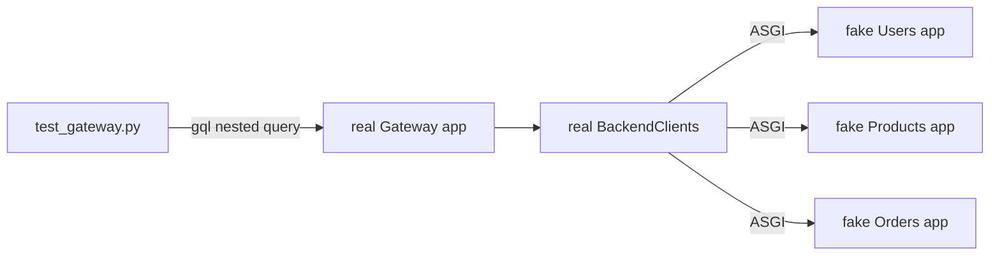
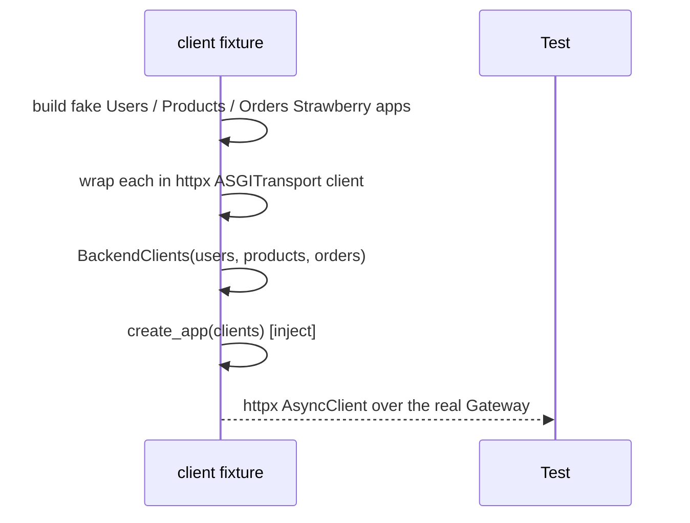
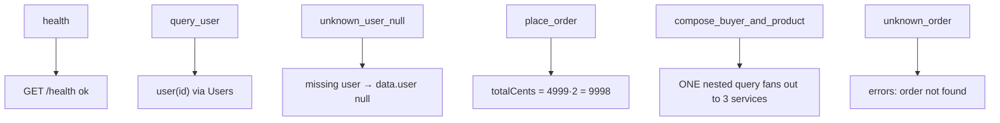

# `gateway/tests/` — test suite (GraphQL Gateway)

The Gateway composes three backend GraphQL services, so the harness builds
**three fake Strawberry apps** (Users, Products, Orders) with in-memory data and
wires the **real** Gateway `BackendClients` to them over in-process ASGI
transports. The real gateway schema — including the `Order.buyer` and
`OrderItem.product` field resolvers that fan out — is exercised end to end.



---

## 1. `conftest.py` — three fake backend graphs



- **`_UQuery` / `_UMutation`** — fake `user(id)` (unknown → `GraphQLError`) and
  `create_user`.
- **`_PQuery`** — fake `product(id)`.
- **`_OQuery` / `_OMutation`** — fake `order(id)` and `place_order`; the latter
  computes `totalCents` from the products' `priceCents` and stores the order in
  the in-memory `ORDERS` dict.
- **Gotcha — `_OItemInput`:** the fake Orders input type is declared
  `@strawberry.input(name="OrderItemInput")` so its GraphQL name matches what the
  Gateway's `placeOrder` document sends (`[OrderItemInput!]!`). Without the
  rename the field would be `OItemInput` and the variables wouldn't bind.

---

## 2. `test_gateway.py` — proving the stitching



The centerpiece is `test_order_composes_buyer_and_product_in_one_query`: after
placing an order, a **single** nested query

```graphql
order(id: $id) {
  totalCents
  buyer { fullName }              # → Users service
  items { quantity product { name } }   # → Products service
}
```

returns `buyer.fullName == "Buyer One"` and `items[0].product.name ==
"Keyboard"` — proving the Gateway fanned out to all three backends from one
client request. `test_unknown_user_returns_null` confirms a missing `buyer`
resolves to `null` (client-friendly) rather than failing the whole query, while
`test_unknown_order_is_error` shows a hard failure still surfaces in `errors[]`.

---

## How to run

```powershell
cd gateway
..\.venv\Scripts\python.exe -m pytest -q
```
