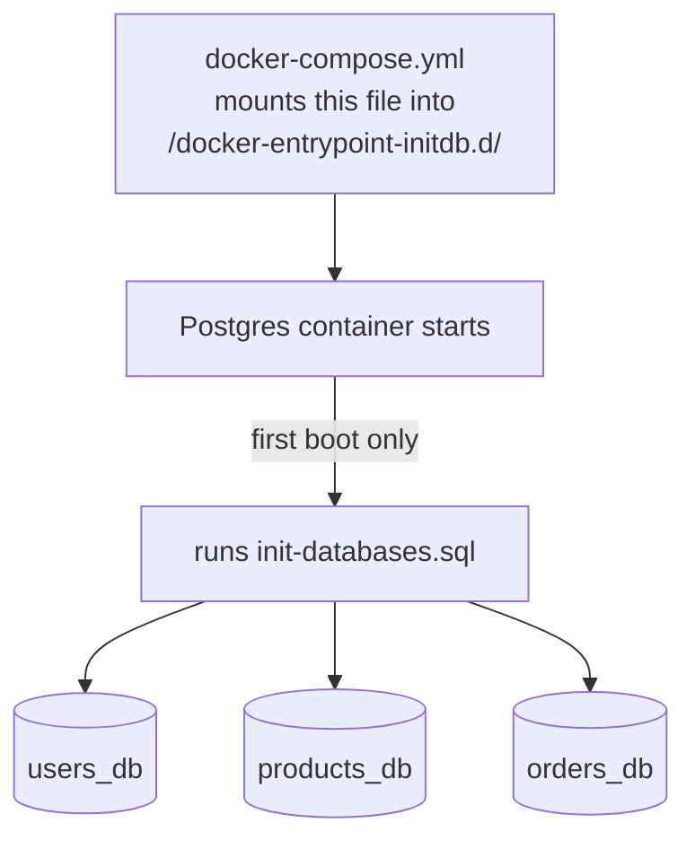

# `infra/postgres/` — database bootstrap

One file: [`init-databases.sql`](init-databases.sql). It implements the
**database-per-service** pattern with a single Postgres container.



```sql
CREATE DATABASE users_db;
CREATE DATABASE products_db;
CREATE DATABASE orders_db;
```

| Line | Effect |
|------|--------|
| `CREATE DATABASE users_db;` | private database for the Users service |
| `CREATE DATABASE products_db;` | private database for the Products service |
| `CREATE DATABASE orders_db;` | private database for the Orders service |

**Why one instance, three databases:** in production each service would usually
get its own Postgres cluster. Here we use one container with three **isolated**
databases so the whole system comes up from a single `docker compose up`, while
still enforcing that no service can read another's tables (each service is
configured with a URL pointing only at its own database). The GraphQL edition
keeps exactly the same storage layout as the REST and gRPC editions — only the
transport differs.

Scripts in `/docker-entrypoint-initdb.d/` run **only on first startup** (when the
data directory is empty). To re-run after changing this file, remove the Postgres
volume (`docker compose down -v`).
