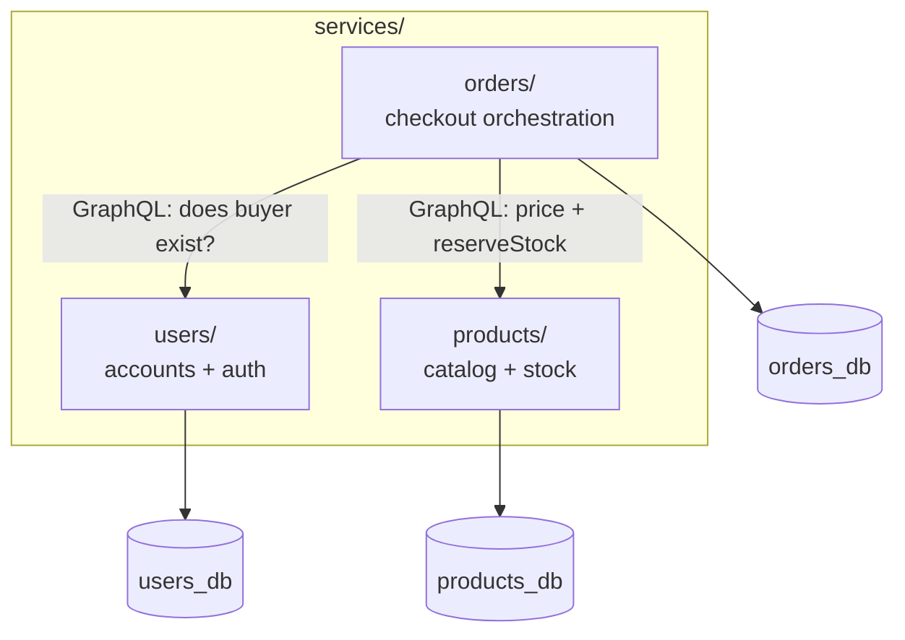
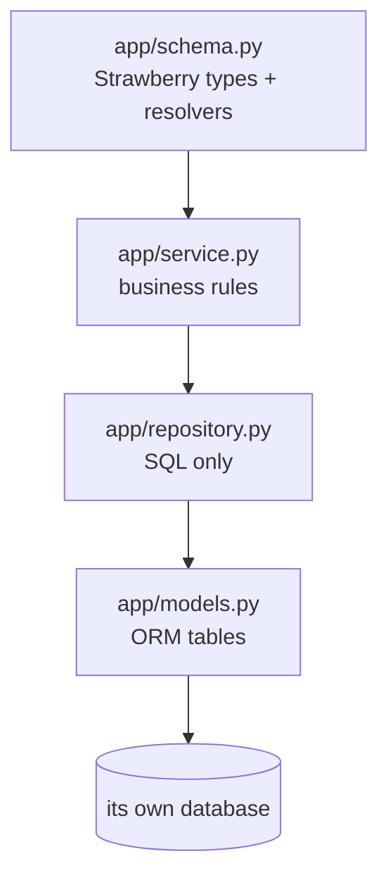

# `services/` — the microservices

This folder holds the three independent backend services. Each is a **separately
deployable unit** with its own code, its own database, its own Dockerfile, and
its own tests. They never share a database or import each other's code — they
communicate only over **GraphQL (documents POSTed over HTTP)**.

| Service | Owns | Talks to | README |
|---------|------|----------|--------|
| `users/` | accounts, login/JWT | — (leaf) | [users/app](users/app/README.md) · [tests](users/tests/README.md) |
| `products/` | catalog, stock reservation | — (leaf) | [products/app](products/app/README.md) · [tests](products/tests/README.md) |
| `orders/` | orders, checkout flow | Users + Products | [orders/app](orders/app/README.md) · [tests](orders/tests/README.md) |

---

## The pattern every service follows

- **Database-per-service:** decoupled schemas; a change in one never breaks another.
- **Layered:** each layer has one job and only depends inward — that's what makes
  the services independently testable (each `tests/` folder runs with no network).
- **Same shape, different domain:** learning one service teaches you all three.

---

## How the GraphQL edition differs from REST / gRPC

| Concern | REST | gRPC | **GraphQL** |
|---------|------|------|-------------|
| Transport adapter | `app/routers/*` | `app/*servicer` | **`app/schema.py`** (Strawberry) |
| Endpoint | many REST paths | RPC methods | one **`/graphql`** endpoint |
| Failure signal | HTTP status code | gRPC status code | **`errors[]`** in a 200 response |
| Cross-service calls | JSON REST | typed stubs | GraphQL documents over `httpx` |
| Field naming on the wire | as-is | as-is | **camelCase** (`priceCents`, `fullName`) |

There are **no** `routers/`, `pb/`, `protos/`, or `scripts/` folders here — the
Strawberry `schema.py` is the entire transport layer. Drill into any service's
`app/` README for the line-by-line walkthrough.
