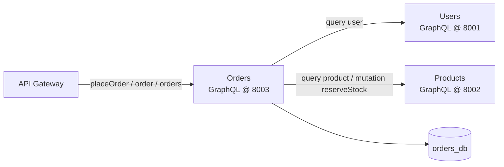
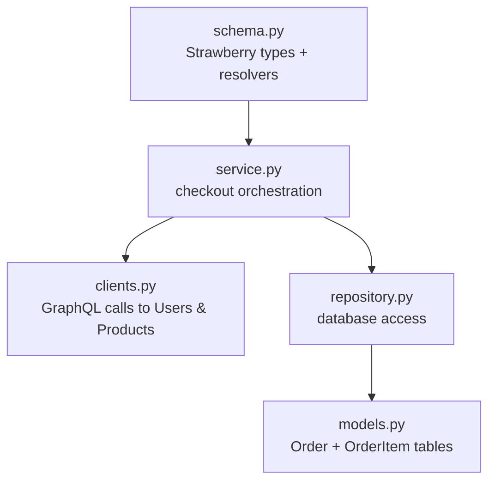
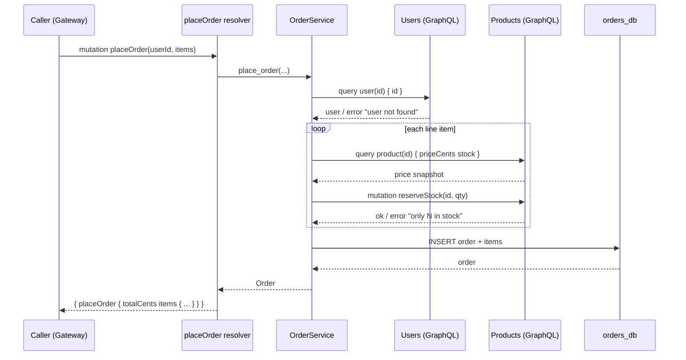
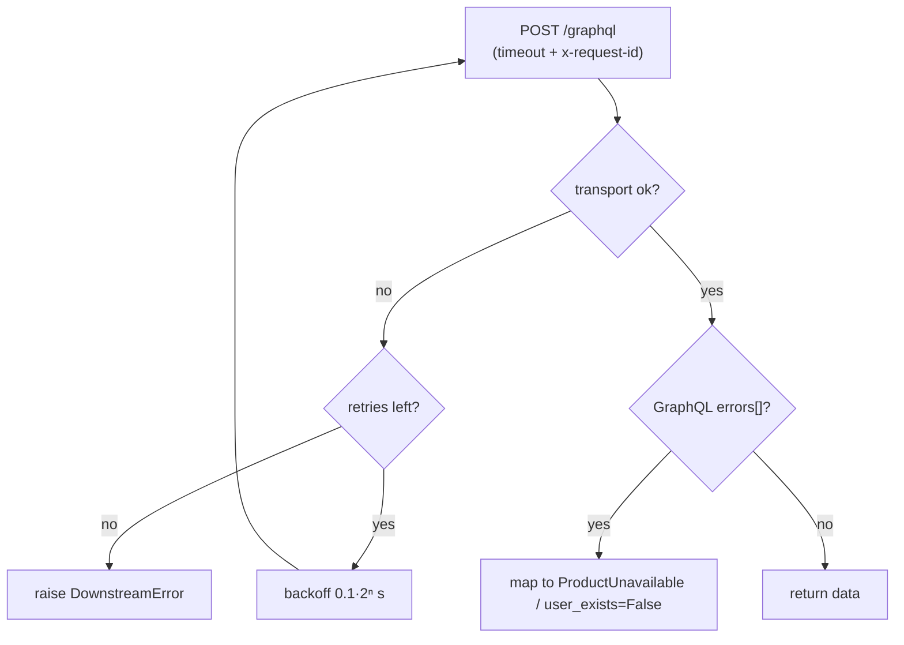
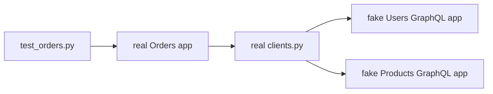

# Orders Service (GraphQL)

The **Orders** service owns checkout. It is the most interesting service in this
repo because it is simultaneously a GraphQL **server** (it exposes `placeOrder`,
`order`, `orders`) and a GraphQL **client** (it POSTs GraphQL documents to the
Users and Products services to fulfil an order).

---

## 1. Where it sits



The service both terminates GraphQL requests (top edge) and originates GraphQL
requests (bottom edges) — over plain HTTP POSTs.

---

## 2. Layered anatomy



| File | Responsibility |
| --- | --- |
| `config.py` | Settings: port, DB URL, **downstream URLs**, timeout, retries. |
| `models.py` | `Order` header + `OrderItem` lines (price snapshot per line). |
| `repository.py` | `add` / `get` / `list_for_user`. |
| `clients.py` | `UsersGraphQLClient` + `ProductsGraphQLClient` (httpx POST, retry, headers). |
| `service.py` | `OrderService.place_order` orchestration + domain exceptions. |
| `schema.py` | GraphQL types/resolvers; reads clients from `context`; maps errors. |
| `main.py` | Owns two `httpx.AsyncClient`s; wires them into the GraphQL context. |

---

## 3. The checkout flow



The **unit price is snapshotted** into each `OrderItem` at purchase time.

---

## 4. Resilient downstream calls

`clients.py` wraps every outbound GraphQL POST with a timeout and retry policy.
Only *transport* failures are retried; a GraphQL `errors` array is a real answer.



The `x-request-id` header is read from `request_id_ctx` (set by the inbound
middleware) and attached to every outbound call, tracing the whole fan-out.

---

## 5. Error → GraphQL error mapping

| Domain condition | Client sees (in `errors[]`) |
| --- | --- |
| empty items / bad quantity | `an order needs at least one item` / `quantity must be positive` |
| buyer does not exist | `buyer does not exist` |
| product missing / oversold | `product … not found` / `only N in stock` |
| dependency unreachable | `a downstream service is unavailable` |
| order id not found | `order not found` |

---

## 6. Testing strategy

The suite stands up **fake** in-process Users/Products GraphQL apps (Strawberry
schemas over in-memory data) and wires the **real** Orders clients to them via an
ASGI transport. This exercises the real client code, orchestration, and GraphQL
serialization against controllable dependencies.



```powershell
..\..\.venv\Scripts\python.exe -m pytest -q     # 8 tests

uvicorn app.main:app --port 8003                # GraphiQL at /graphql
```
