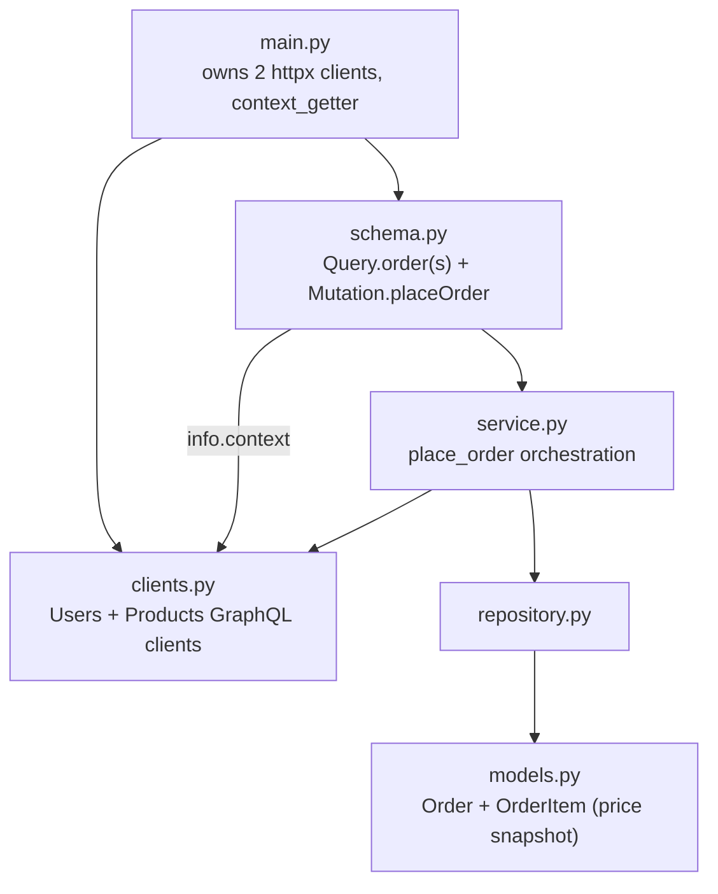
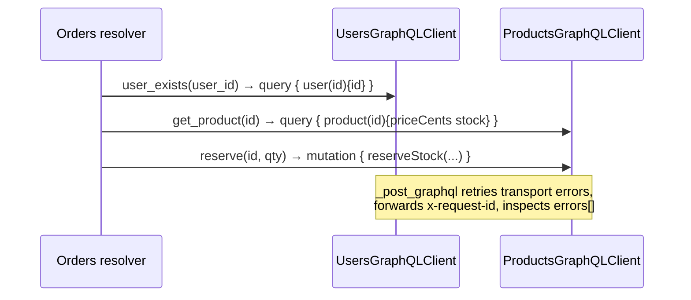
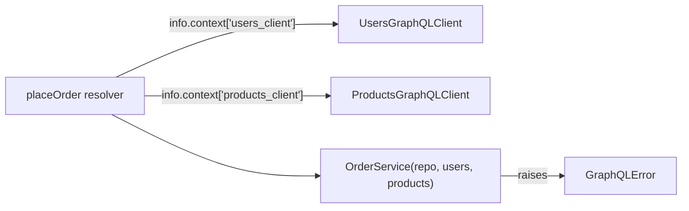
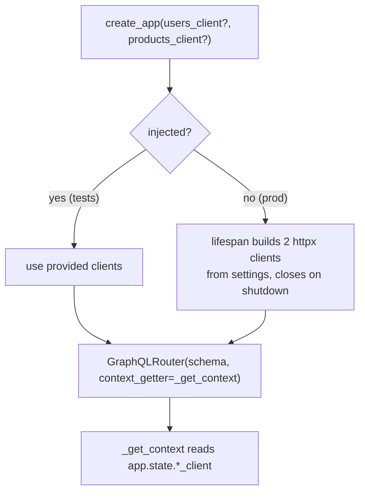

# `services/orders/app/` — application package (GraphQL)

The **Orders service** is the orchestrator: it validates the buyer against
**Users** and reserves stock against **Products** before persisting an order. In
this edition every downstream call is a **GraphQL document POSTed over HTTP**
(via `httpx`), where the REST edition used JSON REST and the gRPC edition used
typed stubs.

> **Concepts in this folder** — see [CONCEPTS.md](../../../CONCEPTS.md).
> Illustrates *Orchestration/Saga*, *Strategy* (retry), *Dependency Injection*
> (clients via `context`), and *price-snapshot immutability* — flagged inline.

---

## 1. Module map

---

## 2. `clients.py` — GraphQL clients for Users + Products

Each downstream dependency is a `GraphQL document POSTed over HTTP`. The
`httpx.AsyncClient` is **injected** so tests can point it at in-process fake apps.

| Piece | Role |
|-------|------|
| `_post_graphql(client, query, variables)` | POSTs `{query, variables}`; retries only transport errors with exponential backoff (`0.1·2^(n-1)`); forwards `x-request-id`; returns JSON body. |
| `_first_error_message(body)` | Reads `body["errors"][0]["message"]` — the GraphQL way to detect a failed op. |
| `UsersGraphQLClient.user_exists(id)` | Returns `False` if the query has an error or `data.user is None`. |
| `ProductsGraphQLClient.get_product(id)` | Reads `priceCents` (**camelCase!**); raises `ProductUnavailable` on error. |
| `ProductsGraphQLClient.reserve(id, qty)` | Calls `reserveStock`; propagates the "only N in stock" message as `ProductUnavailable`. |
| `DownstreamError` | Raised after retries are exhausted (service unreachable). |

**Gotcha — camelCase over the wire:** Strawberry serialises `price_cents` as
`priceCents`, so the client reads `product["priceCents"]`, not `price_cents`.

> **Pattern — Strategy:** `_post_graphql`'s retry/backoff is an interchangeable
> policy around the HTTP call. **Pattern — DI:** resolvers pull the clients from
> `info.context` (wired in `main.py`), so tests inject fakes
> ([03-design-patterns](../../../../../03-design-patterns/architectural_notes.md)).

---

## 3. `schema.py` — resolvers read clients from `context`

- The resolvers take `info: Info` and pull `users_client` / `products_client`
  out of `info.context` (wired in `main.py` from `app.state`) — that's how the
  injected clients reach the orchestration layer.
- `OrderItemInput` is a `@strawberry.input` type (`product_id`, `quantity`);
  `placeOrder` maps it to `[(product_id, quantity)]` pairs for the service.
- Exception → `GraphQLError` mapping:

  | Domain exception | GraphQL error message |
  |------------------|-----------------------|
  | `ValidationError` | (the message) |
  | `UserNotFound` | "buyer does not exist" |
  | `ProductUnavailable` | `exc.detail` (e.g. "only N in stock") |
  | `DownstreamError` | "a downstream service is unavailable" |
  | `OrderNotFound` (query) | "order not found" |

---

## 4. `main.py` — owning the clients + `context_getter`

- `create_app(users_client=None, products_client=None)` allows **optional
  injection**: tests pass fakes; production leaves them `None` and the lifespan
  builds real `httpx` clients from settings and closes them on shutdown.
- `context_getter=_get_context` exposes those clients to every resolver via the
  GraphQL `context`.

---

## 5. Inner layers

`service.py` (`place_order`: validate buyer → price + reserve each item →
snapshot `unit_price_cents` → persist), `repository.py`, and `models.py`
(`Order` + `OrderItem` with the **price snapshot**) mirror the
[REST Orders app README](../../../../rest-ecommerce/services/orders/app/README.md).
Only the client transport (GraphQL over `httpx`) differs.
