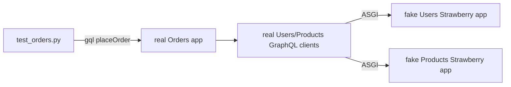
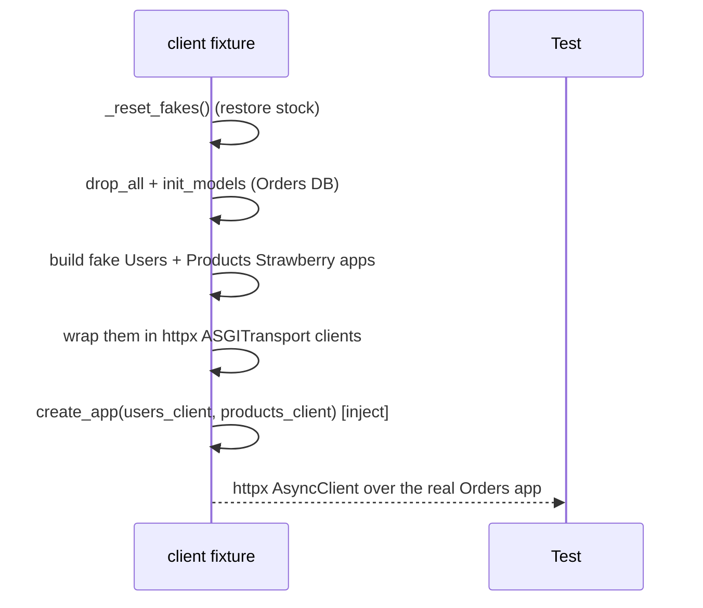
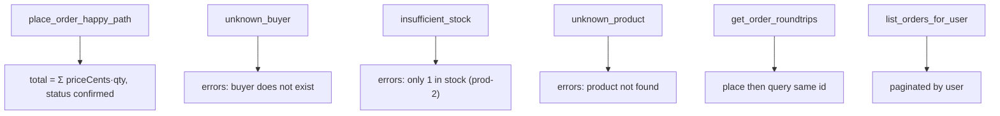

# `services/orders/tests/` — test suite (GraphQL)

Orders is a GraphQL **client** of Users and Products, so the suite builds two
tiny **fake Strawberry apps** (in-memory data) and wires the **real** Orders
clients to them over an in-process ASGI transport. The real client code,
orchestration, and GraphQL serialization are all exercised for real.



---

## 1. `conftest.py` — fake downstream graphs



- **`_UsersQuery`** — a fake `user(id)` resolver; unknown id raises
  `GraphQLError("user not found")` (matching the real Users service's error).
- **`_ProductsQuery` / `_ProductsMutation`** — fake `product(id)` and
  `reserveStock(id, quantity)`; oversell raises `GraphQLError("only N in stock")`
  and successful reserves **mutate the in-memory `_PRODUCTS` stock** so a second
  reserve sees the decremented value.
- `_reset_fakes()` restores stock (`prod-1`=10, `prod-2`=1) before each test so
  cases don't leak state.
- The fixture injects the real clients via `create_app(users_client=...,
  products_client=...)` and drives the app through its real
  `lifespan_context` — so `init_models` runs but no real `httpx` clients are
  built.

**Why fakes are Strawberry apps, not mocks:** this exercises the *actual* GraphQL
serialization (camelCase `priceCents`), the `_post_graphql` retry/error handling,
and the `errors[]` inspection end-to-end.

---

## 2. `test_orders.py`



Failure cases follow the GraphQL convention: **HTTP 200**, `data: null`, message
in `errors[0]`. The happy path asserts the order total equals the sum of the
snapshotted `priceCents × quantity`, and that reserving stock actually decrements
the fake Products inventory.

---

## How to run

```powershell
cd services/orders
..\..\.venv\Scripts\python.exe -m pytest -q
```
