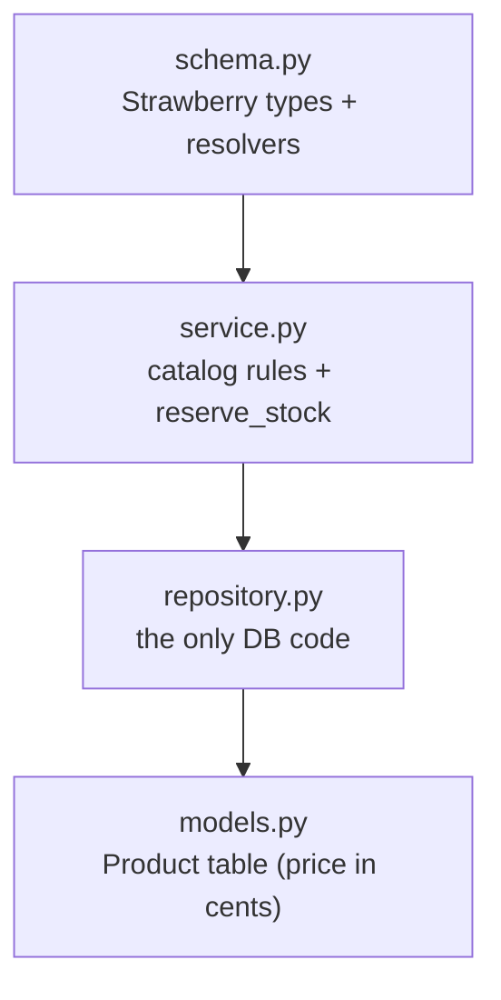
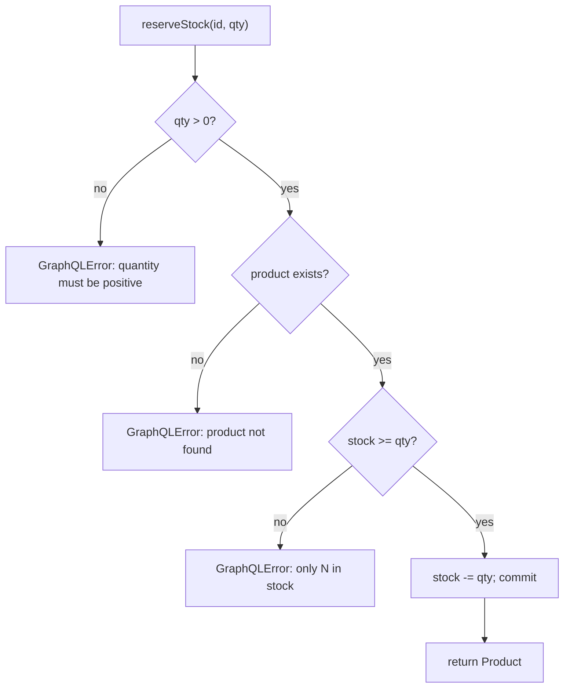

# Products Service (GraphQL)

The **Products** service owns the catalog and inventory. It exposes a **GraphQL**
endpoint at `/graphql`. Besides normal CRUD it has one special mutation,
`reserveStock`, called by the Orders service during checkout to atomically
decrement inventory.

---

## 1. Layered anatomy



| File | Responsibility |
| --- | --- |
| `config.py` | Settings (HTTP port, DB URL). |
| `models.py` | `Product` (unique `sku`, `price_cents:int`, `stock:int`). |
| `repository.py` | `add` / `get` / `get_by_sku` / `list` / `save`. |
| `service.py` | `create` / `get` / `list` / `reserve_stock` + domain exceptions. |
| `schema.py` | GraphQL `Query` + `Mutation`; maps exceptions to `GraphQLError`. |
| `main.py` | FastAPI app mounting `GraphQLRouter` at `/graphql`. |

---

## 2. The GraphQL schema

```graphql
type Product {
  id: ID!, sku: String!, name: String!, description: String!,
  priceCents: Int!, stock: Int!
}

type Query {
  product(id: ID!): Product!
  products(limit: Int! = 50, offset: Int! = 0): [Product!]!
}

type Mutation {
  createProduct(sku: String!, name: String!, priceCents: Int!,
                description: String! = "", stock: Int! = 0): Product!
  reserveStock(id: ID!, quantity: Int!): Product!
}
```

---

## 3. Stock reservation

`reserveStock` is the write path the Orders service depends on. It reads the
product, checks stock, decrements, and persists — raising `InsufficientStock`
if the quantity can't be met.



---

## 4. Error handling

| Domain exception | Client sees (in `errors[]`) |
| --- | --- |
| `ValidationError` | `sku and name are required` / `price_cents must be non-negative` / `quantity must be positive` |
| `SkuAlreadyExists` | `sku already exists` |
| `ProductNotFound` | `product not found` |
| `InsufficientStock` | `only N of <id> in stock` |

---

## 5. Testing & running

```powershell
..\..\.venv\Scripts\python.exe -m pytest -q     # 8 tests

uvicorn app.main:app --port 8002                # GraphiQL at /graphql
```
