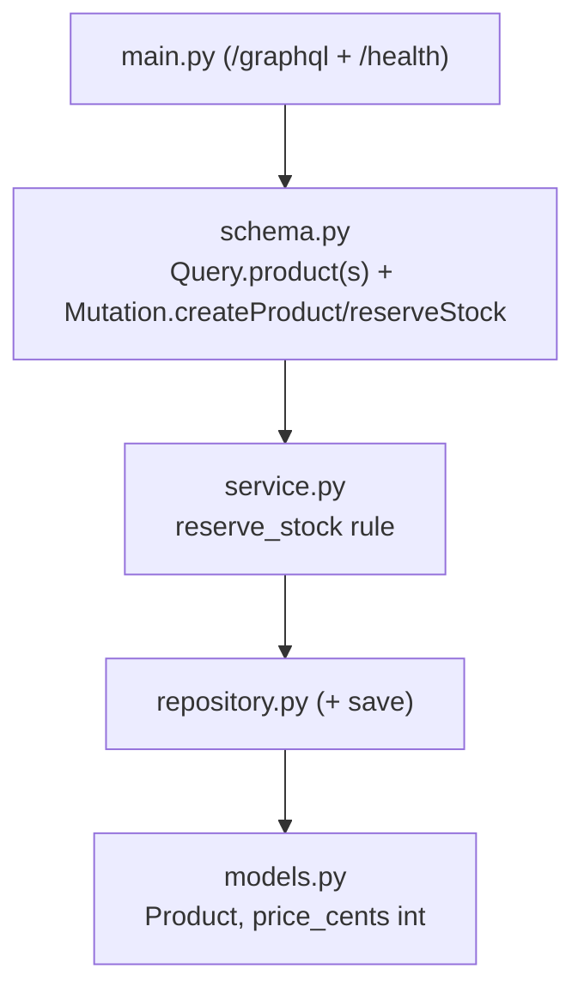
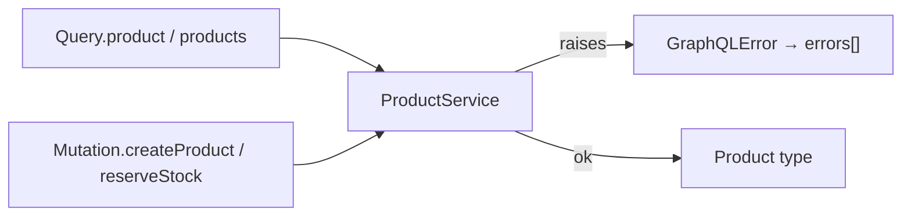

# `services/products/app/` — application package (GraphQL)

The **Products (catalog) service** over GraphQL. Same layered design as the
GraphQL Users service — a Strawberry [`schema.py`](schema.py) adapts the API to
the transport-agnostic service layer — with the catalog-specific reservation
rule. See [Users app README](../../users/app/README.md) for the shared GraphQL
mechanics (`main.py` mounting `/graphql`, middleware, error model).

> **Concepts in this folder** — see [CONCEPTS.md](../../../CONCEPTS.md).
> Illustrates *Adapter* (schema), *money-as-integer-cents*, and the
> *check-then-act / oversell* concurrency concern — flagged inline below.

---

## 1. Module map

---

## 2. `schema.py` — the catalog GraphQL API

| GraphQL element | Backed by | Error → `GraphQLError` |
|-----------------|-----------|------------------------|
| `type Product` | `Product.from_model` | price_cents is **integer cents** |
| `Query.product(id)` | `service.get` | `ProductNotFound` → "product not found" |
| `Query.products(limit, offset)` | `service.list` | — |
| `Mutation.createProduct(...)` | `service.create` | `ValidationError`, `SkuAlreadyExists` |
| `Mutation.reserveStock(id, quantity)` | `service.reserve_stock` | `ProductNotFound`, `InsufficientStock` ("only N in stock") |

`reserveStock` is the mutation the **Orders service** calls at checkout. Because
GraphQL surfaces failures in `errors[]` (HTTP 200), an oversell shows up as
`data: null` + an `InsufficientStock` message rather than a 409.

> **System design — money as integer cents** (no float rounding) and the
> **check-then-act race** in `reserveStock` (a read-modify-write needing an atomic
> conditional update / row lock under concurrency)
> ([04-system-design](../../../../../04-system-design/architectural_notes.md),
> [09-concurrency](../../../../../09-concurrency/)).

---

## 3. Inner layers (same design)

`service.py` holds the reservation rule (fetch → check `stock >= qty` → decrement
or raise `InsufficientStock`), `repository.py` adds `save()` for the stock
update, and `models.py` stores **money as integer cents** — identical to the
[REST Products app README](../../../../rest-ecommerce/services/products/app/README.md).
The GraphQL-specific `schema.py` + `main.py` mirror the
[GraphQL Users app README](../../users/app/README.md).
