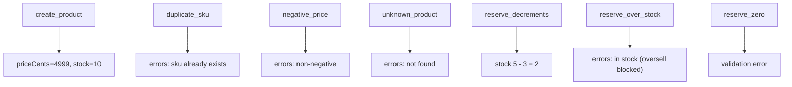

# `services/products/tests/` — test suite (GraphQL)

Same in-process ASGI + `gql()` helper approach as the
[Users tests](../../users/tests/README.md): POST GraphQL documents to `/graphql`,
assert on `data` / `errors`.

```mermaid
flowchart LR
    T[test_products.py] -->|"gql(query, variables)"| App[create_app()]
    App --> Schema[Strawberry schema]
    Schema --> DB[(in-memory SQLite)]
```

---

## 1. `conftest.py`

Provides the `client` fixture (fresh schema per test via `drop_all` + `init_models`,
`StaticPool` SQLite) and the `gql()` helper — identical structure to the Users
suite.

---

## 2. `test_products.py`

Documents `CREATE`, `GET`, and `RESERVE`; note the camelCase fields (`priceCents`,
`reserveStock`).



| Test | Asserts |
|------|---------|
| `test_create_product` | `priceCents`/`stock` round-trip |
| `test_duplicate_sku_is_error` | error "sku already exists" |
| `test_negative_price_is_validation_error` | error "non-negative" |
| `test_get_unknown_product_is_error` | error "not found" |
| `test_reserve_decrements_stock` | 5 − 3 = 2 |
| `test_reserve_more_than_stock_is_error` | error "in stock" — **oversell blocked** |
| `test_reserve_zero_is_validation_error` | quantity must be positive |

The reservation tests protect the same invariant the Orders checkout depends on:
stock can never go negative.

---

## How to run

```powershell
cd services/products
..\..\.venv\Scripts\python.exe -m pytest -q
```
