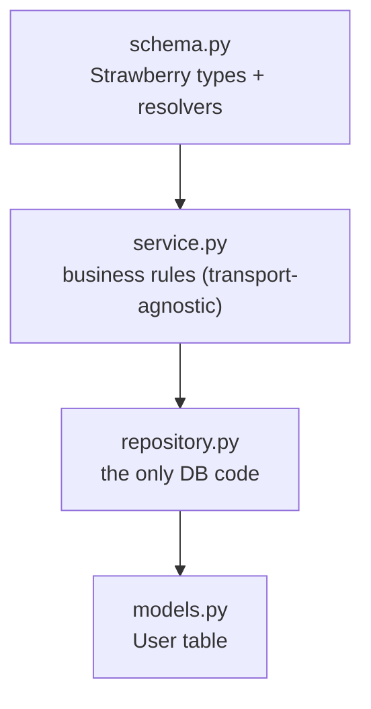
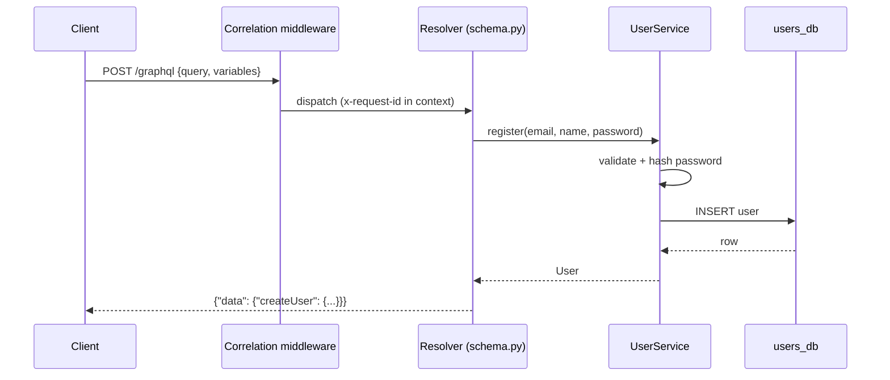

# Users Service (GraphQL)

The **Users** service owns accounts and authentication. It exposes a single
**GraphQL** endpoint at `/graphql`. It is the direct counterpart of the REST and
gRPC editions' Users services — identical business logic, a different transport.

---

## 1. REST vs gRPC vs GraphQL — the same service, three faces

```mermaid
flowchart LR
    subgraph REST
        r["POST /users<br/>GET /users/{id}"]
    end
    subgraph gRPC
        g["UserService.CreateUser<br/>UserService.GetUser"]
    end
    subgraph GraphQL
        q["mutation createUser<br/>query user(id)"]
    end
    r -. same service.py .- g
    g -. same service.py .- q
```

In GraphQL there is **one endpoint and one round-trip**; the client chooses which
fields it wants. There are no per-resource URLs and no HTTP status codes for
business errors — errors come back in the response's `errors` array.

---

## 2. Layered anatomy



| File | Responsibility |
| --- | --- |
| `config.py` | Settings (HTTP port, DB URL, JWT). |
| `database.py` | Async engine, `SessionLocal`, `init_models`. |
| `models.py` | `User` ORM table (stores only a password *hash*). |
| `security.py` | bcrypt hashing + JWT issuing. |
| `repository.py` | `add` / `get` / `get_by_email` / `list`. |
| `service.py` | `register` / `get` / `list` / `login` + domain exceptions. |
| `schema.py` | GraphQL `Query` + `Mutation`; maps exceptions to `GraphQLError`. |
| `observability.py` | Correlation-id middleware + JSON logs. |
| `main.py` | FastAPI app; mounts `GraphQLRouter` at `/graphql`. |

---

## 3. The GraphQL schema

```graphql
type User { id: ID!, email: String!, fullName: String!, isActive: Boolean! }
type AuthToken { accessToken: String!, tokenType: String! }

type Query {
  user(id: ID!): User!
  users(limit: Int! = 50, offset: Int! = 0): [User!]!
}

type Mutation {
  createUser(email: String!, password: String!, fullName: String! = ""): User!
  login(email: String!, password: String!): AuthToken!
}
```

Note the `User` type has **no password field at all** — a hash can never leak
through the graph because it isn't part of the schema.

---

## 4. A request end to end



If the service raises `EmailAlreadyExists`, the resolver raises a `GraphQLError`
and the client receives `{"data": null, "errors": [{"message": "..."}]}` — still
HTTP 200, because in GraphQL transport success and business failure are separate.

---

## 5. Error handling

| Domain exception | Client sees (in `errors[]`) |
| --- | --- |
| `ValidationError` | `a valid email is required` / `password must be at least 8…` |
| `EmailAlreadyExists` | `email already registered` |
| `UserNotFound` | `user not found` |
| `InvalidCredentials` | `invalid credentials` |

---

## 6. Testing & running

Tests drive the real app over an in-process ASGI transport and POST GraphQL
documents; the schema is reset before each test.

```powershell
..\..\.venv\Scripts\python.exe -m pytest -q     # 7 tests

uvicorn app.main:app --port 8001                # explore GraphiQL at /graphql
```
