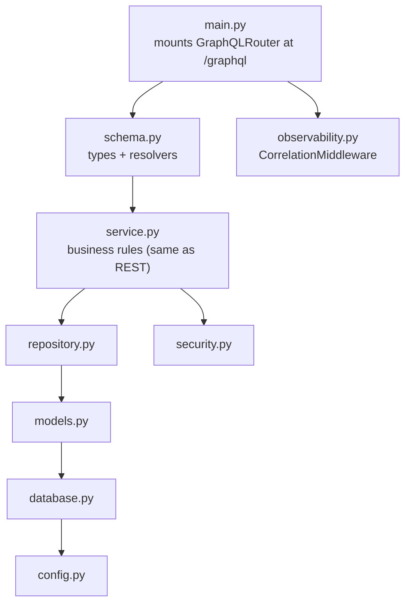
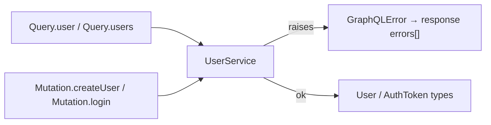
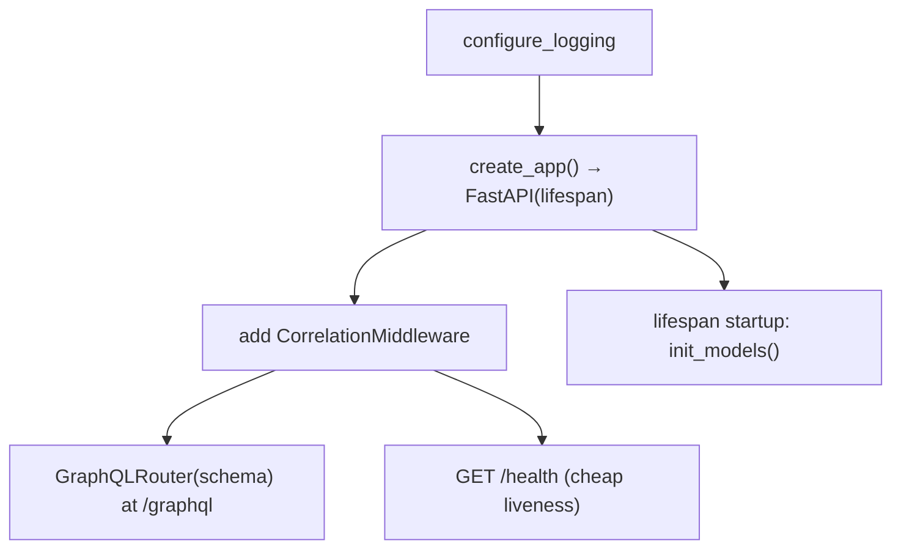

# `services/users/app/` — application package (GraphQL)

The full code of the **Users service**, exposed over **GraphQL** via Strawberry.
The inner layers (`service.py`, `repository.py`, `models.py`, `security.py`,
`config.py`, `database.py`) are the same transport-agnostic design as the REST
and gRPC editions. The only thing that changes is the **edge**: a
[`schema.py`](schema.py) of Strawberry types + resolvers replaces routers, and
errors become **`GraphQLError`s** in the response's `errors[]` list.

> **Concepts in this folder** — see [CONCEPTS.md](../../../CONCEPTS.md). The
> `schema.py` is an *Adapter*; `from_model` is a *DTO/Mapper*; plus *Repository*,
> *Hashing (DSA)*, *Singleton*, and the GraphQL *errors[]* model — flagged inline.

---

## 1. Module map

---

## 2. `schema.py` — the GraphQL adapter

`schema.py` is to GraphQL what routers are to REST and the servicer is to gRPC.
Strawberry `@strawberry.type` classes describe **what the API exposes**; resolvers
open a session, call the service, and turn domain exceptions into `GraphQLError`.

| GraphQL element | Backed by | Notes |
|-----------------|-----------|-------|
| `type User` | `User.from_model(orm)` | id/email/full_name/is_active — **no password field** (can't leak). |
| `type AuthToken` | login result | `access_token` + `token_type="bearer"`. |
| `Query.user(id)` | `service.get` | `UserNotFound` → `GraphQLError("user not found")`. |
| `Query.users(limit, offset)` | `service.list` | paginated list. |
| `Mutation.createUser(email, password, full_name)` | `service.register` | `ValidationError`/`EmailAlreadyExists` → `GraphQLError`. |
| `Mutation.login(email, password)` | `service.login` | `InvalidCredentials` → `GraphQLError`. |

**GraphQL error model:** unlike REST (HTTP status) or gRPC (status code), a failed
GraphQL operation still returns **HTTP 200** with `data: null` and a populated
`errors` array. That's why the tests assert on `body["errors"][0]["message"]`.

> **Pattern — Adapter + DTO/Mapper:** the Strawberry resolvers adapt GraphQL ops to
> service calls, and `User.from_model` maps the ORM row to a wire type with **no
> password field**. **System design — errors-in-body:** moving failure into
> `errors[]` (not the transport status) is a defining GraphQL trait
> ([04-system-design](../../../../../04-system-design/architectural_notes.md)).

`schema = strawberry.Schema(query=Query, mutation=Mutation)` is the exported
object `main.py` mounts.

---

## 3. `main.py` — mounting GraphQL on FastAPI

- The Strawberry `GraphQLRouter` is mounted at **`/graphql`** (with the GraphiQL
  explorer enabled) — that single endpoint serves every query and mutation.
- A tiny **`/health`** endpoint gives Docker a liveness probe without needing to
  send a GraphQL document.

---

## 4. Inner layers (same design as REST)

`service.py` (validates email + **password ≥ 8**, dup-check, hashing — note the
GraphQL edition uses an 8-char minimum), `repository.py` (SQL only),
`models.py` (`users` table, UUID-as-string), `security.py` (bcrypt + JWT),
`config.py`, and `database.py` mirror the
[REST Users app README](../../../../rest-ecommerce/services/users/app/README.md).
Only the adapter that catches the domain exceptions differs (schema/`GraphQLError`
here vs. router/HTTP there).
