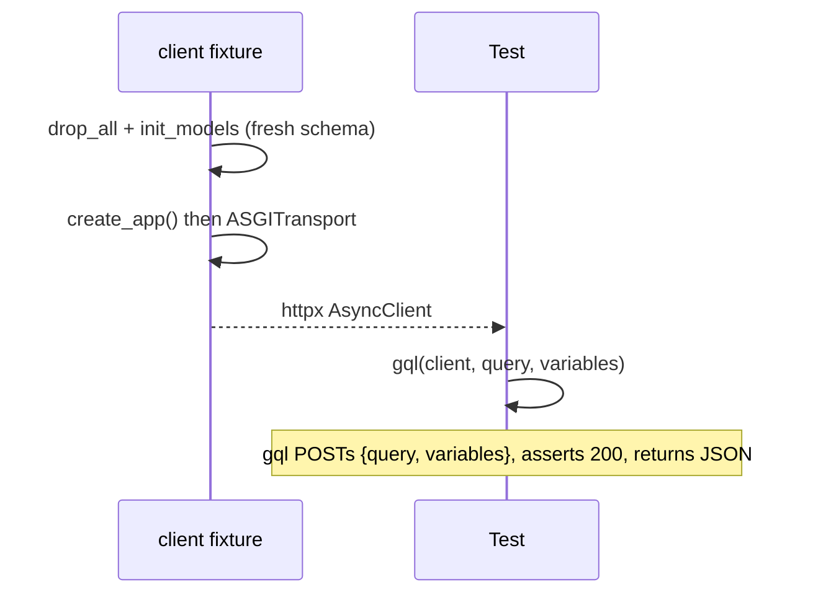
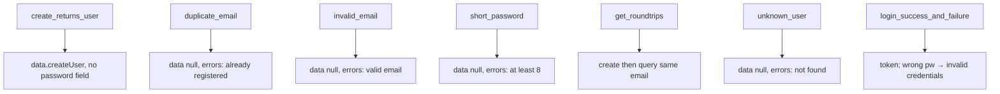

# `services/users/tests/` — test suite (GraphQL)

These tests drive the real FastAPI + Strawberry app in-process over an ASGI
transport, POSTing GraphQL documents to `/graphql` and asserting on the JSON
`data` / `errors` they return.

```mermaid
flowchart LR
    T[test_users.py] -->|"POST /graphql {query, variables}"| App[create_app()]
    App --> Schema[Strawberry schema]
    Schema --> DB[(in-memory SQLite)]
```

---

## 1. `conftest.py` — the `client` fixture + `gql()` helper



- Schema is reset per test (`drop_all` + `init_models`) because in-memory SQLite
  with `StaticPool` keeps one connection alive for the whole process.
- `gql(client, query, variables)` is the helper every test uses: it POSTs
  `{"query": ..., "variables": ...}` to `/graphql`, asserts the HTTP status is
  **200** (GraphQL always returns 200), and returns the parsed body so tests can
  inspect `data` and `errors`.

---

## 2. `test_users.py` — asserting on `data` vs `errors`

The GraphQL documents (`CREATE`, `GET`, `LOGIN`) are defined once at the top and
reused. Note the camelCase field names (`fullName`, `isActive`, `accessToken`) —
Strawberry auto-converts Python `snake_case` to GraphQL `camelCase`.



| Test | Asserts |
|------|---------|
| `test_create_user_returns_user_without_password` | `data.createUser`, `isActive true`, **no `password`** |
| `test_duplicate_email_is_error` | `data == null`, error "already registered" |
| `test_invalid_email_is_validation_error` | error "valid email" |
| `test_short_password_is_validation_error` | error "at least 8" |
| `test_get_user_roundtrips` | create → query returns same email |
| `test_get_unknown_user_is_error` | `data == null`, error "not found" |
| `test_login_success_and_failure` | token issued; wrong password → "invalid credentials" |

The pattern for a *failed* GraphQL op is always: **HTTP 200**, `data: null`, and a
message in `errors[0]["message"]` — different from REST/gRPC where failure is a
status code.

---

## How to run

```powershell
cd services/users
..\..\.venv\Scripts\python.exe -m pytest -q
```
