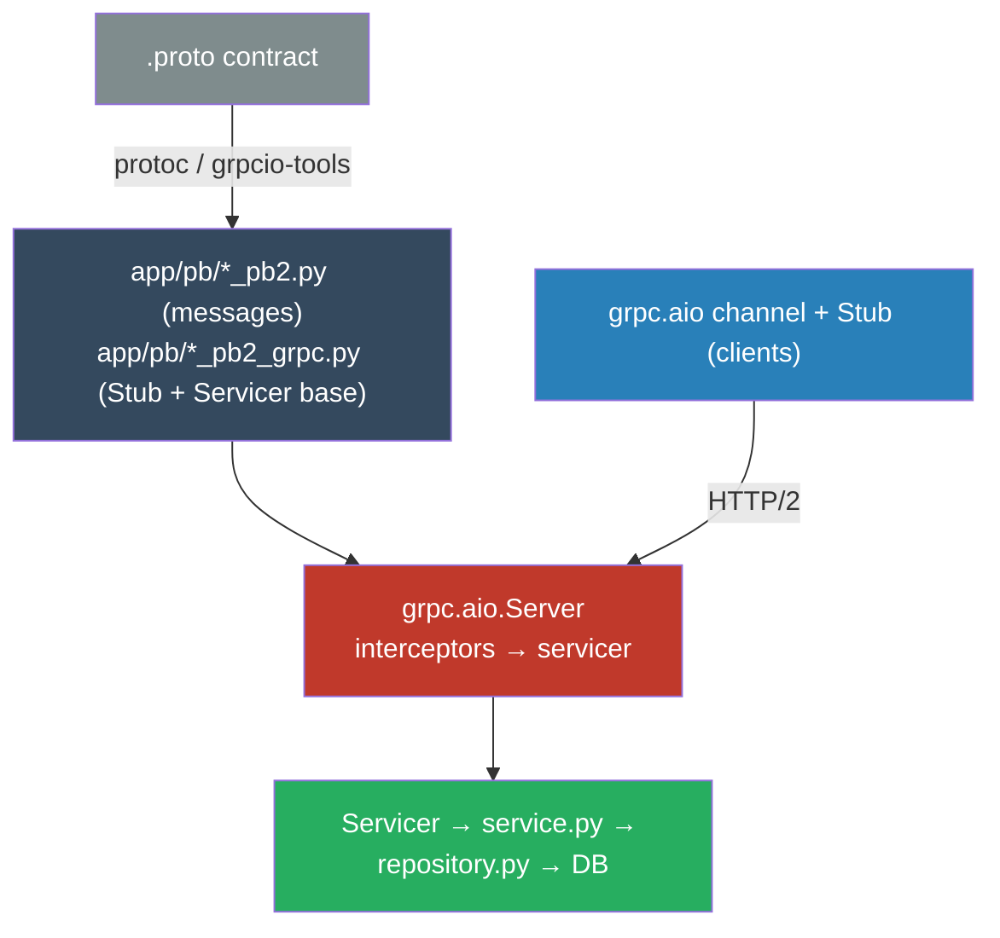
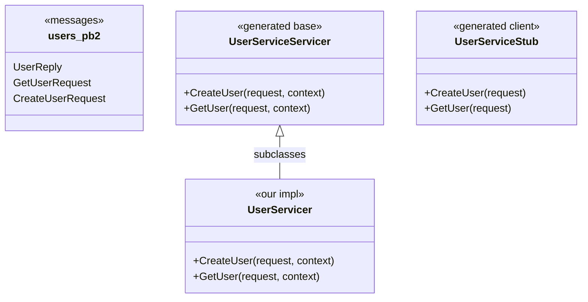
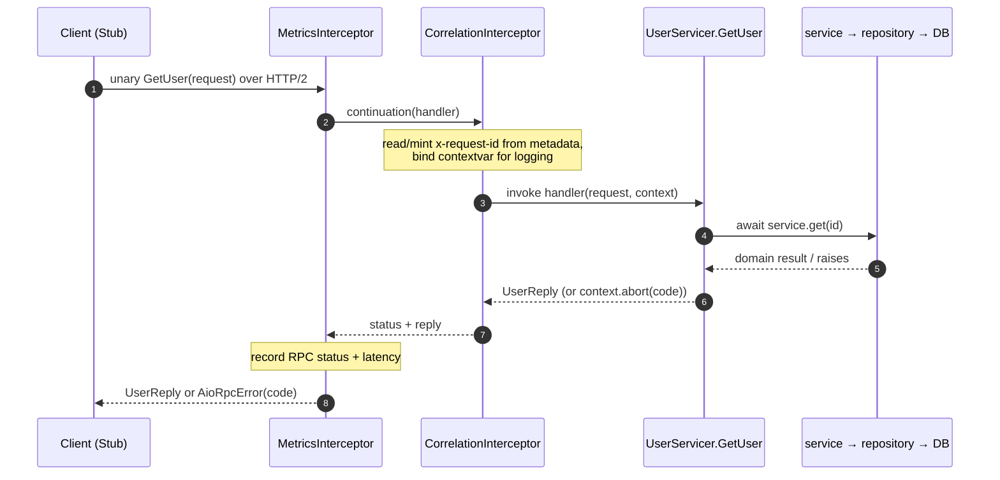
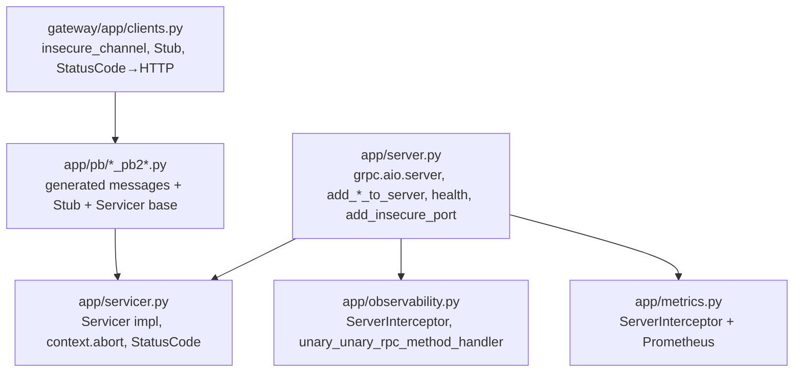

# grpcio in the gRPC edition — how it works & how this service uses it

> **TL;DR.** grpcio is the Python implementation of **gRPC**: strongly-typed RPCs
> over HTTP/2 with **Protocol Buffers** as the wire format. This repo uses the
> **`grpc.aio`** (asyncio) API. Service contracts live in `.proto` files;
> `protoc`/`grpcio-tools` generate the `*_pb2.py` (messages) and `*_pb2_grpc.py`
> (stubs + servicer base classes) under `app/pb/`. This document explains the
> grpcio machinery this repo leans on and points at the exact files.

---

## 1. The layered picture



The generated code is the fixed contract on both ends: a **client** calls
methods on a generated `Stub`; the **server** subclasses a generated `Servicer`
and implements those same methods.

---

## 2. Generated code — what protoc gives you



Real files: the generated base classes are in
[services/users/app/pb/users_pb2_grpc.py](services/users/app/pb/users_pb2_grpc.py);
our implementation is
[services/users/app/servicer.py](services/users/app/servicer.py).

---

## 3. The grpcio API surface this repo uses

| Symbol | What it does | Used in |
| --- | --- | --- |
| `grpc.aio.server(interceptors=[...])` | create the async server | [services/users/app/server.py](services/users/app/server.py) |
| `add_UserServiceServicer_to_server(impl, server)` | register a servicer on the server | `server.py` |
| generated `...Servicer` base class | contract the servicer must implement | [services/users/app/servicer.py](services/users/app/servicer.py) |
| `async def RpcName(self, request, context)` | a unary RPC handler | `servicer.py` |
| `await context.abort(code, msg)` | end an RPC with a gRPC status | `servicer.py` |
| `grpc.StatusCode.*` | status enum (`NOT_FOUND`, `ALREADY_EXISTS`, …) | `servicer.py`, [gateway/app/clients.py](gateway/app/clients.py) |
| `server.add_insecure_port(bind)` | bind a TCP port (returns the chosen port) | `server.py` |
| `await server.start()` / `await server.stop(grace)` | run / drain the server | `server.py`, tests `conftest.py` |
| `grpc.aio.ServerInterceptor` + `intercept_service` | cross-cutting middleware | [services/users/app/observability.py](services/users/app/observability.py), [services/users/app/metrics.py](services/users/app/metrics.py) |
| `grpc.unary_unary_rpc_method_handler(...)` | rebuild a wrapped handler inside an interceptor | `observability.py`, `metrics.py` |
| `grpc.aio.insecure_channel(target)` + `Stub` | client-side connection + typed calls | [gateway/app/clients.py](gateway/app/clients.py), tests |
| `grpc.aio.AioRpcError` | client-side error carrying `.code()` | [services/users/tests/test_users.py](services/users/tests/test_users.py) |
| `grpc_health.v1.health` / `health_pb2` / `health_pb2_grpc` | standard health-check service | `server.py`, [services/users/app/healthcheck.py](services/users/app/healthcheck.py) |

---

## 4. Building the server

`build_server` wires interceptors (outermost-first), registers our servicer,
adds the standard health service, and binds a port. It is exported so tests can
start the *same* server on an ephemeral port.

```python
import grpc
from grpc_health.v1 import health, health_pb2, health_pb2_grpc

from .metrics import MetricsInterceptor
from .observability import CorrelationInterceptor
from .pb import users_pb2, users_pb2_grpc
from .servicer import UserServicer


async def build_server(bind: str) -> tuple[grpc.aio.Server, int]:
    server = grpc.aio.server(
        interceptors=[MetricsInterceptor(), CorrelationInterceptor(service_name)]
    )
    users_pb2_grpc.add_UserServiceServicer_to_server(UserServicer(), server)

    health_servicer = health.aio.HealthServicer()
    health_pb2_grpc.add_HealthServicer_to_server(health_servicer, server)
    await health_servicer.set(SERVICE_NAME, health_pb2.HealthCheckResponse.SERVING)

    port = server.add_insecure_port(bind)
    return server, port
```

Full version: [services/users/app/server.py](services/users/app/server.py).

---

## 5. The servicer — protobuf ⇄ domain

The servicer subclasses the generated base and does exactly four things: open a
session, translate the protobuf `request` into plain args, call the
transport-agnostic service, and convert the result (or domain error) back into a
protobuf reply (or a gRPC status via `context.abort`).

```python
import grpc

from .pb import users_pb2, users_pb2_grpc


class UserServicer(users_pb2_grpc.UserServiceServicer):
    async def GetUser(self, request, context) -> users_pb2.UserReply:
        async with SessionLocal() as session:
            try:
                user = await UserService(UserRepository(session)).get(request.id)
            except UserNotFound:
                await context.abort(grpc.StatusCode.NOT_FOUND, "user not found")
            return _to_reply(user)
```

Domain-error → status-code mapping (from
[services/users/app/servicer.py](services/users/app/servicer.py)):

| Domain error | gRPC status |
| --- | --- |
| `EmailAlreadyExists` | `ALREADY_EXISTS` |
| `InvalidCredentials` | `UNAUTHENTICATED` |
| `ValidationError` | `INVALID_ARGUMENT` |
| not found | `NOT_FOUND` |

---

## 6. Interceptors — the gRPC middleware onion

A `ServerInterceptor` implements `intercept_service`, wraps the real handler, and
returns a new handler built with `grpc.unary_unary_rpc_method_handler`.
Interceptors run **outermost-first**, so `MetricsInterceptor` (registered first)
times the whole call including `CorrelationInterceptor`'s logging.



The real interceptors are
[services/users/app/observability.py](services/users/app/observability.py)
(`CorrelationInterceptor`) and
[services/users/app/metrics.py](services/users/app/metrics.py)
(`MetricsInterceptor`).

> **Teardown note.** Under `grpc.aio` an RPC coroutine can be finalized in a
> *different* context than the one that set the correlation `contextvar` (e.g. a
> call cancelled during shutdown), which makes `token.reset()` raise
> `ValueError`. The `finally` block in `observability.py` guards that reset so
> teardown never surfaces a spurious error.

---

## 7. The client side — channel + Stub

The Gateway holds one long-lived `grpc.aio` channel per backend and a Stub for
typed calls, then maps gRPC status back to HTTP (the inverse of the servicer).

```python
import grpc

GRPC_TO_HTTP = {
    grpc.StatusCode.NOT_FOUND: 404,
    grpc.StatusCode.ALREADY_EXISTS: 409,
    grpc.StatusCode.INVALID_ARGUMENT: 422,
    grpc.StatusCode.FAILED_PRECONDITION: 409,
    grpc.StatusCode.UNAUTHENTICATED: 401,
}


async def get_user(stub, user_id: str):
    async with grpc.aio.insecure_channel("users:50051") as channel:
        ...
```

Full version: [gateway/app/clients.py](gateway/app/clients.py). Tests assert the
propagated code, e.g. `exc.value.code() == grpc.StatusCode.NOT_FOUND` in
[services/users/tests/test_users.py](services/users/tests/test_users.py).

---

## 8. Where each concept lives (map)



**Key takeaway.** grpcio splits every service into a **generated contract**
(`*_pb2*.py`) and a hand-written **servicer** that adapts protobuf to the shared
domain core. `grpc.aio` interceptors provide the same cross-cutting concerns
(tracing, metrics, auth) as HTTP middleware, and `grpc.StatusCode` is the gRPC
analogue of HTTP status codes — mapped back to HTTP at the Gateway edge.
