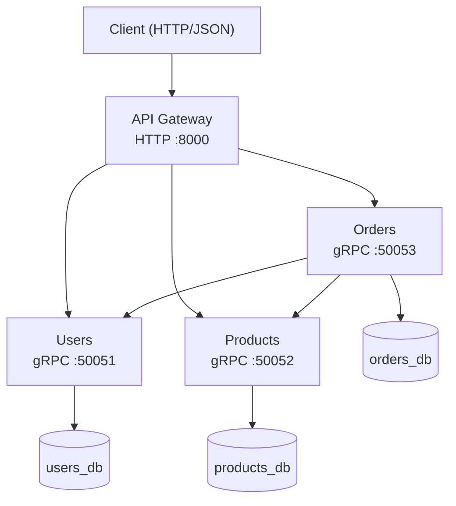
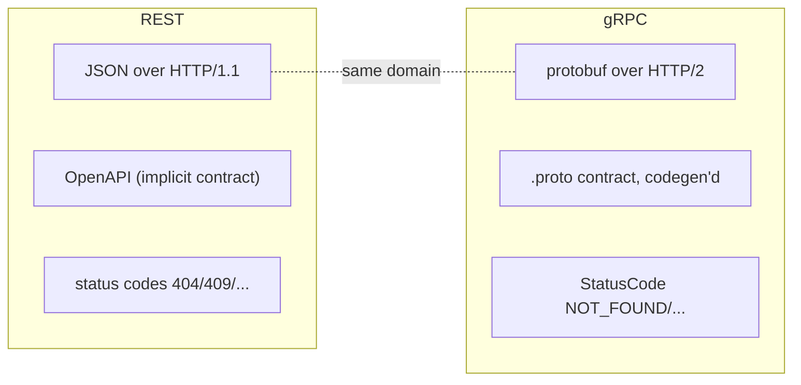

# gRPC E-commerce Microservices

A production-grade, multi-service e-commerce backend where **every inter-service
call is a gRPC unary RPC** defined by a Protocol Buffers contract. It is one of
three sibling repos that implement the *identical* domain over different
protocols so they can be compared directly:

| Repo | Transport | Contract |
| --- | --- | --- |
| `rest-ecommerce` | HTTP/JSON | OpenAPI (implicit) |
| **`grpc-ecommerce`** (this) | **gRPC / HTTP-2** | **Protocol Buffers** |
| `graphql-ecommerce` | GraphQL | SDL schema |

---

## 1. Topology



The Gateway is the only public component; it speaks HTTP outward and gRPC inward.

---

## 2. What's inside

```
grpc-ecommerce/
├── protos/                 # canonical .proto contracts (source of truth)
├── scripts/gen_protos.py   # regenerate stubs into every service + gateway
├── services/
│   ├── users/              # UserService  (gRPC server)
│   ├── products/           # ProductService (gRPC server)
│   └── orders/             # OrderService (gRPC server AND client)
├── gateway/                # HTTP → gRPC translator (FastAPI + grpc.aio client)
├── infra/postgres/         # init-databases.sql (3 databases)
├── docs/                   # ARCHITECTURE.md + REQUEST-LIFECYCLE.md
├── docker-compose.yml      # postgres + 3 services + gateway
└── Makefile                # protos / up / down / test / logs
```

Each folder has its own `README.md` explaining the code with Mermaid diagrams.

---

## 3. REST vs gRPC — what actually changed



| Concern | REST edition | gRPC edition |
| --- | --- | --- |
| Wire format | JSON | Protocol Buffers (binary) |
| Contract | implicit / OpenAPI | explicit `.proto`, code-generated |
| Transport | HTTP/1.1 | HTTP/2 (multiplexed) |
| Error signalling | HTTP status | gRPC `StatusCode` |
| Client calls | `httpx` + retry | `grpc.aio` stub + retry |
| Health | `GET /health/live` | `grpc_health.v1` Health service |
| Correlation | `X-Request-ID` header | `x-request-id` metadata |

The **business logic layer is unchanged** — only the transport adapter differs.

> **Studying the concepts?** [CONCEPTS.md](CONCEPTS.md) maps every **design
> pattern**, **SOLID** principle, **system-design** idea, and (the few) genuine
> **DSA** touch-points in this repo to the exact file that demonstrates them —
> including the gRPC-specific ones (Adapter/servicer, remote Proxy/stubs,
> Interceptor, contract-first codegen) — and cross-links to the `02`/`03`/`04`
> curriculum folders.

---

## 4. Quick start (Docker)

```bash
cp .env.example .env
docker compose up --build -d      # postgres + 3 gRPC services + gateway
curl http://localhost:8000/health
```

Try it end to end:

```bash
# create a product and a user, then place an order
curl -X POST localhost:8000/products -d '{"sku":"KB1","name":"Keyboard","price_cents":4999,"stock":10}' -H 'content-type: application/json'
curl -X POST localhost:8000/users    -d '{"email":"a@b.com","full_name":"Ann","password":"pw"}' -H 'content-type: application/json'
curl -X POST localhost:8000/orders   -d '{"user_id":"<uid>","items":[{"product_id":"<pid>","quantity":2}]}' -H 'content-type: application/json'
curl localhost:8000/aggregate/orders/<order-id>
```

---

## 5. Local development & tests

The `.venv/` here has the toolchain (grpcio, grpcio-tools, sqlalchemy, pytest…).

```powershell
# regenerate stubs after editing a .proto
.venv\Scripts\python.exe scripts\gen_protos.py

# run a service's tests (GRPC_VERBOSITY=NONE avoids harmless GOAWAY exit-code noise)
cd services\orders
$env:GRPC_VERBOSITY="NONE"
..\..\.venv\Scripts\python.exe -m pytest -q
```

**Test counts:** Users 6 · Products 8 · Orders 8 · Gateway 7 = **29 tests**.

Each service's tests run against fake in-process gRPC dependencies on ephemeral
ports, so no Postgres or Docker is needed to run them.

---

## 6. Learn the internals

- [docs/ARCHITECTURE.md](docs/ARCHITECTURE.md) — contract-first design, layering, cross-cutting concerns.
- [docs/REQUEST-LIFECYCLE.md](docs/REQUEST-LIFECYCLE.md) — a request traced end to end with failure + retry paths.
- Per-folder READMEs: [services/users/README.md](services/users/README.md), [services/products/README.md](services/products/README.md), [services/orders/README.md](services/orders/README.md), [gateway/README.md](gateway/README.md).
