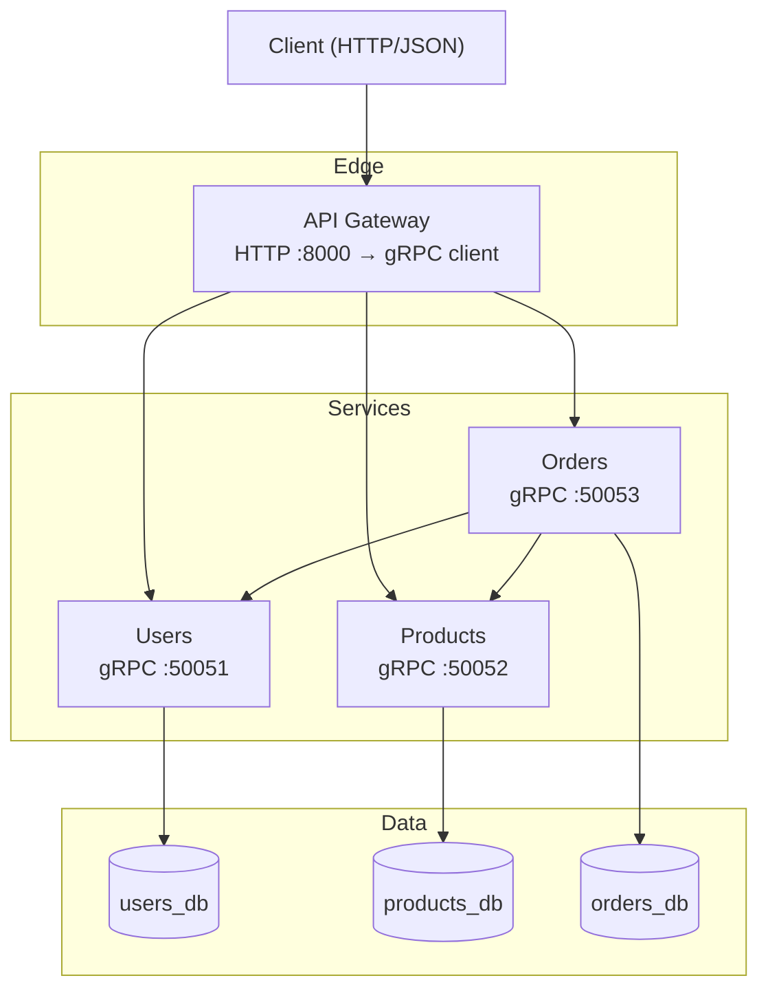
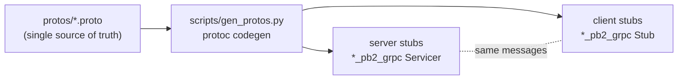
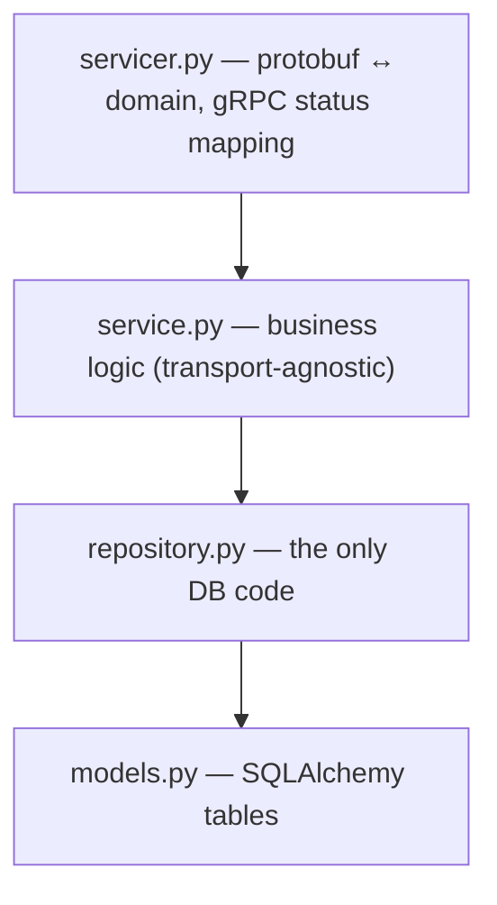
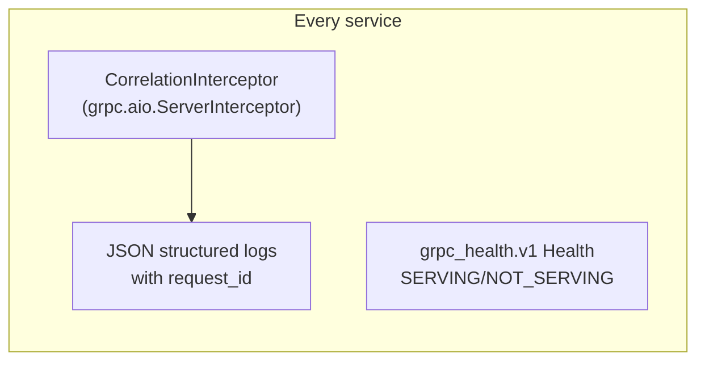

# Architecture — gRPC E-commerce

This repo implements the same e-commerce domain as the REST and GraphQL editions,
but every inter-service call is a **gRPC** unary RPC defined by a Protocol Buffers
contract. Reading the three editions side by side shows exactly what changes when
you swap the transport — and what stays the same.

---

## 1. System topology

Only the Gateway is public. Everything behind it speaks gRPC.

---

## 2. The contract is the source of truth

In gRPC the wire format is defined *once*, in `.proto` files under `protos/`, and
both sides generate code from them. Server and client can never disagree about
the message shape.

`gen_protos.py` writes the generated modules into each service's `app/pb/` (and
the gateway's). A small `pb/__init__.py` shim adds that directory to `sys.path`
so the generated flat `import users_pb2` statements resolve.

---

## 3. Per-service layering

Every service uses the same layered design; only the top (transport) layer knows
about protobuf.

Because `service.py` and below never import protobuf, the exact same business
logic could be re-exposed over REST or GraphQL — which is precisely what the
sibling repos do.

---

## 4. Cross-cutting concerns

- **Correlation id**: the Gateway mints an `x-request-id`; every service reads it
  from inbound metadata and forwards it on outbound calls, so one id traces a
  request across the whole fan-out.
- **Health**: each service registers the standard gRPC Health service; Docker's
  `HEALTHCHECK` and the Gateway's `/health/ready` both probe it.
- **Deadlines + retries**: callers (Orders, Gateway) attach a timeout to every
  RPC and retry only transient codes (`UNAVAILABLE`, `DEADLINE_EXCEEDED`).

---

## 5. Data ownership

Database-per-service: one Postgres instance, three logical databases created by
`infra/postgres/init-databases.sql`. No service reads another's tables — the only
way to get another service's data is to call its RPC.

| Service | Database | Owns |
| --- | --- | --- |
| Users | `users_db` | user accounts, credentials |
| Products | `products_db` | catalog, stock levels |
| Orders | `orders_db` | orders + line items (with price snapshot) |
