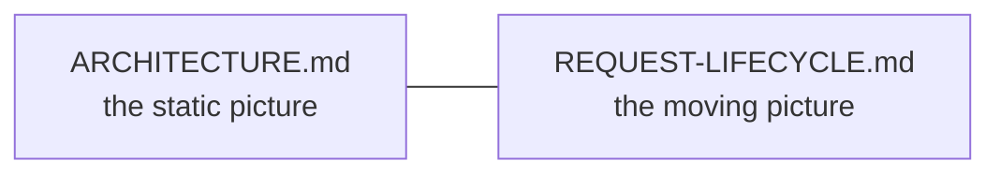
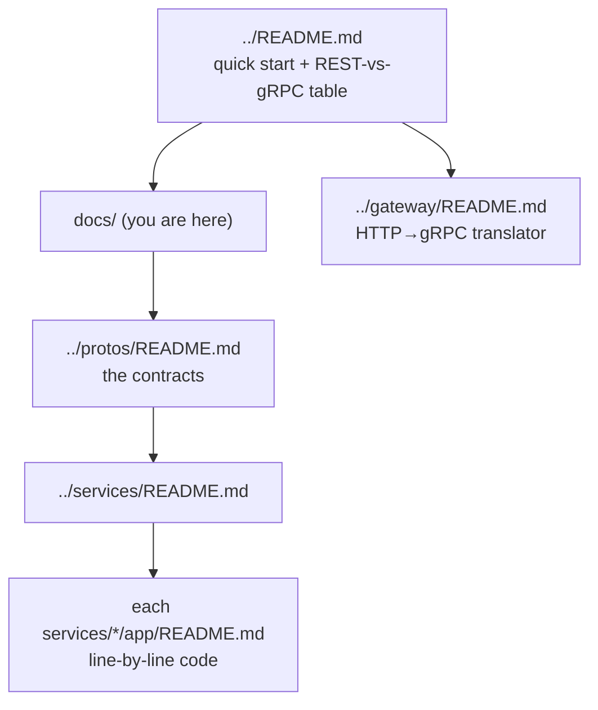

# `docs/` — architecture documentation (gRPC)

System-level documentation for the gRPC e-commerce repo. These explain the
**whole** system; each folder's own README explains that folder's code.

| Document | Answers |
|----------|---------|
| [ARCHITECTURE.md](ARCHITECTURE.md) | The pieces, how gRPC/protobuf ties them together, and how this compares to the REST/GraphQL editions. |
| [REQUEST-LIFECYCLE.md](REQUEST-LIFECYCLE.md) | Step by step: what happens when a `PlaceOrder` RPC flows through the system (interceptor → servicer → service → downstream stubs). |

## Where to go next

Start with [ARCHITECTURE.md](ARCHITECTURE.md), then
[REQUEST-LIFECYCLE.md](REQUEST-LIFECYCLE.md), then the contracts in
[../protos/README.md](../protos/README.md) and the code in
[../services/README.md](../services/README.md).
