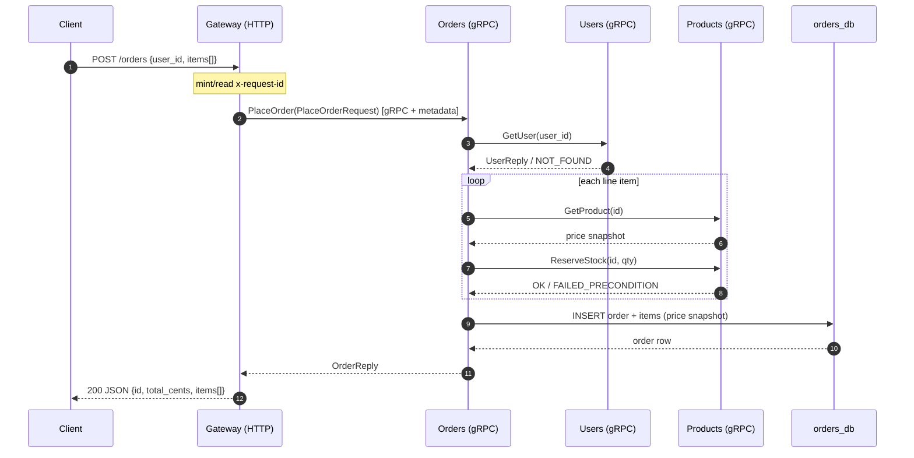
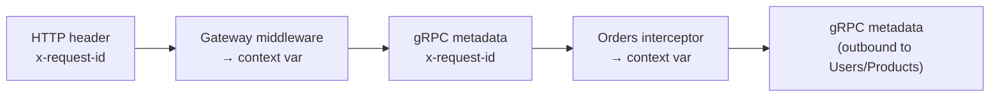
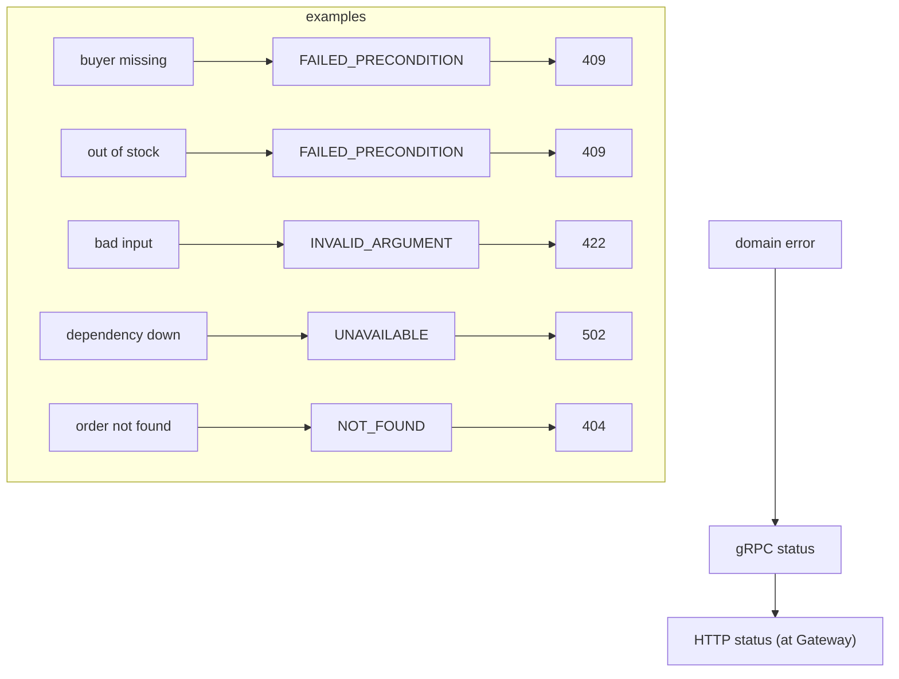
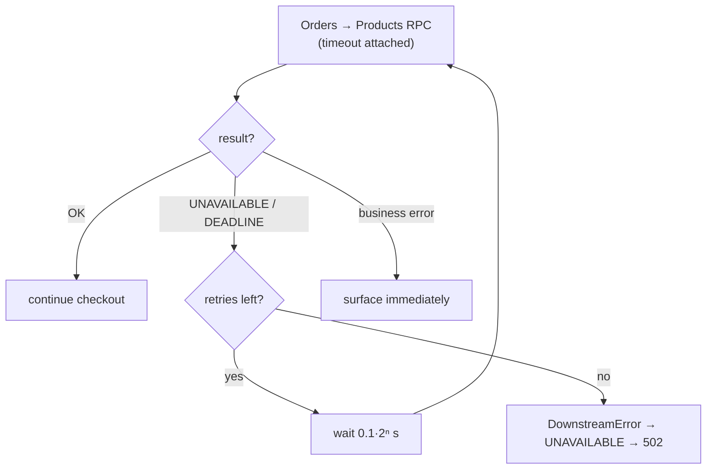

# Request Lifecycle — placing an order

This walks a single "place an order" request from the client's HTTP call all the
way down to three databases and back, showing exactly where the protocol switches
between HTTP and gRPC.

---

## 1. End-to-end sequence

Step 1–2 is **HTTP**; every arrow after that is **gRPC**. The Gateway is the
translation boundary.

---

## 2. Where the id lives

The same id is a header at the edge and metadata on every hop — logs from all
four services can be joined on it.

---

## 3. Failure translation

Each servicer maps domain errors to gRPC status; the Gateway maps gRPC status
back to HTTP. A failure therefore surfaces to the client as a sensible HTTP code.

---

## 4. Retry behaviour on a flaky dependency

Only transient codes are retried; a `NOT_FOUND` or `FAILED_PRECONDITION` is a
real answer and is surfaced without retrying.
