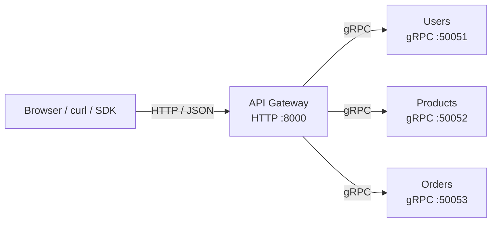
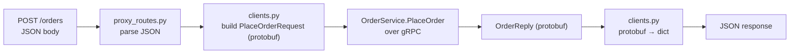
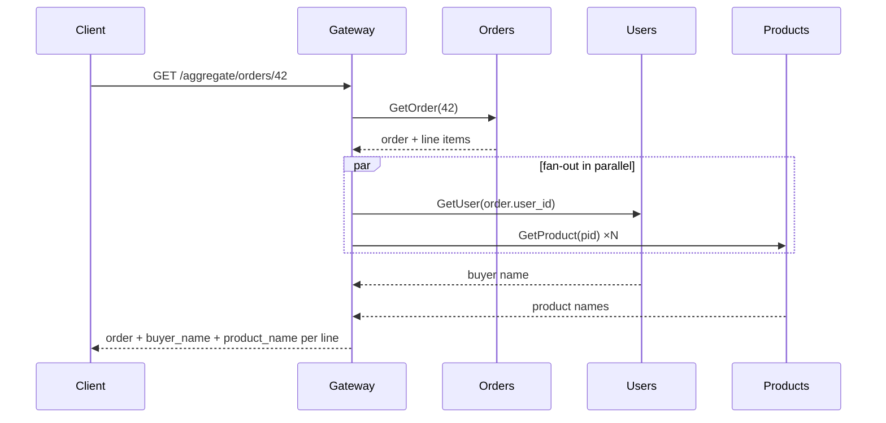
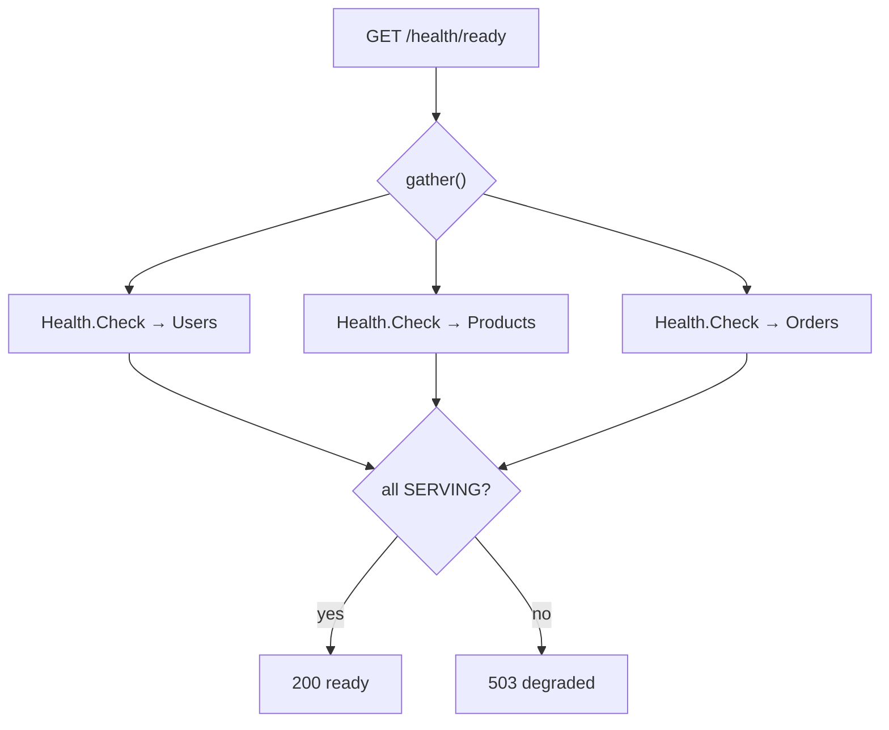

# API Gateway (gRPC backend)

The **Gateway** is the single public entry point. It speaks **HTTP/JSON** to the
outside world and **gRPC** to the three backend services. It is the direct
counterpart of the REST edition's Gateway, but where that one forwarded HTTP to
HTTP, this one *translates protocols*: HTTP request in, protobuf RPC out.

It is completely **stateless** — no database.

---

## 1. Position in the system



---

## 2. What "protocol translation" means here



The reverse of what each servicer does: the servicer maps *domain errors → gRPC
status*; the Gateway maps *gRPC status → HTTP status*.

| gRPC status | HTTP status |
| --- | --- |
| `NOT_FOUND` | 404 |
| `ALREADY_EXISTS` | 409 |
| `INVALID_ARGUMENT` | 422 |
| `FAILED_PRECONDITION` | 409 |
| `UNAUTHENTICATED` | 401 |
| `UNAVAILABLE` | 502 |
| `DEADLINE_EXCEEDED` | 504 |

---

## 3. File anatomy

| File | Responsibility |
| --- | --- |
| `config.py` | HTTP host/port + the three backend gRPC addresses. |
| `observability.py` | Correlation middleware; mints/forwards `x-request-id` as gRPC metadata. |
| `clients.py` | One channel + stub per service; protobuf ↔ dict; gRPC status → HTTP. |
| `routers/proxy_routes.py` | REST-shaped endpoints delegating to `clients.py`. |
| `routers/aggregate.py` | `GET /aggregate/orders/{id}` — enrich an order in parallel. |
| `routers/health.py` | `/health` (self) + `/health/ready` (fan-out probe). |
| `main.py` | App factory; opens channels on startup, closes them on shutdown. |

Channels are opened once in the lifespan and reused for every request — opening a
channel per call would be slow and defeat HTTP/2 multiplexing.

---

## 4. The aggregation endpoint

`GET /aggregate/orders/{id}` shows why a gateway exists: the client makes **one**
call and the gateway composes the answer from **three** services in parallel.



---

## 5. Readiness fan-out

`/health/ready` probes each backend's gRPC **Health** service in parallel and
returns 503 if any is not `SERVING`.



---

## 6. Endpoints

| Method + path | Backend RPC |
| --- | --- |
| `POST /users` | `UserService.CreateUser` |
| `GET /users/{id}` | `UserService.GetUser` |
| `GET /users` | `UserService.ListUsers` |
| `POST /users/login` | `UserService.Login` |
| `POST /products` | `ProductService.CreateProduct` |
| `GET /products/{id}` | `ProductService.GetProduct` |
| `GET /products` | `ProductService.ListProducts` |
| `POST /orders` | `OrderService.PlaceOrder` |
| `GET /orders/{id}` | `OrderService.GetOrder` |
| `GET /orders?user_id=` | `OrderService.ListOrders` |
| `GET /aggregate/orders/{id}` | Orders + Users + Products |

---

## 7. Testing & running

The tests stand up fake in-process gRPC servers for all three backends, point the
gateway settings at them, and drive the gateway over HTTP via an ASGI transport —
so the real routing, translation, and status mapping run.

```powershell
$env:GRPC_VERBOSITY="NONE"
..\.venv\Scripts\python.exe -m pytest -q     # 7 tests

uvicorn app.main:app --port 8000             # run locally
```
