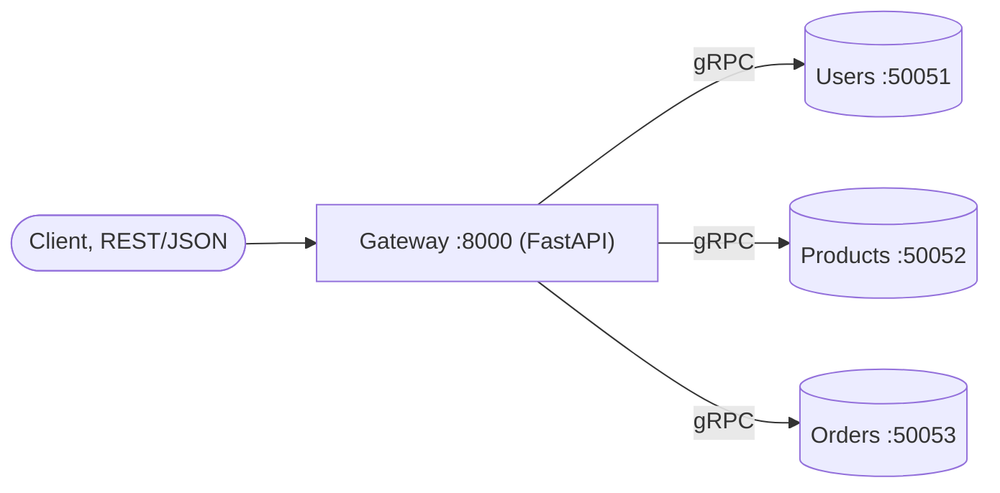
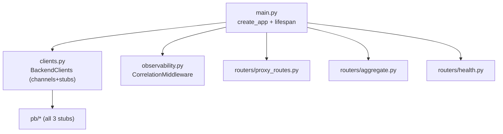
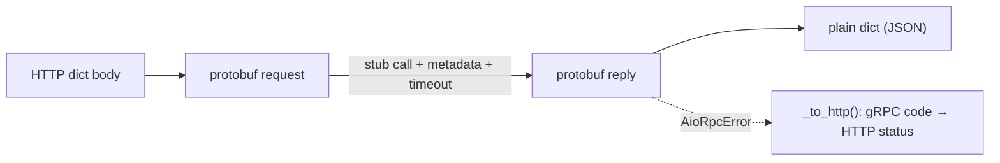
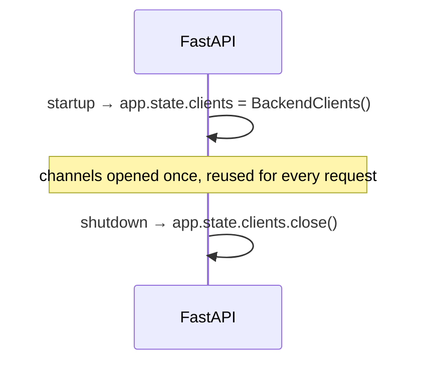

# `gateway/app/` — API Gateway application package (HTTP → gRPC)

The gRPC gateway is an **HTTP → gRPC translator**. Clients speak plain REST/JSON
to it; internally it calls the backends over **gRPC**. It holds one long-lived
`grpc.aio` channel + typed stub per service, opened on startup and closed on
shutdown.

> **Concepts in this folder** — see [CONCEPTS.md](../../CONCEPTS.md). Illustrates
> *API Gateway / Facade* with **protocol translation**, remote *Proxy* (stubs),
> and *long-lived channels* (connection reuse) — flagged inline below.

---

## 1. Module map

| File | Role |
|------|------|
| [clients.py](clients.py) | `BackendClients` — the HTTP↔gRPC translation + status mapping |
| [main.py](main.py) | `create_app()`; lifespan opens/closes channels on `app.state.clients` |
| [observability.py](observability.py) | correlation middleware + `outbound_metadata()` to forward `x-request-id` |
| [pb/](pb/README.md) | generated stubs for all three services |

---

## 2. `clients.py` — the translation layer

`BackendClients` owns three channels + stubs. Every method: build a protobuf
request from an HTTP dict → call the stub (with metadata + deadline) → convert the
reply back to a plain dict → **map any gRPC error to an `HTTPException`**.

### The status map (inverse of the servicers)

| `grpc.StatusCode` | HTTP |
|-------------------|------|
| `NOT_FOUND` | 404 |
| `ALREADY_EXISTS` | 409 |
| `FAILED_PRECONDITION` | 409 |
| `INVALID_ARGUMENT` | 422 |
| `UNAUTHENTICATED` | 401 |
| `UNAVAILABLE` | 502 |
| `DEADLINE_EXCEEDED` | 504 |
| (anything else) | 500 |

`_user`, `_product`, `_order` are the reply→dict converters (the `_order` one
rebuilds the nested items list). `close()` shuts the three channels down cleanly.

> **Pattern — Facade with protocol translation:** the gateway presents a REST/JSON
> face while speaking gRPC internally; `_to_http()` is the inverse of the
> servicers' status maps — one boundary owns the translation both ways
> ([03-design-patterns](../../../../03-design-patterns/architectural_notes.md)).

---

## 3. `main.py` — lifespan owns the channels

Channels are **long-lived** (created once at startup, not per request) — that's
how gRPC is meant to be used; a channel multiplexes many calls over one HTTP/2
connection. Routers read `request.app.state.clients`.

> **System design — connection reuse:** one HTTP/2 channel multiplexes many
> concurrent RPCs, so opening channels once at startup (not per request) avoids
> repeated TCP/TLS handshakes — a key gRPC performance property
> ([04-system-design](../../../../04-system-design/architectural_notes.md),
> [10-networking-security-testing](../../../../10-networking-security-testing/)).

`observability.py` differs slightly from the services: it exposes
`outbound_metadata()` so each outbound stub call forwards the inbound
`x-request-id` as gRPC metadata, keeping the trace unbroken across the HTTP→gRPC
boundary.
