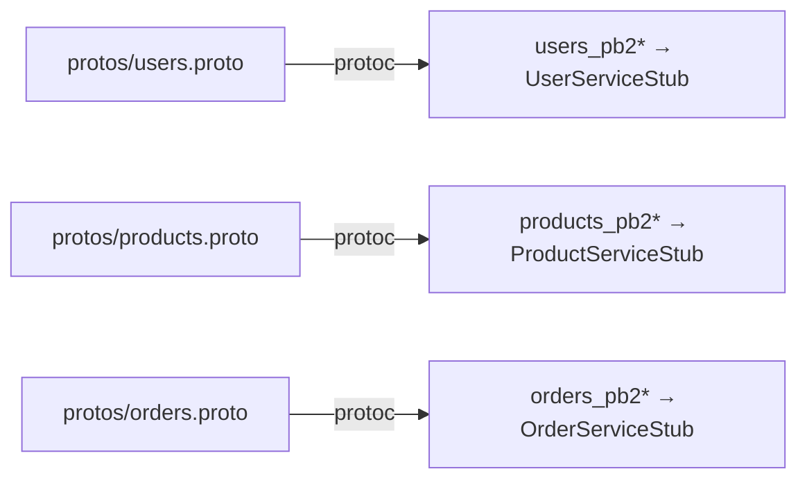

# `gateway/app/pb/` — generated gRPC stubs

Generated by [`scripts/gen_protos.py`](../../../scripts/README.md). **Do not edit
by hand.** The gateway calls **all three** backends, so it needs all three
**client** stubs.

| Stub | Used by |
|------|---------|
| `users_pb2_grpc.UserServiceStub` | `BackendClients.create_user/get_user/list_users/login` |
| `products_pb2_grpc.ProductServiceStub` | `BackendClients.*_product(s)` |
| `orders_pb2_grpc.OrderServiceStub` | `BackendClients.place_order/get_order/list_orders` |

The gateway uses **only the client-side `*Stub` classes** — never the
`*Servicer` base classes, because it is not a gRPC server. The `__init__.py`
sys.path shim works as described in the
[Users pb README](../../../services/users/app/pb/README.md). Regenerate with
`python scripts/gen_protos.py` (or `make protos`) from the repo root.
