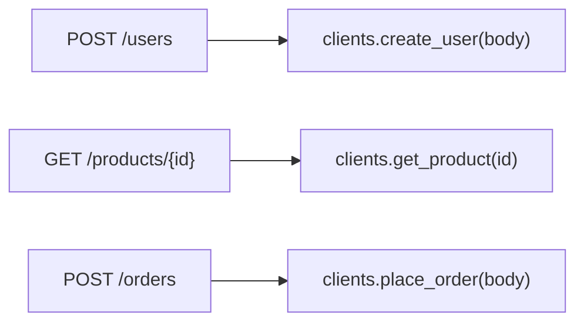
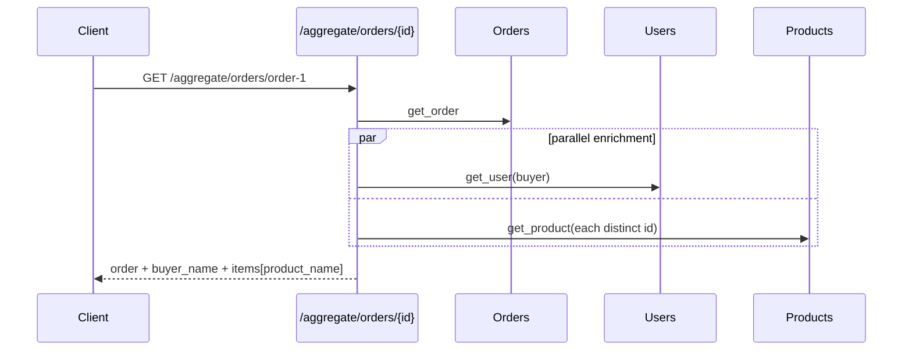
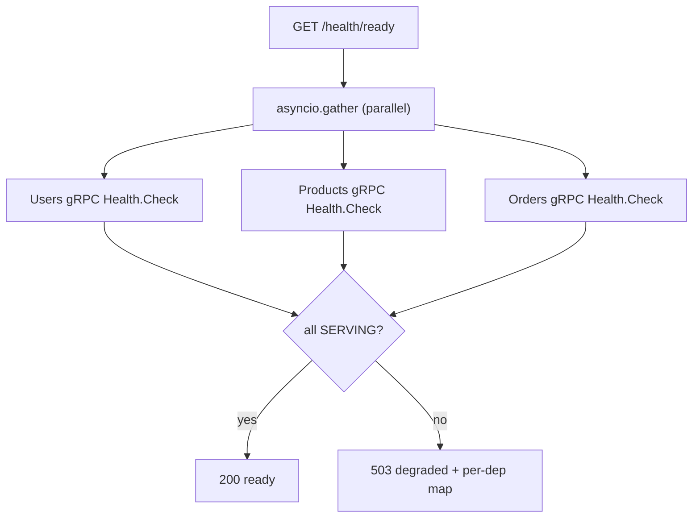

# `gateway/app/routers/` — gateway route families (HTTP → gRPC)

Three routers translate REST-shaped HTTP into gRPC calls via
`request.app.state.clients` (`BackendClients`).

| File | Prefix | Responsibility |
|------|--------|----------------|
| [proxy_routes.py](proxy_routes.py) | (root) | one REST endpoint per gRPC method |
| [aggregate.py](aggregate.py) | `/aggregate` | fan out to several services, compose |
| [health.py](health.py) | `/health` | liveness + gRPC Health fan-out |

---

## 1. `proxy_routes.py` — REST verb/path → gRPC method

Each handler is a one-liner: read the HTTP request, call the matching
`BackendClients` method, return the dict as JSON. This is where the REST world
(paths, verbs, JSON) is mapped onto the gRPC world (services, methods, protobuf).
All status-code translation is already handled inside `clients.py`.

---

## 2. `aggregate.py` — parallel fan-out + compose

`GET /aggregate/orders/{id}` returns an order enriched with the buyer's name and
each item's product name — the same value-add as the REST gateway, but the
enrichment calls go out **in parallel over gRPC**.

- Uses `asyncio.gather(..., return_exceptions=True)` so one failed enrichment
  doesn't sink the whole response — missing names come back as `None`.
- Only **distinct** product ids are fetched (`{i["product_id"] for i in items}`),
  avoiding duplicate calls for repeated products.

---

## 3. `health.py`

`/health` is always `200` (the gateway process is up). `/health/ready` opens a
short-lived channel to each backend's **standard gRPC Health service**, probes
them in parallel (2s timeout), and returns **503** if any is not SERVING.

## 4. `__init__.py`

Empty package marker for `from .routers import aggregate, health, proxy_routes`.
