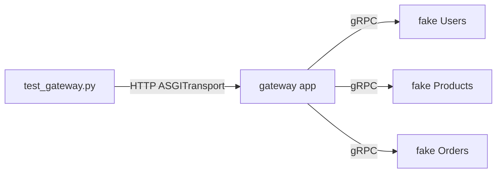
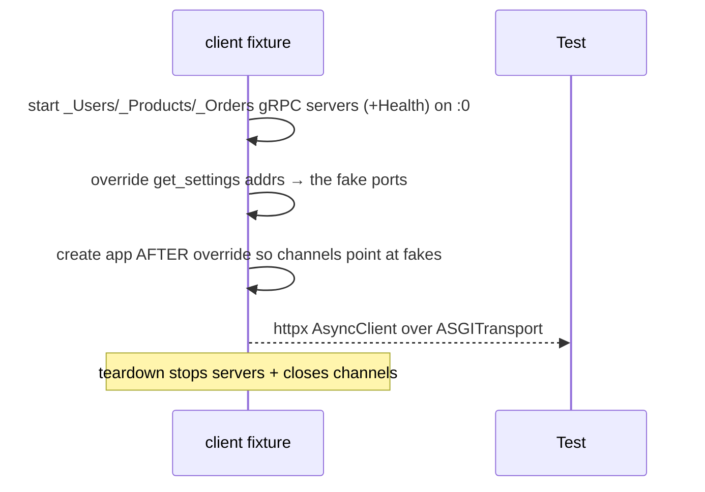
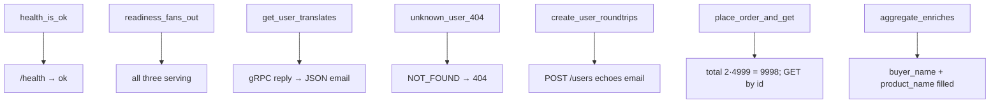

# `gateway/tests/` — test suite (gRPC gateway)

The gateway is a pure HTTP → gRPC translator, so the harness stands up **three
fake in-process gRPC servers** (Users, Products, Orders — each with a standard
Health service) on ephemeral ports, points the gateway's settings at them, and
drives the gateway over HTTP via `ASGITransport`. The real gateway routing,
translation, and status mapping all run.



---

## 1. `conftest.py` — fake fleet + settings override



- Each fake implements the generated `*Servicer` interface with in-memory dicts
  (`_Users` seeds `user-1`, `_Products` seeds `prod-1` @ 4999, `_Orders` starts
  empty and echoes a `unit_price_cents=4999` snapshot).
- Every fake also registers a **gRPC Health servicer** set to SERVING, so the
  gateway's `/health/ready` fan-out sees them as up.
- The settings addresses are overridden to the ephemeral ports **before** the
  gateway opens its channels.

---

## 2. `test_gateway.py` — what each test proves



| Test | Proves |
|------|--------|
| `test_health_is_ok` | liveness |
| `test_readiness_fans_out` | all deps `serving` |
| `test_get_user_translates_grpc_to_json` | protobuf reply → JSON |
| `test_unknown_user_maps_not_found_to_404` | **gRPC `NOT_FOUND` → HTTP 404** (the status map) |
| `test_create_user_roundtrips` | HTTP body → protobuf request |
| `test_place_order_and_get` | orchestrated call, `total_cents == 9998` |
| `test_aggregate_enriches_order` | fan-out fills `buyer_name` + `product_name` |

The `test_unknown_user_maps_not_found_to_404` case is the key one — it verifies
the whole `AioRpcError → HTTPException` mapping end-to-end.

---

## How to run

```powershell
cd gateway
$env:GRPC_VERBOSITY="NONE"
..\.venv\Scripts\python.exe -m pytest -q
```
