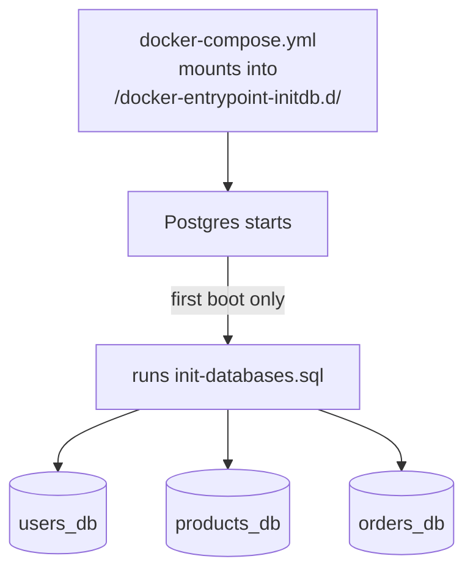

# `infra/postgres/` — database bootstrap

One file: [`init-databases.sql`](init-databases.sql). It implements the
**database-per-service** pattern with a single Postgres container.



```sql
CREATE DATABASE users_db;
CREATE DATABASE products_db;
CREATE DATABASE orders_db;
```

**Why one instance, three databases:** each service is configured with a URL
pointing only at its own database, so no service can read another's tables —
while the whole system still comes up from a single `docker compose up`. Scripts
in `/docker-entrypoint-initdb.d/` run **only on first startup** (empty data
directory); to re-run after editing, drop the volume with
`docker compose down -v`.

> Identical to the [REST edition's bootstrap](../../../rest-ecommerce/infra/postgres/README.md) —
> the database topology doesn't change between protocols, only the wire format does.
