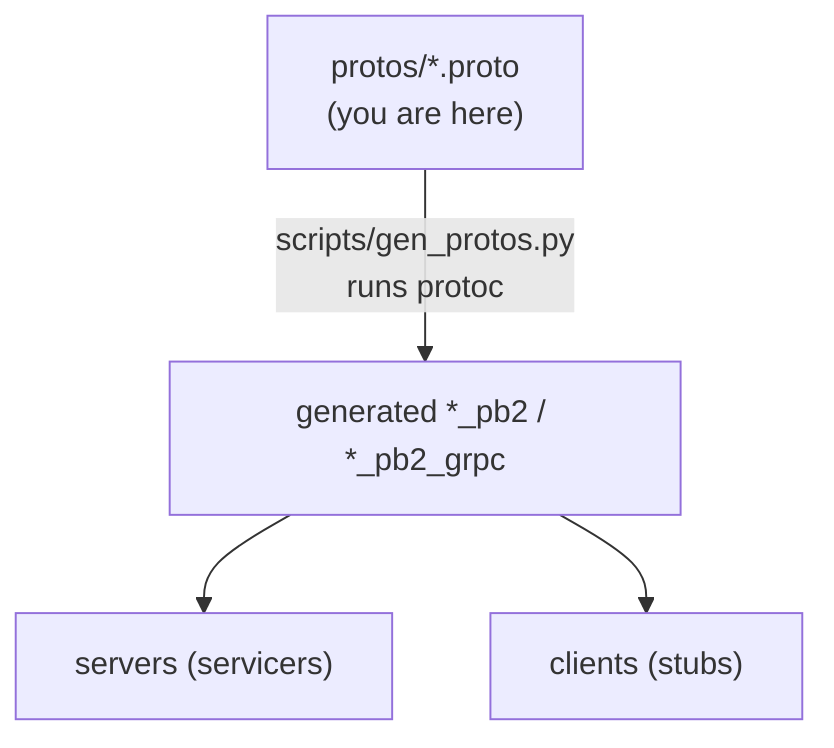
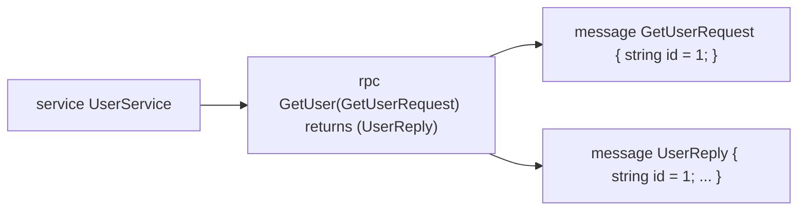

# `protos/` — the gRPC contracts (source of truth)

These `.proto` files are the **single source of truth** for every inter-service
call. Both the server and its clients generate code from the same file, so they
can never disagree about the wire format. This is the defining feature of gRPC:
the contract comes first, the code is generated from it.

> **System design \u2014 contract-first / IDL:** the schema is defined once and code is
> generated for every language, giving compile-time-safe cross-service contracts
> and explicitly versioned **field numbers** for backward/forward compatibility.
> **DSA \u2014 binary encoding:** protobuf uses varint-encoded field tags \u2014 a compact
> binary format vs. JSON text. See
> [04-system-design](../../../04-system-design/architectural_notes.md) and the repo
> [CONCEPTS.md](../CONCEPTS.md).



| File | Defines | Server | Clients |
|------|---------|--------|---------|
| [users.proto](users.proto) | `UserService` (CreateUser, GetUser, ListUsers, Login) | Users svc | Orders, Gateway |
| [products.proto](products.proto) | `ProductService` (CreateProduct, GetProduct, ListProducts, ReserveStock) | Products svc | Orders, Gateway |
| [orders.proto](orders.proto) | `OrderService` (PlaceOrder, GetOrder, ListOrders) | Orders svc | Gateway |

---

## Anatomy of a `.proto`



| Concept | Meaning |
|---------|---------|
| `service` | a named group of RPC methods |
| `rpc M(Req) returns (Rep)` | one **unary-unary** method: one request message in, one reply out |
| `message` | a typed record; fields carry a **field number** (`= 1`, `= 2`) |
| **field numbers** | the field's identity on the wire — **never change them once deployed**; names can change, numbers cannot |
| `repeated` | a list (e.g. `repeated OrderItemInput items`) |
| `int64 unit_price_cents` | money as integer cents (same rule as REST/GraphQL) |

Two deliberate contract choices worth noting:
- `UserReply` has **no password field** — a hash can never leak over the wire.
- `orders.proto` shows a service that is both a **server** and a **client**
  (Orders implements `OrderService` but calls `UserService` + `ProductService`).

## Regenerating after an edit

```powershell
python scripts/gen_protos.py     # or: make protos
```

See [scripts/README.md](../scripts/README.md) for how generation maps each proto
into the right service's `app/pb/` folder.
