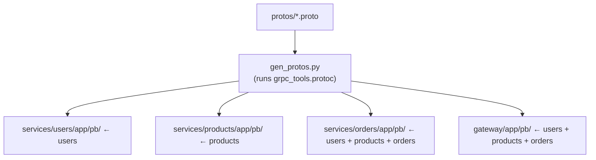
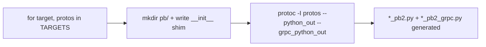

# `scripts/` — build/codegen scripts

One script: [`gen_protos.py`](gen_protos.py). It regenerates the gRPC Python
stubs from the canonical [`protos/`](../protos/README.md) contracts, placing each
service's stubs into its own `app/pb/` folder.



---

## What `gen_protos.py` does

| Step | Detail |
|------|--------|
| **1. Targets map** | `TARGETS` says which proto modules each package needs. Leaf services get only their own; **Orders** and the **Gateway** get all three (they are clients). |
| **2. Write the shim** | Each `pb/` gets an `__init__.py` that prepends its own dir to `sys.path`, so the generated `import users_pb2` (flat import that protoc emits) resolves. |
| **3. Run protoc** | Invokes `python -m grpc_tools.protoc` with `--python_out` (messages) and `--grpc_python_out` (service stubs). |



---

## Why generate instead of hand-writing?

The `*_pb2.py` (messages) and `*_pb2_grpc.py` (stubs) are **derived** from the
`.proto` contract. Regenerating guarantees the code always matches the contract —
you never hand-edit generated files (see any [`pb/README.md`](../services/users/app/pb/README.md)).

## Run it

```powershell
python scripts/gen_protos.py     # or: make protos
```

The Dockerfiles also run this during image build (build context = repo root, so
`protos/` is available), so containers always ship freshly generated stubs.
