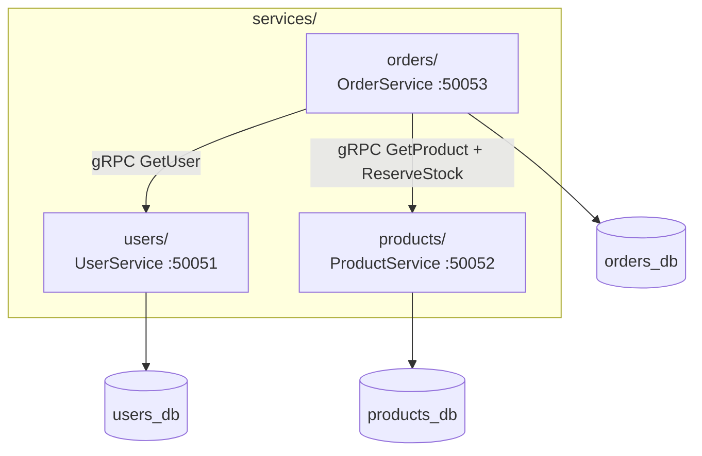
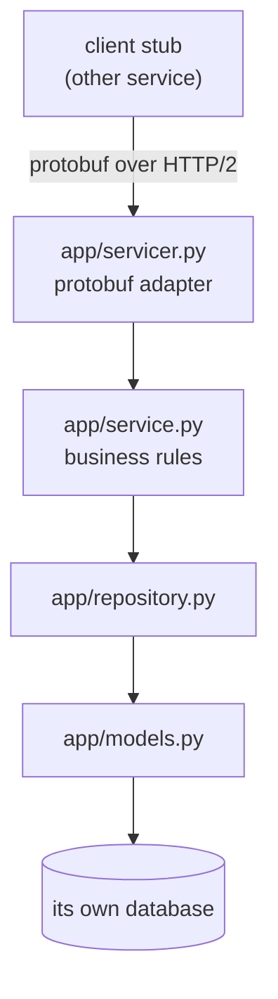

# `services/` — the microservices (gRPC)

The three independent backend services, each a separately deployable **gRPC
server** with its own database, Dockerfile, and tests. They communicate over
**gRPC** (not HTTP), using the contracts in [`../protos/`](../protos/README.md).

| Service | Port | Owns | Talks to | README |
|---------|------|------|----------|--------|
| `users/` | 50051 | accounts, login | — | [users/README.md](users/README.md) · [app](users/app/README.md) |
| `products/` | 50052 | catalog, stock | — | [products/README.md](products/README.md) · [app](products/app/README.md) |
| `orders/` | 50053 | orders, checkout | Users + Products | [orders/README.md](orders/README.md) · [app](orders/app/README.md) |

---

## The gRPC service shape

Compared to the REST edition, only the **edge** changes:

| REST | gRPC |
|------|------|
| `app/routers/*` (HTTP) | `app/servicer.py` + `app/server.py` (gRPC) |
| middleware | interceptor (`observability.py`) |
| HTTP status codes | `grpc.StatusCode` |
| — | `app/pb/` generated stubs |

The inner layers (`service`, `repository`, `models`) are **transport-agnostic and
identical** to REST — which is exactly the point of the layering. Drill into any
service's `app/` README for the line-by-line walkthrough.
