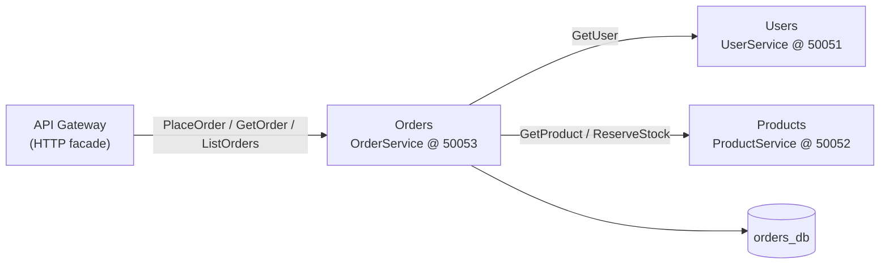
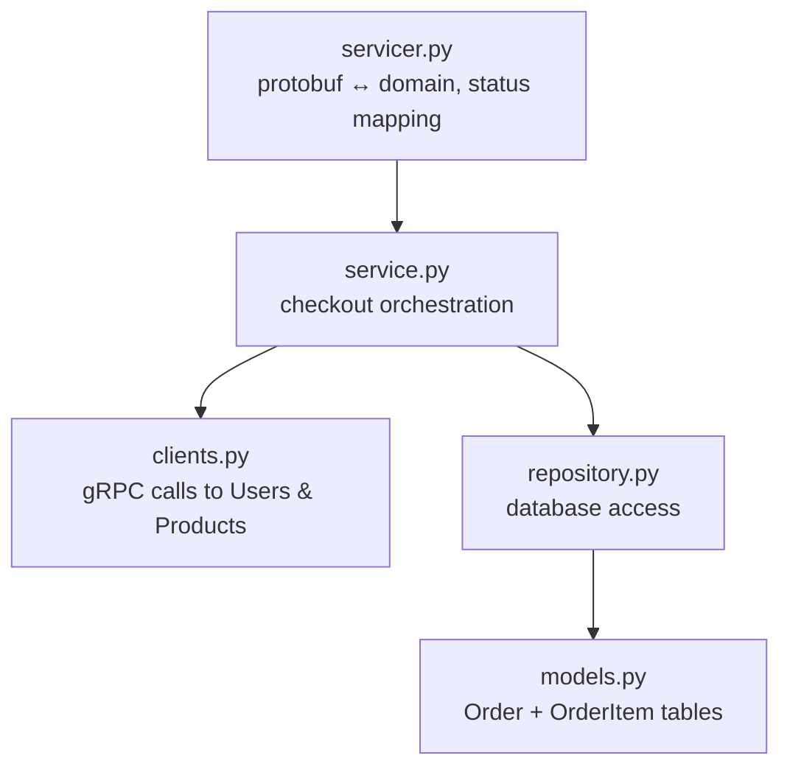
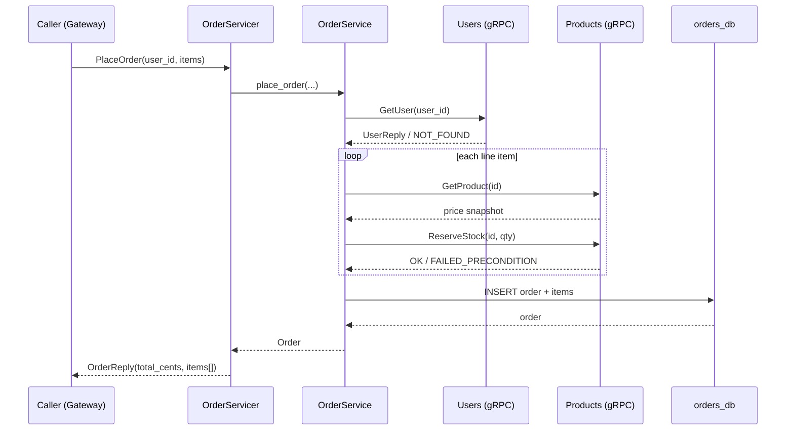
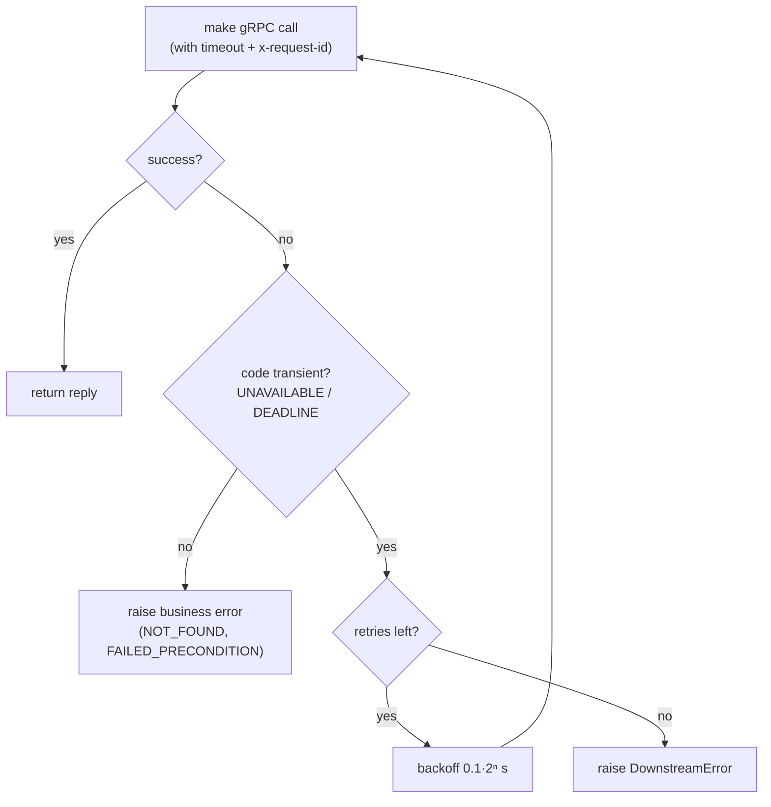
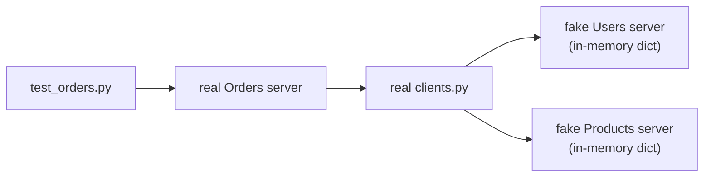

# Orders Service (gRPC)

The **Orders** service owns checkout. It is the most interesting service in this
repo because it is simultaneously a gRPC **server** (it implements
`OrderService`) and a gRPC **client** (it calls `UserService` and
`ProductService` to fulfil an order). It is the direct counterpart of the REST
edition's Orders service — same domain logic, different transport.

---

## 1. Where it sits in the system



The service both terminates RPCs (top edge) and originates RPCs (bottom edges).

---

## 2. Layered anatomy

Every request flows through the same layers. Only `servicer.py` knows about
protobuf; everything below it is transport-agnostic Python.



| File | Responsibility |
| --- | --- |
| `config.py` | Settings: bind address, DB URL, **downstream addresses**, timeout, retries. |
| `database.py` | Async engine, `SessionLocal`, `init_models`. |
| `models.py` | `Order` header + `OrderItem` lines (price snapshot per line). |
| `repository.py` | `add` / `get` / `list_for_user` — the only DB code. |
| `clients.py` | `UsersGrpcClient` + `ProductsGrpcClient` with deadline, retry, metadata. |
| `service.py` | `OrderService.place_order` orchestration + domain exceptions. |
| `servicer.py` | Maps domain exceptions to gRPC status codes. |
| `observability.py` | Correlation interceptor + JSON logs; forwards `x-request-id`. |
| `server.py` | Builds the async server, opens downstream channels, wires health. |

---

## 3. The checkout sequence



The **unit price is snapshotted** into each `OrderItem` at purchase time, so a
later price change never rewrites order history.

---

## 4. Resilient downstream calls

`clients.py` wraps every outbound RPC with a deadline and a retry policy. Only
*transient* codes are retried; business errors are surfaced immediately.



The `x-request-id` metadata is read from `request_id_ctx` (set by the inbound
interceptor) and attached to every outbound call, so one id traces the whole
Gateway → Orders → Users/Products fan-out.

---

## 5. Error → gRPC status mapping

| Domain condition | Raised as | gRPC status |
| --- | --- | --- |
| empty items / bad quantity | `ValidationError` | `INVALID_ARGUMENT` |
| buyer does not exist | `UserNotFound` | `FAILED_PRECONDITION` |
| product missing / oversold | `ProductUnavailable` | `FAILED_PRECONDITION` |
| dependency unreachable | `DownstreamError` | `UNAVAILABLE` |
| order id not found | `OrderNotFound` | `NOT_FOUND` |

---

## 6. Testing strategy

The Orders service cannot import the other services' server code, so the test
suite stands up **fake** in-process gRPC servers implementing the generated
`UserServiceServicer` / `ProductServiceServicer` on ephemeral ports. This
exercises the **real** client code, orchestration, and serialization against a
controllable dependency.



Run locally:

```powershell
$env:GRPC_VERBOSITY="NONE"   # silence harmless GOAWAY noise on teardown
..\..\.venv\Scripts\python.exe -m pytest -q
```

---

## 7. Running

```powershell
python -m app.server        # starts the async gRPC server on :50053
python -m app.healthcheck   # exits 0 when SERVING (used by Docker HEALTHCHECK)
```
