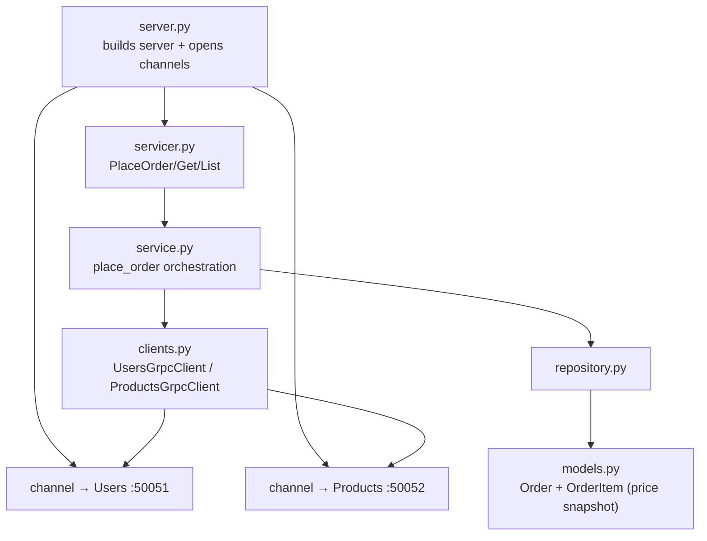
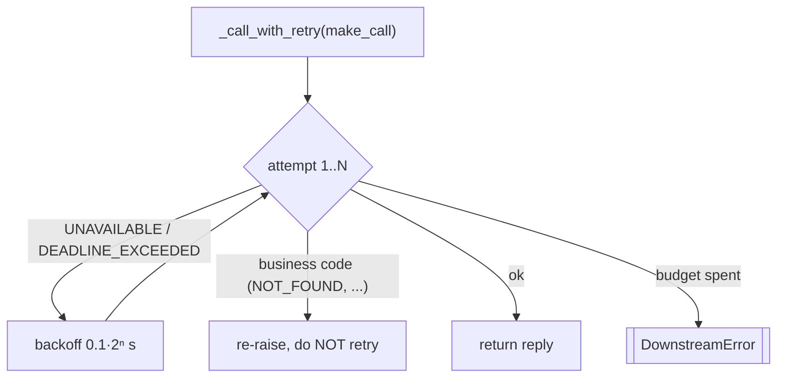
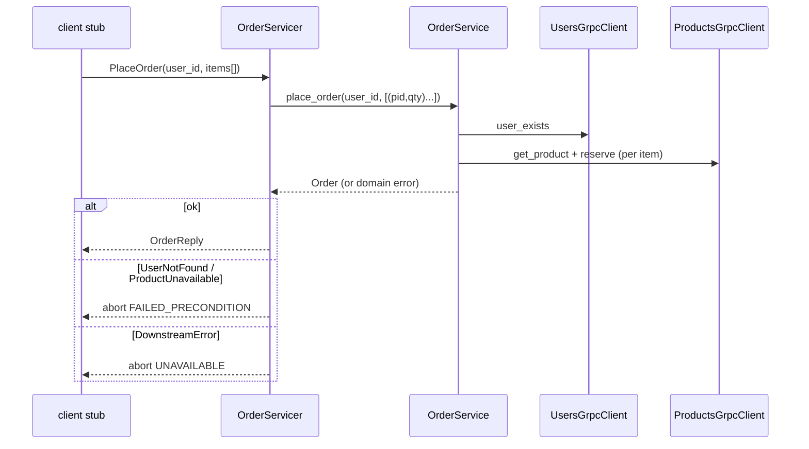
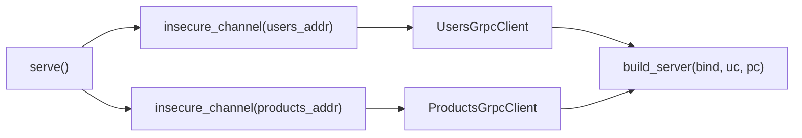

# `services/orders/app/` — application package (gRPC)

The **Orders service** over gRPC. It is both a gRPC **server** (its own
`OrderService`) *and* a gRPC **client** of Users and Products. The orchestration
logic in `service.py` is the same as REST; what's different is the outbound edge —
[`clients.py`](clients.py) uses **channels + stubs + deadlines** instead of httpx.

> Stubs: [`pb/`](pb/README.md) (contains `users`, `products` **and** `orders`
> because Orders calls the first two). Contracts:
> [`../../../protos/`](../../../protos/README.md).

> **Concepts in this folder** — see [CONCEPTS.md](../../../CONCEPTS.md).
> Illustrates *Orchestration/Saga*, *Strategy* (selective retry), remote *Proxy*
> (stubs), *Adapter* (servicer), and *deadlines* — flagged inline below.

---

## 1. Module map — server + client in one process

---

## 2. `clients.py` — the gRPC outbound edge

The gRPC analogue of REST's httpx clients. Two production concerns live here:

| Piece | Detail |
|-------|--------|
| `_md()` | forwards the correlation id as `x-request-id` **metadata** (gRPC's headers). |
| `_RETRYABLE = {UNAVAILABLE, DEADLINE_EXCEEDED}` | only **transient** codes are retried; `NOT_FOUND`/`FAILED_PRECONDITION` are business answers and re-raised immediately. |
| every call passes `timeout=` | a per-call **deadline** so a slow dependency can't hang the order. |
| `UsersGrpcClient.user_exists` | `GetUser` → `True`; `NOT_FOUND` → `False`; else `DownstreamError`. |
| `ProductsGrpcClient.get_product` | `GetProduct` → dict; `NOT_FOUND` → `ProductUnavailable`. |
| `ProductsGrpcClient.reserve` | `ReserveStock`; **`FAILED_PRECONDITION` → `ProductUnavailable`** (oversold), `NOT_FOUND` → `ProductUnavailable`. |

The clients translate **gRPC status codes back into domain exceptions**, so
`service.py` stays transport-agnostic — it only ever sees `ProductUnavailable` /
`DownstreamError`, never a `StatusCode`.

> **Pattern — Strategy:** `_call_with_retry` is an interchangeable retry policy.
> **System design — resilience:** retry *only* the transient codes
> (`UNAVAILABLE`/`DEADLINE_EXCEEDED`) and always set a per-call **deadline** so a
> slow dependency can't hang checkout
> ([04-system-design](../../../../../04-system-design/architectural_notes.md)).

---

## 3. `servicer.py` — status mapping (orchestrator)

| Domain exception | `grpc.StatusCode` |
|------------------|-------------------|
| `ValidationError` | `INVALID_ARGUMENT` |
| `UserNotFound` | `FAILED_PRECONDITION` |
| `ProductUnavailable` | `FAILED_PRECONDITION` |
| `DownstreamError` | `UNAVAILABLE` |
| `OrderNotFound` | `NOT_FOUND` |

`PlaceOrder` unpacks protobuf items into `[(product_id, quantity), …]` tuples
before calling the service. `_to_reply` builds the nested `OrderReply` with its
`OrderItemReply` list.

---

## 4. `server.py` — server that is also a client

Unlike Users/Products, `build_server(bind, users_client, products_client)`
**accepts the two clients** so tests can inject clients pointed at fake in-process
servers. `serve()` opens **long-lived channels** to
`settings.users_service_addr` / `products_service_addr`, wraps them in the typed
clients, and hands them to `build_server`.

---

## 5. Inner layers + shared gRPC bits

`service.py` (checkout orchestration + price snapshot), `repository.py`,
`models.py` (`Order`/`OrderItem`, `selectin` + cascade) mirror the
[REST Orders app README](../../../../rest-ecommerce/services/orders/app/README.md).
The gRPC `observability.py` interceptor, `healthcheck.py` (probes `:50053`), and
`pb/` shim mirror the [gRPC Users app README](../../users/app/README.md).
