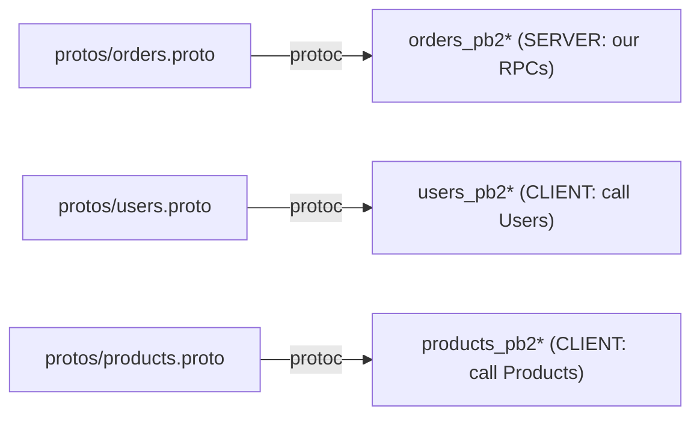

# `services/orders/app/pb/` — generated gRPC stubs

Generated by [`scripts/gen_protos.py`](../../../../scripts/README.md). **Do not
edit by hand.** Unlike the leaf services, this folder holds **three** proto
modules, because the Orders service is both a server *and* a client.

| Stub | Used as | By |
|------|---------|----|
| `orders_pb2` / `orders_pb2_grpc` | **server** — `OrderServiceServicer` base + `OrderServiceStub` | [servicer.py](../servicer.py), tests |
| `users_pb2` / `users_pb2_grpc` | **client** — `UserServiceStub` | [clients.py](../clients.py) |
| `products_pb2` / `products_pb2_grpc` | **client** — `ProductServiceStub` | [clients.py](../clients.py) |

The `__init__.py` sys.path shim works exactly as described in the
[Users pb README](../../../users/app/pb/README.md). Regenerate with
`python scripts/gen_protos.py` (or `make protos`) from the repo root.
