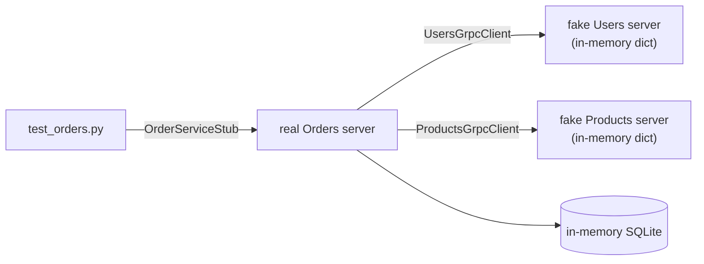
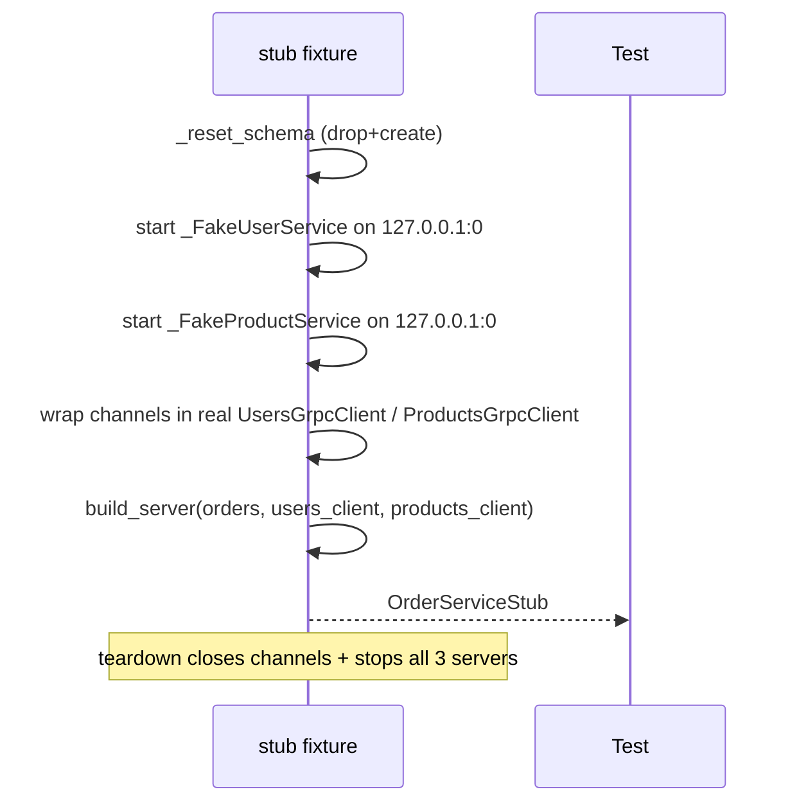
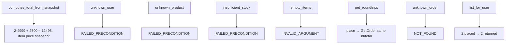

# `services/orders/tests/` — test suite (gRPC)

The Orders service is a gRPC **client** of Users and Products, so its tests stand
up **two fake in-process gRPC servers** that implement the generated
`UserServiceServicer` / `ProductServiceServicer` interfaces. The **real** Orders
client, orchestration, and protobuf serialization run end-to-end against them.



---

## 1. `conftest.py` — three real servers, two of them fake logic



| Fake | Seed data | Behaviour |
|------|-----------|-----------|
| `_FakeUserService` | `{"user-1": ...}` | `GetUser` → reply or `NOT_FOUND` |
| `_FakeProductService` | `prod-1` (4999, stock 10), `prod-2` (2500, stock 1) | `GetProduct` / `ReserveStock`; **mutates stock**; `FAILED_PRECONDITION` when oversold |

The fakes are **real gRPC servers** (not mocks) — so the actual client retry
logic, deadlines, metadata forwarding, and serialization are all exercised.

---

## 2. `test_orders.py` — what each test proves



| Test | Expected `StatusCode` |
|------|-----------------------|
| `test_place_order_computes_total_from_snapshot` | OK (`total == 12498`) |
| `test_unknown_user_is_failed_precondition` | `FAILED_PRECONDITION` |
| `test_unknown_product_is_failed_precondition` | `FAILED_PRECONDITION` |
| `test_insufficient_stock_is_failed_precondition` | `FAILED_PRECONDITION` |
| `test_empty_items_is_invalid_argument` | `INVALID_ARGUMENT` |
| `test_get_order_roundtrips` | OK |
| `test_get_unknown_order_is_not_found` | `NOT_FOUND` |
| `test_list_orders_for_user` | OK (count == 2) |

---

## How to run

```powershell
cd services/orders
$env:GRPC_VERBOSITY="NONE"
..\..\.venv\Scripts\python.exe -m pytest -q
```
