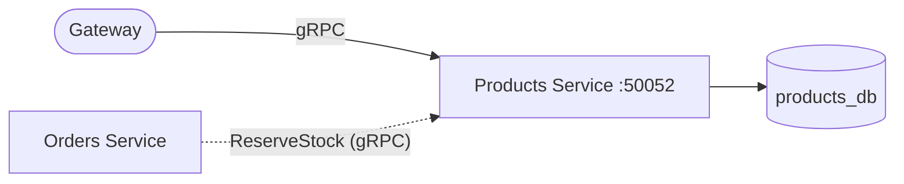
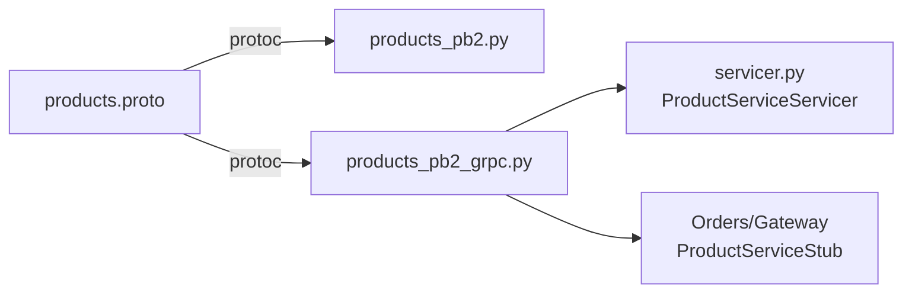
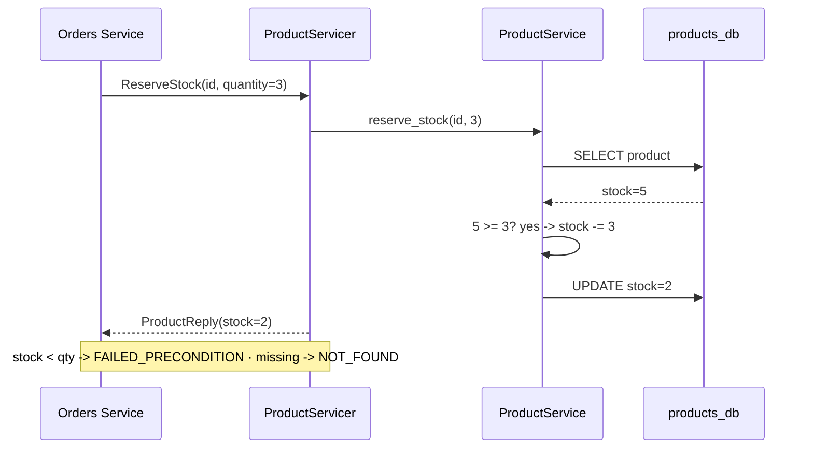

# Products Service (gRPC)

The **Products service** owns the catalog and inventory. Same domain as the REST
edition; the transport is **gRPC**. Its most important RPC is `ReserveStock`,
which the Orders service calls during checkout.

---

## 1. Where this service sits



---

## 2. The contract

Defined in [products.proto](../../protos/products.proto):



Four RPCs: `CreateProduct`, `GetProduct`, `ListProducts`, and `ReserveStock`.

---

## 3. Reserving stock — the key RPC



---

## 4. Status-code mapping

Where REST returned HTTP codes, gRPC returns **status codes**:

| Situation | REST (HTTP) | gRPC status |
|-----------|-------------|-------------|
| bad input | 422 | `INVALID_ARGUMENT` |
| duplicate SKU | 409 | `ALREADY_EXISTS` |
| product missing | 404 | `NOT_FOUND` |
| not enough stock | 409 | `FAILED_PRECONDITION` |

`FAILED_PRECONDITION` is the idiomatic gRPC code for "the system state won't
allow this operation" — a better fit for oversell than a generic conflict.

---

## 5. File-by-file

- `app/pb/` — generated `products_pb2` + `products_pb2_grpc` (via
  [gen_protos.py](../../scripts/gen_protos.py)).
- `app/servicer.py` — implements `ProductServiceServicer`; opens a DB session per
  RPC, calls the service, maps domain errors to status codes.
- `app/service.py` — catalog rules; `reserve_stock` enforces "never oversell".
- `app/repository.py` — the only SQL. `save()` persists a stock change.
- `app/models.py` — the `products` table; `price_cents` is an integer.
- `app/server.py` — `grpc.aio` server + standard health service + interceptor.
- `app/observability.py` — correlation-id interceptor + JSON logs.
- `app/healthcheck.py` — probe used by Docker's `HEALTHCHECK` (port 50052).

> ⚠️ **Same concurrency caveat as the REST edition:** `reserve_stock` does
> read-then-write in app code. Under concurrent load use a conditional
> `UPDATE ... WHERE stock >= :q` or `SELECT ... FOR UPDATE` so the database
> enforces the invariant atomically.

---

## 6. Running it

```bash
pip install -r requirements.txt
python -m app.server        # listens on [::]:50052
```

### Tests
```bash
GRPC_VERBOSITY=NONE pytest -q   # real server, ephemeral port, in-memory SQLite
```

Covered: create+get, unknown (`NOT_FOUND`), duplicate SKU (`ALREADY_EXISTS`),
reserve decrement, insufficient stock (`FAILED_PRECONDITION`), reserve unknown
(`NOT_FOUND`), negative price (`INVALID_ARGUMENT`), and list.
