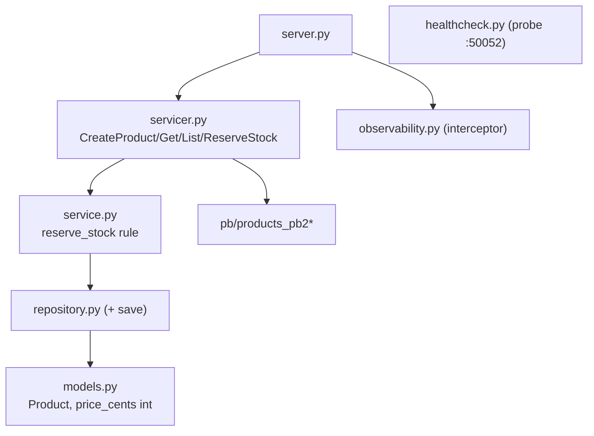
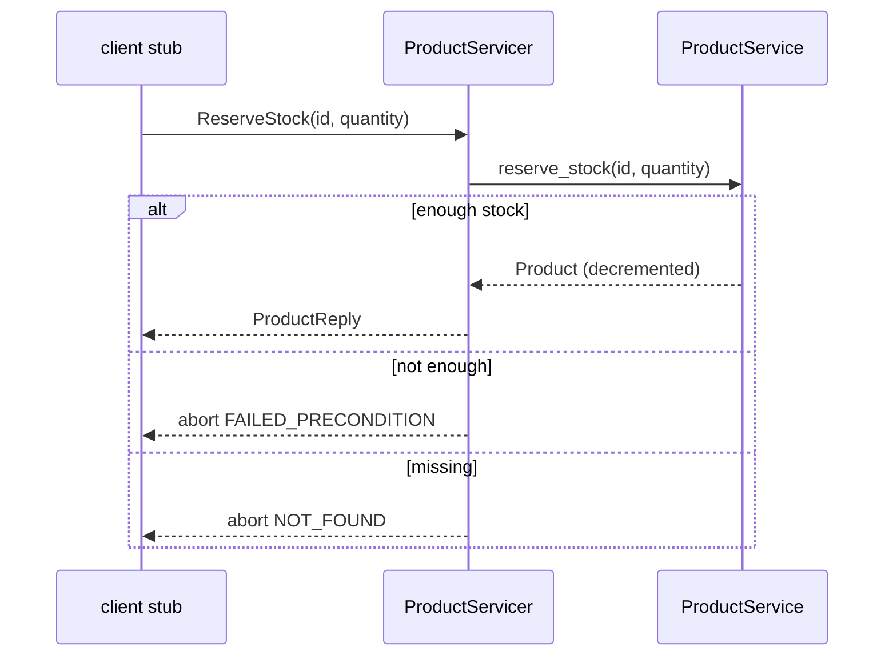

# `services/products/app/` — application package (gRPC)

The **Products (catalog) service** over gRPC. Same layered design as the gRPC
Users service — a **servicer** adapts protobuf to the transport-agnostic service
layer — with the catalog-specific reservation rule. This README covers what's
different; see [Users app README](../../users/app/README.md) for the shared gRPC
mechanics (server, interceptor, healthcheck, pb shim).

> Generated stubs: [`pb/`](pb/README.md). Contract:
> [`../../../protos/products.proto`](../../../protos/README.md).

> **Concepts in this folder** — see [CONCEPTS.md](../../../CONCEPTS.md).
> Illustrates *Adapter* (servicer), *money-as-integer-cents*, and the
> *check-then-act / oversell* concurrency concern — flagged inline below.

---

## 1. Module map

---

## 2. `servicer.py` — status mapping for the catalog

| Domain exception | `grpc.StatusCode` | REST equivalent |
|------------------|-------------------|-----------------|
| `ValidationError` | `INVALID_ARGUMENT` | 422 |
| `SkuAlreadyExists` | `ALREADY_EXISTS` | 409 |
| `ProductNotFound` | `NOT_FOUND` | 404 |
| `InsufficientStock` | `FAILED_PRECONDITION` | 409 |

> Note the deliberate choice: "not enough stock" maps to **`FAILED_PRECONDITION`**
> (the request is valid but the system state won't allow it), which is more
> precise than reusing `ALREADY_EXISTS`. This is the RPC that the **Orders
> service** calls at checkout.

The four RPCs (`CreateProduct`, `GetProduct`, `ListProducts`, `ReserveStock`)
each open a session, call the service, and pack the result into a `ProductReply`.

---

## 3. Inner layers (same as REST + gRPC Users)

`service.py` holds the reservation rule (`reserve_stock`: fetch → check
`stock >= qty` → decrement or raise `InsufficientStock`), `repository.py` adds a
`save()` for the stock update, and `models.py` stores **money as integer cents**.
These are the same as the [REST Products app README](../../../../rest-ecommerce/services/products/app/README.md).
The gRPC-specific `server.py`, `observability.py`, `healthcheck.py`, and `pb/`
mirror the [gRPC Users app README](../../users/app/README.md).

> **System design — money as integer cents** avoids float rounding; **check-then-act
> race:** `reserve_stock` is a read-modify-write that needs an atomic conditional
> update / row lock under real concurrency
> ([04-system-design](../../../../../04-system-design/architectural_notes.md),
> [09-concurrency](../../../../../09-concurrency/)).
