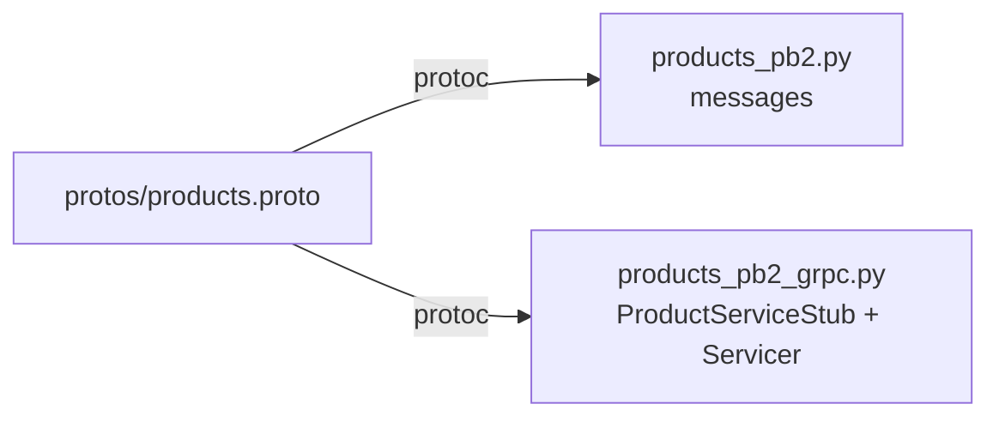

# `services/products/app/pb/` — generated gRPC stubs

Generated from [`protos/products.proto`](../../../../protos/README.md) by
[`scripts/gen_protos.py`](../../../../scripts/README.md). **Do not edit by hand.**

| File | Contains |
|------|----------|
| `products_pb2.py` | `CreateProductRequest`, `ReserveStockRequest`, `ProductReply`, `ListProductsReply`, … |
| `products_pb2_grpc.py` | `ProductServiceStub` (client) + `ProductServiceServicer` (server base) |
| `__init__.py` | the sys.path shim (same mechanism explained in the [Users pb README](../../../users/app/pb/README.md)) |

This service only needs the `products` stubs (it doesn't call anyone). Regenerate
with `python scripts/gen_protos.py` (or `make protos`) from the repo root.
