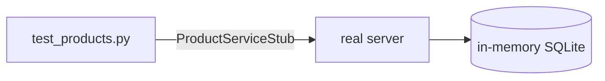
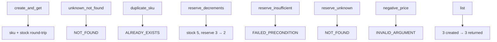

# `services/products/tests/` — test suite (gRPC)

Real in-process gRPC server + generated stub over a loopback channel and
in-memory SQLite — same harness as the [gRPC Users tests](../../users/tests/README.md)
(`stub` fixture, `_reset_schema()` per test, ephemeral port).



---

## What each test proves



| Test | Expected `StatusCode` |
|------|-----------------------|
| `test_create_and_get` | OK |
| `test_get_unknown_not_found` | `NOT_FOUND` |
| `test_duplicate_sku_already_exists` | `ALREADY_EXISTS` |
| `test_reserve_decrements` | OK (`stock == 2`) |
| `test_reserve_insufficient_failed_precondition` | `FAILED_PRECONDITION` |
| `test_reserve_unknown_not_found` | `NOT_FOUND` |
| `test_negative_price_invalid_argument` | `INVALID_ARGUMENT` |
| `test_list` | OK (count == 3) |

The `_make(stub, sku, stock, price)` helper creates a product so each test starts
from a known catalog state.

---

## How to run

```powershell
cd services/products
$env:GRPC_VERBOSITY="NONE"
..\..\.venv\Scripts\python.exe -m pytest -q
```
