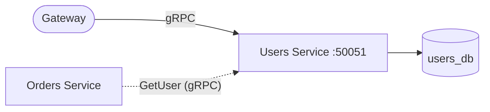
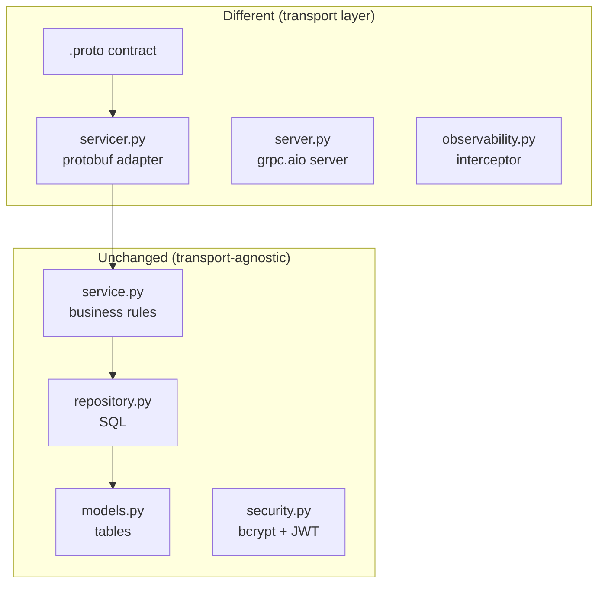
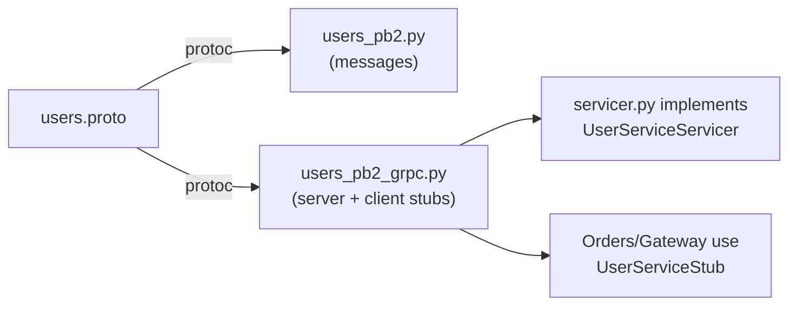
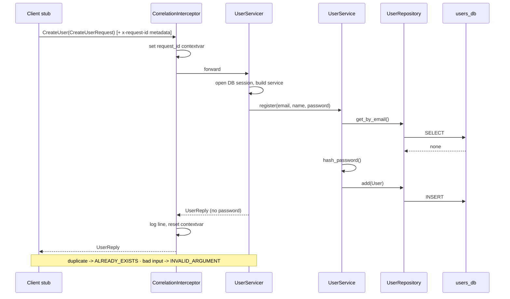

# Users Service (gRPC)

The **Users service** owns accounts and authentication. It is functionally the
same as its REST cousin — the difference is the *transport*: instead of HTTP +
JSON it speaks **gRPC** (HTTP/2 + Protocol Buffers).

---

## 1. Where this service sits



Callers use the **generated client stub** from [users.proto](../../protos/users.proto);
they never craft raw requests. The Orders service calls `GetUser` to validate a
buyer.

---

## 2. REST vs gRPC — what actually changed



| Concept | REST edition | gRPC edition |
|--------|--------------|--------------|
| Contract | OpenAPI (generated *from* code) | `.proto` (code generated *from* it) |
| Endpoint | `POST /users` | `UserService.CreateUser` RPC |
| Input validation | Pydantic DTO | protobuf message + service checks |
| Errors | HTTP status codes | gRPC status codes |
| Cross-cutting | ASGI middleware | gRPC interceptor |
| Wire format | JSON (text) | Protobuf (binary) |

The **service / repository / models** layers are unchanged — proof that good
layering makes the transport a swappable detail.

---

## 3. The contract drives everything



Both sides generate from the same `.proto`, so the client and server can never
disagree about the message shape. See [scripts/gen_protos.py](../../scripts/gen_protos.py).

---

## 4. Request lifecycle — CreateUser



---

## 5. File-by-file

### `app/pb/` — generated stubs
`users_pb2.py` (message classes) and `users_pb2_grpc.py` (server base class +
client stub). Generated from the proto; the `__init__.py` adds this folder to
`sys.path` so the generated flat `import users_pb2` resolves.

### `app/servicer.py` — the protobuf adapter
Implements `UserServiceServicer`. Each method opens a DB session, converts the
protobuf request to arguments, calls the service, and converts the result back to
a reply — or maps a domain exception to a gRPC status via `context.abort`:

| Domain error | gRPC status |
|--------------|-------------|
| `ValidationError` | `INVALID_ARGUMENT` |
| `EmailAlreadyExists` | `ALREADY_EXISTS` |
| user missing | `NOT_FOUND` |
| `InvalidCredentials` | `UNAUTHENTICATED` |

### `app/server.py` — the async server
Builds a `grpc.aio.server`, registers the servicer, the **standard health
service**, and the correlation interceptor. `build_server` is reused by the
tests to run the real server on an ephemeral port.

### `app/observability.py` — the interceptor
The gRPC analogue of HTTP middleware: reads/mints `x-request-id` from call
metadata, stores it in a contextvar, and logs one JSON line per RPC.

### `app/service.py`, `app/repository.py`, `app/models.py`, `app/security.py`, `app/config.py`, `app/database.py`
Identical roles to the REST edition — pure business/data code with no knowledge
of gRPC.

> ⚠️ **Gotcha:** `unary_unary_rpc_method_handler` lives on the top-level `grpc`
> module, **not** `grpc.aio`. Using it from `grpc.aio` raises `AttributeError`
> only *at request time* (inside the interceptor), which is easy to miss until a
> call actually arrives.

---

## 6. Running it

```bash
# from services/users (after generating stubs at the repo root)
pip install -r requirements.txt
python -m app.server        # listens on [::]:50051
```

### Tests
```bash
pytest -q     # starts a real gRPC server on an ephemeral port, in-memory SQLite
```

Covered: create+get, unknown user (`NOT_FOUND`), duplicate email
(`ALREADY_EXISTS`), short password (`INVALID_ARGUMENT`), login success + failure
(`UNAUTHENTICATED`), and list.
