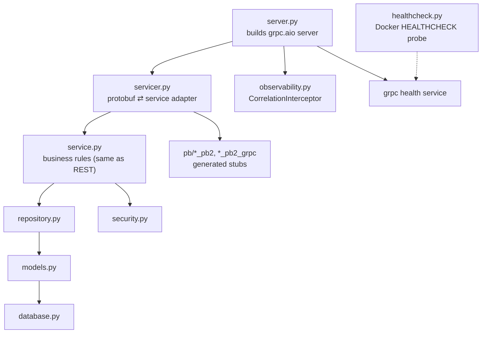
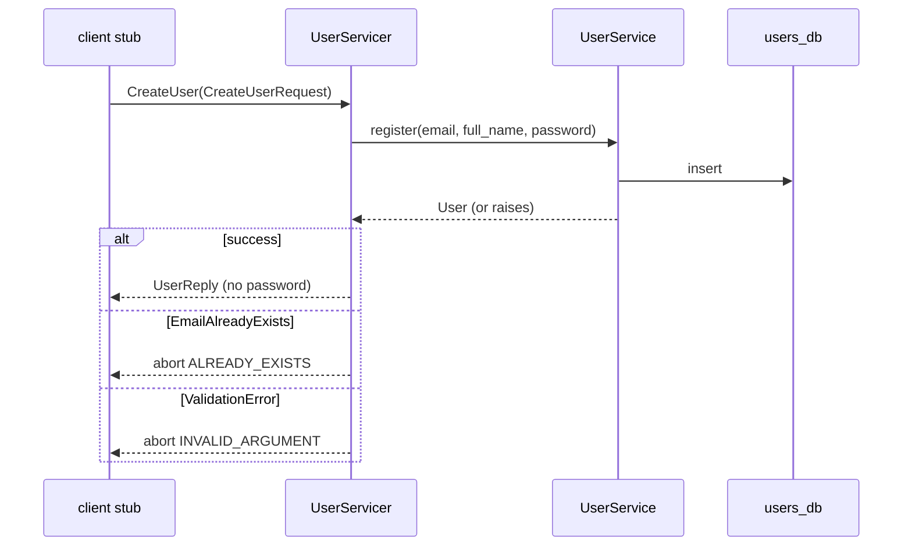
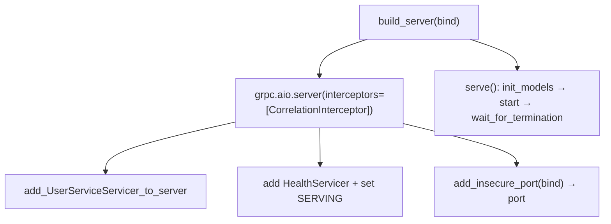
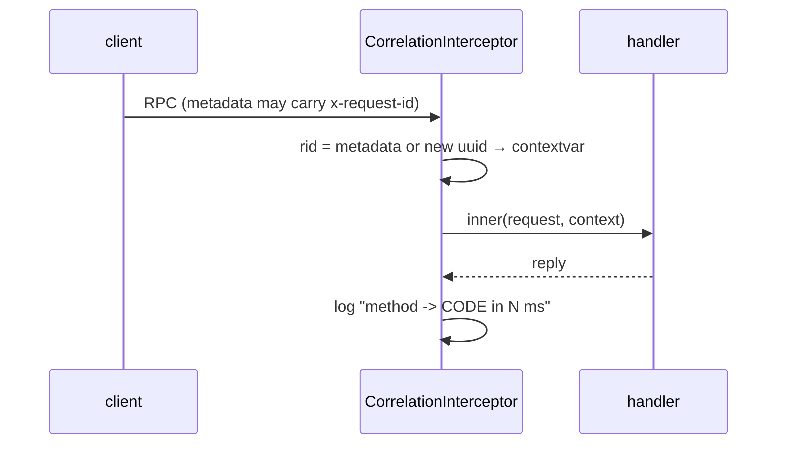

# `services/users/app/` — application package (gRPC)

The full code of the **Users service**, exposed over **gRPC** instead of REST.
The inner layers (`service.py`, `repository.py`, `models.py`, `security.py`,
`config.py`, `database.py`) are **transport-agnostic and nearly identical** to the
REST edition — the only thing that changes is the *edge*: a **servicer** +
**server** replace routers, and errors become **gRPC status codes** instead of
HTTP codes.

> Generated protobuf stubs live in [`pb/`](pb/README.md) (own README). The
> contract itself is in [`../../../protos/users.proto`](../../../protos/README.md).

> **Concepts in this folder** — see [CONCEPTS.md](../../../CONCEPTS.md). The
> servicer is an *Adapter*; the interceptor is *Chain of Responsibility*; the
> generated stubs are a remote *Proxy*; plus *Repository*, *Hashing (DSA)*, and
> *health checking* — flagged inline below.

---

## 1. Module map (what's new vs. REST)

| File | gRPC-specific? | Role |
|------|----------------|------|
| [servicer.py](servicer.py) | **yes** | adapter: protobuf request → service call → protobuf reply / status code |
| [server.py](server.py) | **yes** | builds the `grpc.aio` server, registers servicer + health + interceptor |
| [observability.py](observability.py) | **yes** | `CorrelationInterceptor` (gRPC's equivalent of middleware) |
| [healthcheck.py](healthcheck.py) | **yes** | tiny client that Docker runs to probe SERVING |
| [pb/](pb/README.md) | **yes** | generated message + stub classes |
| service / repository / models / security / config / database | no | same layered design as [REST Users §2–9](../../../../rest-ecommerce/services/users/app/README.md) |

---

## 2. `servicer.py` — the protobuf adapter

The servicer is the gRPC analogue of a router. Its **only** jobs: open a DB
session, unpack the protobuf request into plain args, call the service, and pack
the result back into a protobuf reply — or abort with a status code.

### Domain error → gRPC status code (the gRPC "status table")

| Domain exception | `grpc.StatusCode` | REST equivalent |
|------------------|-------------------|-----------------|
| `ValidationError` | `INVALID_ARGUMENT` | 422 |
| `EmailAlreadyExists` | `ALREADY_EXISTS` | 409 |
| `InvalidCredentials` | `UNAUTHENTICATED` | 401 |
| not found (`GetUser`) | `NOT_FOUND` | 404 |

`_to_reply(user)` is the one place the ORM object becomes a `UserReply` — and the
reply message **has no password field**, so a hash can never leak (the same
guarantee `UserOut` gives in REST).

> **Pattern — Adapter + DTO/Mapper:** the servicer adapts protobuf ↔ service
> calls, and `_to_reply` maps the ORM object to a protobuf DTO. **DSA — binary
> encoding:** protobuf serialises with varint-encoded field numbers, a compact
> binary scheme vs. JSON text
> ([03-design-patterns](../../../../../03-design-patterns/architectural_notes.md)).

---

## 3. `server.py` — building the async server

- `build_server(bind)` is **reused by tests** on an ephemeral port `127.0.0.1:0`.
- It registers three things: our `UserServicer`, the **standard gRPC health
  service** (so orchestrators can probe), and the `CorrelationInterceptor`.
- `serve()` is the production entry point (`python -m app.server`): configure
  logging → create tables → start → block forever.

---

## 4. `observability.py` — interceptor, not middleware

Key facts:
- gRPC uses **interceptors** where HTTP uses middleware. This one implements
  `grpc.aio.ServerInterceptor.intercept_service`.
- It only wraps `unary_unary` handlers (all our RPCs are unary-unary).
- **Gotcha baked in:** the wrapped handler is rebuilt with
  `grpc.unary_unary_rpc_method_handler` — that factory is on `grpc`, **not**
  `grpc.aio`.
- The correlation id travels in call **metadata** under `x-request-id` (gRPC's
  version of a header).

---

## 5. `healthcheck.py` — Docker's probe

A standalone client (`python -m app.healthcheck`) that opens a channel to
`localhost:50051`, calls the standard `Health.Check`, and exits `0` if SERVING
else `1`. `docker-compose.yml` runs it as the container `HEALTHCHECK`.

---

## 6. Shared inner layers (same as REST)

`service.py` (validates email + password length, dup-check, hashing),
`repository.py` (SQL only), `models.py` (`users` table, UUID-as-string),
`security.py` (bcrypt + JWT), `config.py`, and `database.py` are the same layered
design documented in
[the REST Users app README](../../../../rest-ecommerce/services/users/app/README.md).
The service raises the same domain exceptions; only the **adapter** that catches
them differs (servicer/status-codes here vs. router/HTTP-codes there).
