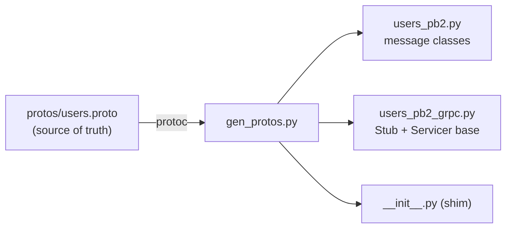
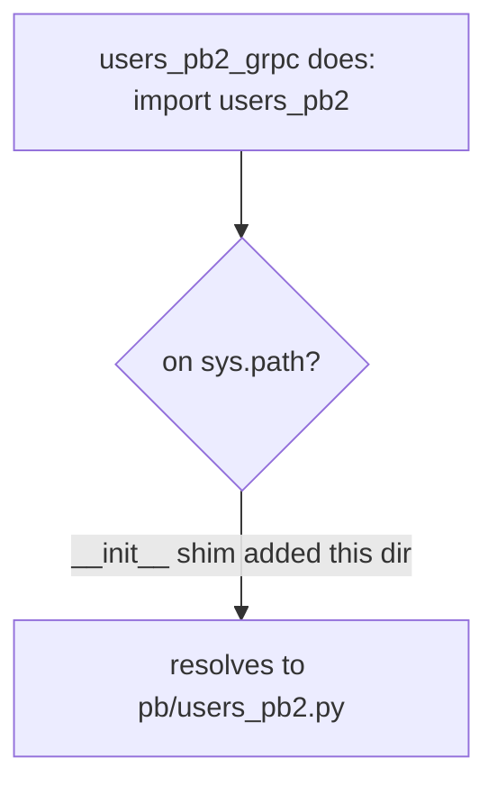

# `services/users/app/pb/` — generated gRPC stubs

**Do not edit these files by hand.** Everything here is generated from the
`.proto` contracts by [`scripts/gen_protos.py`](../../../../scripts/README.md)
(which runs `grpc_tools.protoc`). Regenerating guarantees the code always matches
the contract.



| File | Contains |
|------|----------|
| `users_pb2.py` | the **message** classes (`CreateUserRequest`, `UserReply`, …) and the `DESCRIPTOR` |
| `users_pb2_grpc.py` | the **`UserServiceStub`** (client side) and **`UserServiceServicer`** base class (server side) |
| `__init__.py` | a small **sys.path shim** (see below) |

> This service only needs `users`. The Orders service and Gateway `pb/` folders
> also contain `products` and `orders` stubs, because they *call* those services.

---

## The `__init__.py` sys.path shim — why it exists

`protoc` emits a **flat** import inside `users_pb2_grpc.py`:

```python
import users_pb2 as users__pb2  # not "from . import users_pb2"
```

That only resolves if the stubs' own directory is on `sys.path`. Since the stubs
live inside a package (`app/pb/`), the generated `__init__.py` fixes it:

```python
import os, sys

sys.path.insert(0, os.path.dirname(__file__))
```



So importing `from app.pb import users_pb2, users_pb2_grpc` just works, and the
flat internal import still resolves. Both [`servicer.py`](../servicer.py) and
[`server.py`](../server.py) import through this package.

---

## Regenerating

```powershell
# from repo root
python scripts/gen_protos.py     # or:  make protos
```
