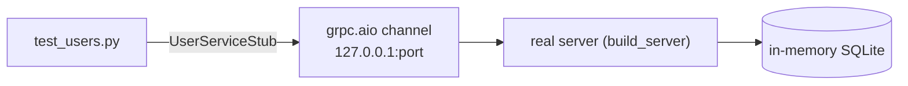
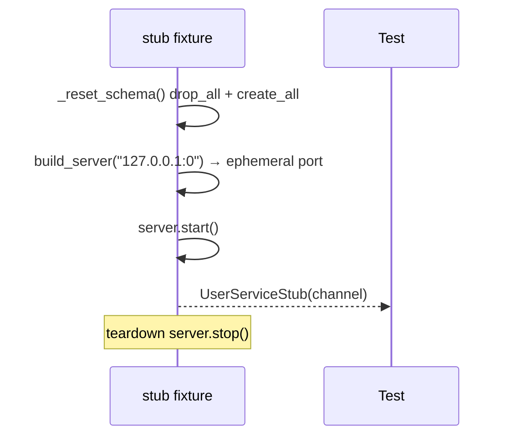
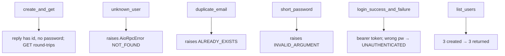

# `services/users/tests/` — test suite (gRPC)

These tests start a **real in-process gRPC server** on an ephemeral port and talk
to it through a generated client stub. That exercises the whole stack —
interceptor, servicer, service, repository, and protobuf serialization — exactly
as in production, just over a loopback channel and an in-memory SQLite database.



---

## 1. `conftest.py` — the `stub` fixture



Two details that matter:

- **`_reset_schema()` per test.** In-memory SQLite with `StaticPool` keeps one
  connection alive for the whole process, so data would leak between tests.
  Dropping and recreating all tables before each test restores isolation.
- **Ephemeral port `127.0.0.1:0`.** The OS picks a free port; `build_server`
  returns the chosen port so the client can connect. No fixed port = no clashes
  when tests run in parallel.

---

## 2. `test_users.py` — asserting on status codes

Unlike REST (where you assert on HTTP status numbers), gRPC tests assert that a
failing call raises `grpc.aio.AioRpcError` with a specific `StatusCode`.



| Test | Expected `StatusCode` |
|------|-----------------------|
| `test_create_and_get_user` | OK (round-trip) |
| `test_get_unknown_user_not_found` | `NOT_FOUND` |
| `test_duplicate_email_already_exists` | `ALREADY_EXISTS` |
| `test_short_password_invalid_argument` | `INVALID_ARGUMENT` |
| `test_login_success_and_failure` | OK, then `UNAUTHENTICATED` |
| `test_list_users` | OK (count == 3) |

---

## How to run

```powershell
cd services/users
$env:GRPC_VERBOSITY="NONE"   # silence harmless GOAWAY logs on teardown
..\..\.venv\Scripts\python.exe -m pytest -q
```

> `GRPC_VERBOSITY=NONE` prevents gRPC's teardown chatter (a harmless `GOAWAY` to
> stderr) from making PowerShell report a non-zero exit code.
