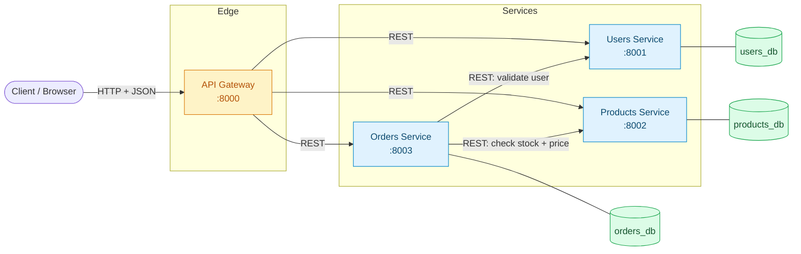
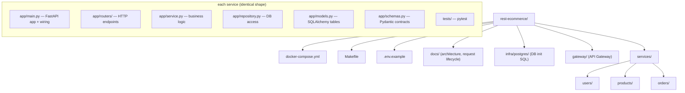

# REST E-Commerce — Production-Grade Microservices

A complete, runnable **REST microservices** system for an e-commerce domain, built with
**FastAPI**, **async SQLAlchemy 2.0 + PostgreSQL**, **Docker Compose**, and **pytest**.

It is one of three sibling repositories that implement the *same* domain with different
protocols so you can compare them directly:

| Repo | Protocol | Transport | Contract |
|------|----------|-----------|----------|
| **`rest-ecommerce`** (this one) | **REST** | HTTP/1.1 + JSON | OpenAPI (auto) |
| `grpc-ecommerce` | gRPC | HTTP/2 + Protobuf | `.proto` files |
| `graphql-ecommerce` | GraphQL | HTTP/1.1 + JSON | SDL schema |

---

## 1. What you get

Four independently deployable services, each with its own database
(**database-per-service**), talking to each other over REST:



- **API Gateway** (`:8000`) — the single public entry point. It fans requests out to the
  backend services, aggregates responses (e.g. building a "checkout" from users + products +
  orders), and is the only service a client ever talks to.
- **Users Service** (`:8001`) — user accounts; owns `users_db`.
- **Products Service** (`:8002`) — product catalog + inventory; owns `products_db`.
- **Orders Service** (`:8003`) — places orders; **calls** Users (to validate the buyer) and
  Products (to check stock/price) before committing; owns `orders_db`.

Every service ships with: layered architecture, Pydantic validation, async DB access,
health/readiness probes, structured JSON logging with correlation IDs, a Dockerfile, and tests.

> **Read next:** [`docs/ARCHITECTURE.md`](docs/ARCHITECTURE.md) for the full design and
> [`docs/REQUEST-LIFECYCLE.md`](docs/REQUEST-LIFECYCLE.md) to trace one request end-to-end.
> Each service folder has its own `README.md` explaining the code **line by line**.

---

## 2. Repository layout



> **Studying the concepts?** [CONCEPTS.md](CONCEPTS.md) maps every **design
> pattern**, **SOLID** principle, **system-design** idea, and (the few) genuine
> **DSA** touch-points in this repo to the exact file that demonstrates them, and
> cross-links to the `02`/`03`/`04` curriculum folders.

---

## 3. Quick start

**Prerequisites:** Docker + Docker Compose (that's it — Python is only needed for local dev).

```bash
# 1. Copy the environment template
cp .env.example .env

# 2. Build and start the whole system (4 services + Postgres)
make up            # == docker compose up --build -d

# 3. Wait for health, then open the gateway's interactive docs
open http://localhost:8000/docs

# 4. Follow the logs
make logs

# 5. Tear it all down
make down
```

### Try it end to end

```bash
# Create a user (via the gateway -> users service)
curl -s -X POST http://localhost:8000/api/users \
  -H 'content-type: application/json' \
  -d '{"email":"ada@example.com","full_name":"Ada Lovelace","password":"s3cret!"}'

# Create a product (via the gateway -> products service)
curl -s -X POST http://localhost:8000/api/products \
  -H 'content-type: application/json' \
  -d '{"sku":"BOOK-001","name":"Clean Code","price_cents":3200,"stock":10}'

# Place an order — the orders service validates the user AND reserves product stock
curl -s -X POST http://localhost:8000/api/orders \
  -H 'content-type: application/json' \
  -d '{"user_id":"<USER_ID>","items":[{"product_id":"<PRODUCT_ID>","quantity":2}]}'
```

---

## 4. Running the tests

Each service has an isolated pytest suite that runs against an in-memory SQLite database
(no Postgres or Docker required), so tests are fast and deterministic:

```bash
make test          # runs pytest in every service
# or per service:
cd services/users && pip install -r requirements.txt && pytest -q
```

---

## 5. Why these choices (the short version)

| Decision | Why |
|----------|-----|
| **Database-per-service** | Each service owns its data; no shared DB coupling. Services can evolve schemas independently. |
| **API Gateway** | One public entry point → auth, rate-limiting, and aggregation live in one place; clients never see the internal topology. |
| **Async SQLAlchemy + asyncpg** | Non-blocking DB I/O so the FastAPI event loop stays free under load. |
| **Pydantic at the boundary** | Untrusted input is validated/coerced before it reaches business logic. |
| **Correlation IDs + JSON logs** | One request is traceable across every service during an incident. |
| **httpx with timeouts + retries** | Service-to-service calls fail fast and survive transient blips instead of hanging. |

For the long version, see [`docs/ARCHITECTURE.md`](docs/ARCHITECTURE.md).
